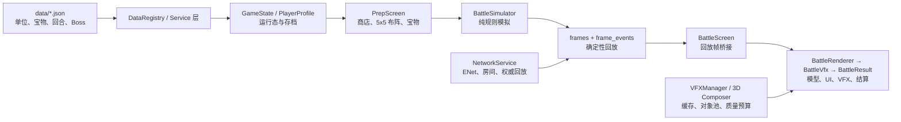

# Glory Beta 0.04

Godot 4.7 的 3v3 布阵自动战斗项目。本 README 同时是项目说明、资源盘点、代码审查记录和后续可由 AI 逐项执行的改进路线。原始审计依据 2026-08-15 至 2026-08-16 的工作区、Godot 4.7.0 导入/运行结果、Android 实机试玩和工程内检查场景编写；2026-08-19 的最新门禁结果优先于下文历史观察。

> 当前结论（2026-08-19）：**A1、A2 本地交付闭环和 A3 已完成验证。** 资产清单覆盖 2643 个文件、3115.5 MiB，稳定库存指纹为 `5dabb3f546ee6ec0dd8491441ab32872afda3c4e2da46360e752e75e91fc508e`；冷克隆缺包时门禁精确失败，恢复 1790 个 Git 外置资源并完成首次 Godot 导入后，资源、模型边界、骨骼、4x4 棋盘和依赖检查均通过。A4/Android 导出与设备回归按用户要求暂停，未改导出预设、未安装 APK。下文提到的“35 个模型坏场景”和棋盘假绿是历史审计，不代表当前 Windows 基线。

## 目录与运行前置条件

当前外层目录是交付容器，真正的 Git/Godot 工程是 `GLory-v1.0/`：

```text
GLory/
├── BetaV9.apk                 # 现有候选 APK，约 976 MiB；不是本次从源码导出的产物
├── assets/                    # 完整交付资源包，约 1.3 GiB，但位置不在 Godot 工程根
└── GLory-v1.0/                # Git 根 / Godot 项目根
    ├── project.godot
    ├── assets/                # 本机运行时叠加后约 1.4 GiB；Git 默认忽略大资源
    ├── data/                  # 单位、宝物、回合、Boss、佣兵等 JSON 数据
    ├── scenes/                # 主菜单、准备、战斗、房间及调试场景
    ├── scripts/               # 规则、数据服务、存档、网络与联机协议
    ├── effects/               # 2D/3D 特效、特效配方与外部参考包
    ├── tools/                 # 确定性、经济、联机、资源及性能检查场景
    └── docs/                  # 规则、数值、经济、状态信封和联机审计文档
```

### 当前本机闭环与团队交付闭环

资源运行时唯一位置仍是工程内的 `assets/`。大资源继续受 `.gitignore` 管理，但 A2 已不再依赖人工叠加：`assets.manifest.json` 给全部资源建立稳定 SHA-256 身份，`assets.bundle.json` 指向本地内容寻址 ZIP，`tools/restore_assets.ps1` 在复制前验证归档、路径表和每个文件。完整操作见 `docs/ASSET_DELIVERY.md`。

当前本地交付闭环：

1. Git 克隆代码后，把与 `assets.bundle.json` 同版本的 ZIP 放在描述文件旁，或显式传给 `tools/restore_assets.ps1 -ArchivePath ...`。
2. 恢复脚本只补缺失文件；遇到目标文件内容不一致时默认拒绝覆盖。恢复后自动运行 2643 项全量 SHA-256 与额外文件门禁。
3. 当前 ZIP 只保存在本机 `../build/assets/`，`storage_uri` 为空：尚未上传对象存储，也未提交 Git。团队共享地址和正式提交是后续外部动作。
4. A4 暂停期间不更新 Android 预设、不构建或安装 APK；旧 APK 的安装成功不能证明当前源码可用。

### `export_presets.cfg` 是什么

这是 Godot 放在项目根的“导出配方”文件：它指定平台、包名、版本、导出过滤规则、架构和可选签名信息。当前本机有一个被忽略的 `Android Debug` 预设，包名为 `com.glory.game`，使用 Godot 默认 Debug 签名，**不含私钥或密码**。正式上架必须另建 Release 预设并由私有 keystore 签名；Debug 预设不能用于发布。

建议先做以下无密钥检查：

```bash
cd GLory-v1.0
/Volumes/repository/乐工坊/tools/godot/Godot.app/Contents/MacOS/Godot --version
# 期望：4.7.x

test -f assets/ui/menu_bg.png
test -f assets/models/units/god_arbiter_animated/god_arbiter_animated.tscn
test -f export_presets.cfg
```

全部通过后才允许导出：

```bash
/Volumes/repository/乐工坊/tools/godot/Godot.app/Contents/MacOS/Godot \
  --headless --path . --export-debug "Android Debug" ../build/Glory-debug.apk
adb push ../build/Glory-debug.apk /data/local/tmp/Glory-debug.apk
adb shell pm install -r /data/local/tmp/Glory-debug.apk
```

## 玩法

Glory 的核心是“布阵决策 + 自动战斗回放”，不是即时微操游戏。

1. 玩家在 5×5 准备棋盘购买、升星和布置普通单位；普通单位上限 7，宝物可提高到 8。
2. 佣兵占棋盘格，但不占普通单位上限、不吃宝物、不参与羁绊，也不能升星。
3. 战斗将布阵转换为带移动、射程、目标选择、攻速、控制、护盾、减防、持续伤害和硬超时结算的 2D 模拟；画面用 2.5D/3D 单位与特效播放回放。
4. 回合 5、10、15、20 是 Boss；6、12、18、21 是 PVP。没有在线对手时，PVP 回合降级为 PVE。
5. 第 21 回合本身是最终战：双方阵营生命未归零时，各按阵营生命召唤 1 个阵营援军。
6. 每 4 回合后抽 3 选 1 宝物；四个种族（神、暗、亡灵、人类）提供羁绊与技能联动。
7. 联机目标是 3v3、服务器权威结算和回放下发；当前实现含 ENet 房间、准备、重连、席位接管、回放压缩及状态恢复脚手架。

完整规则见 [`docs/Beta 0.04.md`](docs/Beta%200.04.md)、数值见 [`docs/Beta 0.04 数值总表.md`](docs/Beta%200.04%20数值总表.md)。其中种族关系系统当前由 `RaceRelationService.ENABLED = false` 关闭；黄金祭坛的“五件套 +100 金”仍未实现。

## 架构



### 分层现状

| 层 | 主要位置 | 职责 | 审查判断 |
| --- | --- | --- | --- |
| 配置与全局状态 | `project.godot`、`scripts/autoload/` | 本地化、存档、随机数、数据、玩家状态、网络、VFX | Autoload 边界明确；`project.godot` 同时出现正常 `config_version` 与乱码 BOM 键，建议清理。 |
| 数据与规则 | `data/`、`scripts/{battle,economy,units,treasure,boss}/` | 数值表、羁绊、伤害、状态、经济、Boss、宝物 | 数据驱动的方向正确，经济/确定性检查已有基础。 |
| 准备阶段 | `scenes/prep/` | 棋盘、商店、宝物、UI、模型摆放 | `PrepUI.gd` 约 2406 行，职责过多；当前继承链还出现解析错误。 |
| 战斗模拟 | `scripts/battle/` | 时间步、目标、伤害、状态、结果、回放 | `BattleSimulator` 与可视化事件分离的方向正确；最重 3v3 最终战的服务器同步计算仍需容量规划。 |
| 战斗呈现 | `scenes/battle/`、`effects/` | 模型、血条、回放帧、特效、屏震、结算 | `BattleScreen → BattleResult → BattleVfx → BattleRenderer → BattleArena` 为五层脚本继承；过深，演出改动风险高。 |
| 网络 | `scripts/autoload/NetworkService.gd`、`scripts/multiplayer/` | 房间、席位、重连、状态、回放压缩 | 有权威回放、持久化及重连测试；`NetworkService.gd` 约 4264 行，是最高优先级拆分热点。 |

## 美术与资源盘点

### 数量与体积

完整资源包原始交付位于外层 `../assets/`，约 1.3 GiB；2026-08-16 已无覆盖叠加进本机 `GLory-v1.0/assets/`，因此当前工程内 `assets/` 约 1.4 GiB。下表描述该完整包的组成：

| 区域 | 文件数 | 约体积 | 内容 |
| --- | ---: | ---: | --- |
| `models/` | 393 | 1070.5 MiB | 单位、佣兵、Boss、PVE 怪、阵营援军、战场水晶及 FBX 动画/贴图 |
| `ui/` | 490 | 224.1 MiB | 主菜单、房间、商店、卡牌、种族、角色、宝物、按钮 |
| `board/` | 29 | 22.4 MiB | 准备与战斗场地、前景遮挡、水面、格子标识 |
| `audio/` | 12 | 13.3 MiB | 菜单、准备、PVE、PVP BGM 与 UI 音效 |
| `vfx/` 与纹理 | 25 | 约 2.6 MiB | 技能、状态与程序化效果辅助纹理 |

叠加前工程根仅有 556 个文件、约 130 MiB，静态扫描到 272 个明确资源文件引用，其中 115 个缺失。叠加后主场景、准备界面、商店、战斗背景、音频和首个 PVE 教程已可运行，说明“资源在外层导致主场景无法加载”的阻断已解除。

这不等于模型资源合格：当前 `model_bounds_check` 仍报告 **35 个不可加载/缺失场景**，并列出缺脚本、缺 `.tres` 材质和大量单位/佣兵的预期 `.tscn` 路径。已加载的若干模型还出现 `span=0` 或 `span=0.019`，所以角色模型、骨骼、材质和动画的全量验收仍不成立。更严重的是检查进程仍以 0 退出，属于假绿。

### 视觉审查

优点：主菜单与森林战场背景的低多边形童话风统一，留有大面积中心空间；宝物卡的石质边框、图标和大字号收益信息具备辨识度。神/暗/亡灵/人类的视觉主题也可以发展为稳定的颜色语言。

主要问题：

- 实机准备阶段的格位、候补区、商店、河流与森林背景已形成统一的低多边形童话风，但商店弹窗会覆盖待命区，必须点击“商店外空白处”才能收起，界面没有关闭提示；这是教学阶段的真实可用性问题。
- 实机战斗中敌方部分单位能显示怪物模型，而民兵、弓箭手、商人显示为蓝色胶囊占位体，整备阶段也只显示名称与星级文字。这使角色身份、站位和合成收益都难以一眼理解，是当前战斗效果差的首要根因，而不只是缺少粒子特效。
- 第二场 PVE 从进入战场到宝藏选择约 2 秒，战斗日志/伤害数字可见但技能、受击、死亡几乎来不及阅读；开始预热会加载 96 项技能/外部场景，实机耗时约 11.8 秒，期间出现 6–7 FPS 和最长约 1.26 秒的处理时间。高性能 Adreno 829 上预热完成后可到约 90 FPS，但显存日志峰值约 646 MiB（贴图约 549 MiB），不能据此声称低端机安全。
- 战斗现在同时混合 2D 雪碧、3D 模型、程序化材质、多个外部 VFX 包。实机观察到水晶边界、怪物模型和伤害数的风格不完全一致；应先建立“可用角色呈现 + 命中时序”的统一语言，再增加高频粒子。
- 完整资源包内存在备份目录、`New folder`、`desktop.ini`、同名变体和大尺寸 FBX/PNG；版本库还提交了约 282 MiB 的 `backups/`。这些内容增加导入时间、APK 体积和误引用风险。
- 最大单张模型贴图接近 30 MiB，且包含大量 FBX。移动端需按设备档位设置导入尺寸、ASTC 压缩和模型 LOD，而不是直接随源文件打包。

### 第三方资源与许可

`effects/vfx3d/vfxv2/` 包含 Binbun、Starter Vfx、Demo 等参考包。当前仅发现 Binbun `BattleFX` 与 `ElementalMagicFX` 的 CC0 许可证；其余包和完整美术资源没有统一的来源/许可清单。**在公开发布或商店上架前，必须为每个可发布资源建立来源、作者、许可证、是否允许再分发、原始链接和 SHA-256。**

不要假定“文件在项目内”就拥有商业再分发权。字体 `Knewave` 自带 OFL 文本，但模型、贴图、音频、AI 生成与外部压缩包均需单独核实。

## 本次验证记录

以下是当前环境的实际结果。`--quit-after` 会强制以 0 退出，即使脚本内部报错，因此不能将进程退出码单独当作通过证据。实机结果仅覆盖一台横屏 Android 16 设备，不能外推到低端机、竖屏、联机或商店发布。

| 项目 | 结果 | 证据与范围 |
| --- | --- | --- |
| Godot 版本与完整资源导入 | 部分通过 | Godot `4.7.stable` 导入 930 个新增资源并注册脚本类。发现 `backups/` 与正式资源 UID 重复；多份 FBX 的外部贴图缺失，例如 `dark_imp_motong`、`dark_queen`、`god_arbiter`。 |
| 确定性回放 | 通过（有限范围） | `determinism_check`：同进程、同 seed 的同步两次与异步一次哈希一致，203 帧。未覆盖跨平台/多 seed/全技能集。 |
| 经济结算 | 通过 | `economy_settle_check` 所有用例通过，包括 PVE/PVP/Boss、利息、连败、刷新、击杀金。 |
| 存档/房间持久化 | 通过 | `persist_check` 成功保存两个房间和 token。 |
| 重连/席位规则 | 通过 | `reconnect_check` 的预留、AI 接管、leader 转移、换位恢复和对局中禁换位全部通过。 |
| 协议握手 | 通过（仅正常路径） | `handshake_check` 的 `ok` 用例通过；仍需版本不匹配、畸形包与真实两端设备验证。 |
| 水晶规则 | 通过 | `crystal_demo_rules_check` 的 PVE/PVP/最终战归属规则全部通过。 |
| 战斗模拟性能 | 有测量值 | 最坏 3v3 最终战：单场中位 428.7 ms、两场约 857.4 ms；回放原始 5.32 MiB、Zstd 后 98.3 KiB。服务器单线程容量必须据此压测。 |
| 准备棋盘烟测 | **失败（假绿）** | 资源叠加后不再卡在 `PrepDetails` 解析；但 `tools/board_4x4_smoke_node.gd:36` 断言 `NetProtocol.sanitize_board()` 对旧 25 格盘面迁移后仍有 2 个非空格，实际失败而进程退出码仍为 0。 |
| 主场景运行 | 通过（有限范围） | `Main.tscn` 能启动，完成 96 项 VFX 预热并进入语言/教学界面；强制退出时有资源泄漏诊断，不能替代长期运行测试。 |
| 资源依赖扫描 | 不完整 | 扫描到 203 个待问依赖文件、254 张被引用 PNG；一个 Binbun 场景的依赖查询失败，报告明确标为不可信。 |
| 模型边界/骨骼检查 | **失败（假绿）** | 完整资源后已有部分模型被检到，但 `model_bounds_check` 仍报 35 个 broken scene；`dark_scythe` 缺脚本、`dark_doom` 缺材质，多个神/暗/亡灵/人类/佣兵场景路径不存在。进程退出码仍为 0。 |
| Android Debug 导出 | 通过但有资源告警 | 生成 `../build/Glory-debug.apk`，609 MiB，SHA-256 `a30f160b6b32dd69fbca6e98af810cbee482062e7f084ecebff951366e960db5`，applicationId `com.glory.game`，版本 `1.0.0-debug`。导出同时打印缺脚本、缺贴图和缺 Binbun 场景错误，说明“能出包”不等于全资源正确。 |
| ADB 实机安装与启动 | 通过 | vivo V2527A，Android 16 / API 36，Adreno 829。`adb push` 后 `pm install -r` 成功，设备记录的包版本为 `1.0.0-debug`，安装时间 2026-08-16 16:16:45；冷启动进入 Godot Vulkan Forward Mobile，无 `FATAL EXCEPTION` 或 Godot `SCRIPT ERROR`。 |
| 实机教学主链 | 通过（单机、有限范围） | 语言选择 → 中文 → 商店打开/选卡/采购 3 名单位 → 拖拽上阵 → 首场 PVE → 民兵二星合成 → 第二场 PVE → 宝藏三选一 → 回到整备，均由 ADB 真实触控完成，进程持续存活。 |
| 实机战斗观感/性能 | 发现 P1 问题 | 首场预热约 11.8 秒；实机最高日志 FPS 约 90，但预热期最低 6–7 FPS、处理时间约 1.26 秒，纹理显存峰值约 549 MiB。玩家单位在战斗中显示为胶囊占位体；第二场战斗约 2 秒即进入奖励，特效与技能不可读。 |

### ADB 回归脚本

在已授权 USB 调试的设备上，按以下顺序执行。vivo V2527A 上直接 `adb install` 曾在增量会话中停滞；推送后让设备本地 `pm install` 更可诊断。不要用 `BetaV9.apk` 宣称当前代码已验收。

```bash
adb devices -l
adb push ../build/Glory-debug.apk /data/local/tmp/Glory-debug.apk
adb shell pm install -r /data/local/tmp/Glory-debug.apk
adb shell pm path com.glory.game
adb shell monkey -p com.glory.game 1
adb logcat -d -v brief | grep -E 'FATAL EXCEPTION|E Godot|ERROR|SCRIPT ERROR'
adb exec-out screencap -p > /tmp/glory-launch.png
```

最低实机验收路径：冷启动 → 主菜单 → 单人教学 → 商店购买/拖拽/出售 → 宝物选择 → PVE 战斗回放 → 结算 → 重启后存档恢复；随后用两台设备完成 3v3 建房、入房、Ready、掉线 20 秒内重连、AI 接管、最终结算和回放重播。

## 审查结论与优先级

### P0：必须先解决

1. **资源交付仍不可复现。** 本机资源叠加已解除启动阻断，但大资源和 `export_presets.cfg` 都未进入可验证交付；新机器无法只靠 Git 恢复当前可玩状态。必须提交 manifest、版本号与哈希，不提交大资源或密钥。
2. **模型资产仍大量不完整。** `model_bounds_check` 仍有 35 个 broken scene，且导出日志含缺脚本、缺材质和缺贴图。实机中我方单位退化为胶囊占位体，直接损害玩法可读性。
3. **失败的测试会假绿。** 准备棋盘烟测已暴露旧 25 格迁移失败，模型检查也打印硬错误，但二者仍以 0 退出；CI 必须把这些条件转换为非零退出码。
4. **Android 只完成 Debug QA，不具备发布资格。** 当前 Debug 包可安装启动，但没有 Release 私钥签名、体积门槛、低端设备证据、许可证总账或双设备联机验收。

### P1：上线前处理

1. **单体脚本。** `NetworkService.gd` 约 4264 行，`PrepUI.gd` 约 2406 行，`UnitSkillVFXComposer3D.gd` 约 1597 行；当前修改极易产生跨功能回归。
2. **战斗呈现耦合且主角缺席。** 视觉事件已由模拟器写入 replay，但 `BattleVfx.gd` 同时做事件路由、快照 diff、技能逻辑、2D/3D 特效、数字、屏震和池管理；深继承链使每个阶段难以独立测试。更优先的是修复 `unit id → 可加载 prefab → 正确锚点`，消灭实机胶囊占位体后才有资格堆叠 VFX。
3. **资源治理缺失。** 282 MiB 备份、重复变体、非资源文件和未量化的外部许可会污染发布包；`dep_scan` 对动态路径只能保守保留 83.8 MiB。
4. **网络生产就绪度不足。** 文档仍列出 relay/NAT、回放传输恢复、两端人工网络 QA、leader 公平规则等未完成项。不要把本地 ENet 测试等同公网联机。
5. **启动与战斗预算过重。** 96 项预热实际约 11.8 秒、峰值纹理显存约 549 MiB；即便测试机预热后 90 FPS，也不能接受把这个负担留给所有设备。

### P2：体验与可维护性

1. 种族关系系统被关闭，需明确是删减、延后还是恢复的产品路线，避免 UI/数据/协议长期留死代码。
2. 主菜单头像框仍有待补角色立绘的 TODO；需要定义安全区、横竖屏、字体回退、无障碍对比度和低端机 UI 基线。
3. 商店打开后以“点击空白处”收起，没有显式关闭 affordance，且会覆盖待命区；教程箭头依赖屏幕坐标，移动端新手易迷失。
4. 高面数/大贴图资源缺少自动 LOD、纹理预算和 APK 体积门槛；当前真实 Debug APK 已为 609 MiB，仍远超常规移动冷启动和分发的舒适区。

## AI 可执行优化清单

下面每项是可以单独交给 AI 落地并验收的工作单。顺序不可颠倒：先保证资产、构建和测试可信，再做战斗表现升级。

### A. 构建、资源与质量门禁

#### A1 — 建立可复现资产清单（P0）

- **输入：** 批准的完整 `assets/` 包与 `data/`、场景、脚本引用。
- **实施：** 新建 `tools/asset_manifest_check.gd` 和 `docs/ASSET_MANIFEST.md`；扫描所有 `res://assets/` 显式引用、运行时目录引用、FBX/GLB 场景、音频和字体，输出 `path / type / size / sha256 / required-by / source-license-id`。
- **挂接点：** 复用 `scripts/assets/BattleAssetManifest.gd`、`BattleAssetService.gd` 和现有 `tools/dep_scan_node.gd`，但不要以 `ResourceLoader.get_dependencies()` 失败后继续报绿。
- **验收：** 空资源/错层级时非零退出；完整资源时 0 缺失；报告能区分运行时必需、仅编辑器、仅备份、仅第三方参考。

#### A2 — 将资源交付与 Git 解耦但可追溯（P0）

- **状态（2026-08-19）：本地闭环完成。** `assets.manifest.json` 使用 schema 2 和稳定库存指纹；`.gitattributes` 固定清单覆盖文本资源为 LF；`assets.bundle.json` 记录归档 SHA-256 与 1790 个外置路径。
- **实施：** `tools/package_assets.ps1` 校验 2643 项后生成内容寻址 ZIP；`tools/restore_assets.ps1` 先在临时目录安全解压、逐项校验，再补入工程；`tools/asset_delivery_check.tscn` 是只读硬门禁。
- **规则：** 工程内 `assets/` 是唯一运行时位置；ZIP 是待恢复工件，不是 Godot 资源根。大资源不进 Git，manifest、bundle 描述、脚本和 `.gitattributes` 应进 Git。
- **验收结果：** 冷克隆缺包时退出码 1 并精确报告 1790 个缺失；恢复、首次完整导入后 2643 项全部匹配、0 extras；单文件篡改被非零退出码拦截；模型、骨骼、棋盘与依赖门禁复跑通过。
- **未完成的外部动作：** ZIP 尚未上传对象存储，`storage_uri` 仍为空；当前工作区也尚未由用户批准提交。

#### A3 — 让检查真正失败（P0）

- **实施：** 修复 `tools/board_4x4_smoke_node.gd`、`model_bounds_check.gd`、`skel_check`、`dep_scan_node.gd`：捕获 parse/load/缺资源/空检查集/依赖查询错误，汇总后 `get_tree().quit(1)`；任何空检查集须标为 `SKIP` 而不是 `PASS`。
- **挂接点：** `NetProtocol.sanitize_board()` 对 25 格旧存档的迁移、`model_bounds_check.gd` 的 35 个 broken scene、FBX 外部贴图缺失和 Binbun 依赖查询失败都应成为明确断言。
- **验收：** 资源被临时移走时 CI 红；恢复后全绿；日志含失败文件、消费者和修复建议。

#### A4 — Android 出包与设备回归门禁（P0）

> **状态：按用户要求暂停。** 本轮没有修改 `export_presets.cfg`、构建 APK、连接设备或运行 ADB。

- **实施：** 保留无密钥 `Android Debug` 预设用于 QA，用私有 CI secret/本地安全钥匙串提供 Release 预设；新增 `tools/android_smoke.sh`，记录 Git commit、manifest hash、Godot 版本、APK SHA-256、包名、安装结果、冷启动 logcat 和截图。设备出现增量安装悬挂时，脚本应自动回退为 `adb push` + `pm install`，并清楚记录会话 ID 与失败信息。
- **验收：** 每一份 QA APK 都能反查到源码 commit 和资源 manifest；安装、启动、语言页、商店、首场战斗截图、无 `FATAL EXCEPTION` 均为必经门。基线样本为 `com.glory.game`、609 MiB、V2527A / Android 16；不得把它误写成 Release 验收。

#### A5 — 资源瘦身与许可总账（P1）

- **实施：** 将 `backups/` 迁出运行仓库或放入带保留策略的工件库；从资源根移除 `desktop.ini`、`New folder`、历史变体；把 FBX 源文件与运行时 `.tscn/.glb` 分仓；建立 `THIRD_PARTY_NOTICES.md`。
- **验收：** 发布包排除备份、源 FBX、编辑器样例与未引用参考包；每项第三方资源都有许可证和来源。Binbun 两个已确认 CC0 包可保留，其他包在许可证确认前不得发布。

### B. 战斗表现重构（P1，先做纵向切片）

#### B1 — 固化“战斗事件契约”

- **目标：** 保留当前模拟与回放分离的优势，禁止渲染资源反向进入战斗规则。
- **现有挂接点：** `DamageService.gd` 已写入伤害数字事件；`BattleSimShared.gd` 产生 `skill_shake`；`BattleScreen.gd` 把 `frame_events` 回灌；`BattleVfx.gd::_play_visual_events()` 消费事件。
- **实施：** 新建 `scripts/battle/BattlePresentationEvent.gd`（或严格 schema 的 JSON）和 `docs/BATTLE_EVENT_SCHEMA.md`。每项固定包含 `event_id`、`tick`、`type`、`source_uid`、`target_uids`、`skill_id`、`amount`、`element/race`、`criticality`、`seed`、`visibility_priority`。
- **验收：** `BattleSimulator` 只产出语义事件；同一 replay 在桌面和 Android 的事件序列 SHA-256 一致；VFX 配置改动不改变战斗结果哈希。

#### B2 — 新建 `BattlePresentationDirector`，替代 `BattleVfx` 的硬编码路由

- **新文件：** `effects/runtime/presentation/BattlePresentationDirector.gd`、`BattleActionTrack.gd`、`UnitActorRegistry.gd`、`VfxProfileResolver.gd`、`VfxPool3D.gd`、`data/vfx/battle_cues/*.tres`。
- **职责：** Director 订阅 `BattlePresentationEvent`，根据 `skill_id + race + quality_tier + priority` 解析 profile，再向 2D/3D pool 下发“预备、飞行/动作、命中、余烬”四段；`BattleVfx` 只保留迁移期的 legacy adapter，逐步退出硬编码事件路由。
- **迁移顺序：** 先迁移普通近战、普通远程、暴击、治疗、护盾、死亡六种高频事件；再迁移一个 Boss 和一个种族标志技能；最后迁移全角色技能。每次只删对应旧分支。
- **验收：** 同一事件只由一个 profile 播放；seek/暂停/重播不重放已消费事件；缺 profile 时播放低成本 fallback，并输出一次可聚合告警。

#### B3 — 用“读秒—动作—命中—结果”建立可读性

- **每个攻击的最小节奏：** `0.08–0.16s` 蓄势（朝向、武器/手部亮起）→ 动作/投射物 → 命中闪白/受击后退/伤害数 → `0.15–0.45s` 残留。Boss 技能另加危险范围和可打断读条。
- **空间规则：** 所有特效从 `BattleRenderer` 已建立的 `world_cast`、`world_hit`、`world_head`、`world_foot` 锚点取位；禁止用屏幕绝对坐标。友方使用冷色、敌方暖/红色，控制效果使用独立轮廓与图标。
- **验收：** 在 60 FPS 和低画质下，观察者能不看日志区分普攻、暴击、治疗、护盾、控制、死亡和 Boss 大招；录制 10 个固定种子的 15 秒关键帧进行人工评分。

#### B4 — 控制特效预算，而非只堆素材

- **实施：** 扩展现有 `VFXQualityBudget.gd`，为 `critical / important / ambient` 设每帧 spawn、存活节点、粒子、透明叠层、动态光源上限；事件溢出时依优先级合并伤害数字、缩短余烬、退化为图标/颜色，而不是随机丢技能。
- **挂接点：** 复用 `VFXManager` 的 2D 缓存/池和 `VFXBlockRoot` 的 3D 并发控制；统一统计到 `PerfLog.gd`。
- **验收：** 低档、满配第 21 回合无持续节点增长；内存、draw call、粒子、平均/1% low FPS、丢弃事件数写入 CSV；超过预算时有可见但简化的反馈。

#### B5 — 建立独立 VFX 评审场景

- **实施：** 扩展 `scenes/debug/ModelBattlePreview.tscn` 或新增 `scenes/debug/BattleVfxReview.tscn`：选择单位/技能/质量档/慢放倍率/背景，固定 seed 截帧，并能并排比较“旧 profile / 新 profile”。
- **验收：** 不进入完整对局也能验证每个 profile、锚点、遮挡、循环清理和低档 fallback；截图和指标可作为美术评审附件。

### C. 战斗代码对标与模仿方案（P1，必须先完成一个纵向切片）

#### C0 — 本次实机评估结论

首场和第二场 PVE 已在 Android 真机跑通，因而问题**不是**“没有战斗代码”，而是表现层未把既有回放事件转成可读的动作。第二场实机截图中，民兵、弓箭手、商人仍表现为蓝色胶囊/蛋形兜底体；伤害数和血条存在，但攻击、命中、受击、死亡几乎在约两秒内压缩完成。与此同时，宝物选择 UI 的卡片、边框和层级已明显更完整，说明战斗场是当前最突出的体验短板。

根因按优先级排序如下：

1. `unit definition → model scene/prefab → BattleRenderer anchor` 映射不完整，当前模型检查已发现 35 个坏场景/依赖；展示失败时回退为胶囊，破坏了角色识别。
2. `BattleSimShared.gd` 已产出 `frame_events`，`BattleScreen.gd` 也会回灌它们，但 `BattleVfx.gd` 仍承担大量硬编码路由；事件缺少统一的“起手、命中、收招”时长和优先级。
3. 模拟可在极短时间算完，结果 UI 随即推进；没有独立的演出时钟和关键事件保留策略，所以伤害发生了、玩家却来不及读懂。
4. 资源存在不等于可发布：当前导出还报过缺脚本/材质/场景依赖，不能用特效堆叠掩盖坏资源链。

结论是：**不重写战斗规则，不导入整套外部游戏；保留 Glory 的模拟/回放，新增一个只消费语义事件的战斗演出层。**

#### C1 — 开源项目选型与许可边界

下列项目用于学习、抽取思想或在许可证允许下复用。执行时必须记录使用的 commit/tag、原始 LICENSE、改动文件和署名；外部项目的美术、音频、角色名、世界观与第三方资源一律不随代码自动进入 Glory。

| 优先级 | 项目与源码入口 | 可模仿/可复用的具体代码 | Glory 中的落点 | 禁止事项 |
| --- | --- | --- | --- | --- |
| **P1 架构标杆** | [R055LE/horror-battler](https://github.com/R055LE/horror-battler) 的 `scripts/combat.gd`、`scripts/combat_animator.gd`、`scripts/game_manager.gd` | 最贴近 Glory 的“商店→布阵→自动战斗→结算”循环；`combat.gd` 先产出 structured event list，`combat_animator.gd` 再用 tween/await 回放。 | 逐项对照其 `combat → event list → animator` 边界，将 Glory 的 `frame_events` 变为稳定契约；只重写同等职责的代码。 | 仓库当前未提供 LICENSE 文件；**只可阅读、截图、人工复述架构，不可复制其代码、资源或数据。**也不可照搬其 5 槽、数值、技能与美术。 |
| **P1 可直接借鉴代码结构** | [Lacaedemon/sparta](https://github.com/Lacaedemon/sparta)（MIT），重点 `scripts/Battle.gd`、`scripts/Replay.gd`、`scripts/Unit.gd`、`scripts/HUD.gd` 与 `scenes/Battle.tscn` | Godot 4.7/GDScript 的可重放战斗切片：`Battle` 协调兵种、AI、胜负和回放；`Replay` 记录固定种子；`Unit` 管角色状态；HUD 独立显示。 | 参考其“模拟/回放/单位演员/HUD”边界，建立 `BattlePresentationDirector` 与 `UnitActorRegistry`，并为事件回放写 headless 测试。若逐行移植 MIT 代码，须保留版权声明并写入 `THIRD_PARTY_NOTICES.md`。 | 它的单位目前以 `_draw()` 彩色 token 表现；这正是 Glory 现在要消除的占位效果，**不可移植其 token 绘制或 RTS 操作/编队规则**。 |
| **P1 手感实现候选** | [Kelpekk/Juicee](https://github.com/Kelpekk/Juicee)（MIT），`addons/juicee/` 及 preset/sequence 示例 | Godot 4.3+ 的可组合屏震、受击闪白、缩放弹性、伤害数、粒子、音频与镜头效果；其 state stack 可避免并发 tween 恢复错误。 | Director 先完成后，试验性放入 `addons/juicee/`；新增 `JuiceeBattleFeelAdapter.gd`，只把 `impact/crit/heal/death` 映射为 mobile profile，不让插件理解伤害规则。 | 不在 `BattleSimShared.gd` 调插件；PVP/回放不得用全局 `Engine.time_scale` 改变模拟。不要与现有 `VFXManager` 双重控制相机/时间；默认关闭 blur、glitch、全屏后处理。 |
| **P2 代码组织参考** | [GDQuest Godot 4 Open RPG](https://github.com/gdquest-demos/godot-open-rpg)（MIT），`combat/`、`src/` 目录 | 2D 回合制而非自动战斗，但战斗状态、数据资源、UI 和服务分层清晰，适合作为可测试 GDScript 的组织参考。 | 参考状态/命令/显示分离的写法，拆小 `PrepUI`、战斗服务和数据资源；不改变 Glory 的 3D 自动战斗玩法。 | 不导入 RPG 回合指令、Kenney 等第三方资源或其完整框架；依赖与资源许可证须单独核查。 |
| **P2 VFX 素材/参数参考** | [Brackeys/vfx-in-godot](https://github.com/Brackeys/vfx-in-godot)（CC0） | 粒子、shader、冲击和预览工程的最小示例。 | 从单个效果开始改为 Glory 的材质、色板、缩放和 mobile budget；登记来源和文件哈希。 | 不能把示例工程整包塞进运行时资源根；不能因为 CC0 而跳过 APK 体积、透明叠层和 GPU 验证。 |

#### C2 — 目标架构与精确挂接点

```text
BattleSimShared（确定性规则，只产出语义事件）
  → replay.frame_events
  → BattleScreen（按 replay tick 入队，不直接播放）
  → BattlePresentationDirector（排程、优先级、快进、生命周期）
      ├─ UnitActorRegistry / UnitVisualResolver（单位 uid → 已验证 Actor3D 与锚点）
      ├─ BattleActionTrack（转向、起手、投射物、命中、收招）
      ├─ BattleFeelAdapter（镜头、音频、伤害数、Juicee 可选适配）
      └─ VfxPool3D / VFXManager（仅负责借还节点和预算）
  → BattleResult（等待关键演出结束或玩家跳过）
```

| 现有位置 | 改造方式 | 新职责/接口 |
| --- | --- | --- |
| `scripts/battle/BattleSimShared.gd::_add_visual_event()` | 保留为唯一语义事件出口；补齐字段，但绝不 `load()` 特效、访问场景树、创建 tween。 | `event_key = battle_id + tick + ordinal`、`type`、`source_uid`、`target_uids`、`skill_id`、`amount`、`is_crit`、`is_lethal`、`presentation_seed`、`visibility_priority`、`timing_hint`。 |
| `scenes/battle/BattleScreen.gd` 的 `frame_events` 回灌处 | 从直接写 `_state.visual_events` 改为 `presentation_director.enqueue_tick(tick, events)`；暂停、seek、重播都调用 Director 的显式 API。 | `enqueue_tick()`、`seek_to_tick()`、`set_speed()`、`skip_to_result()`、`has_blocking_cues()`。 |
| `scenes/battle/BattleRenderer.gd` / `BattleArena.gd` | 每个实际单位只注册一个 `Actor3D`，暴露 `world_foot`、`world_head`、`world_cast`、`world_hit` 锚点。 | `get_actor(uid)`、`get_anchor(uid, anchor_name)`；没有 actor 时返回角色立绘卡牌 fallback，绝不生成蓝/红胶囊。 |
| `scenes/battle/BattleVfx.gd` | 第一阶段保留原接口作兼容；每迁移一种事件，就删掉它对应的硬编码分支。 | 最终只保留 replay 时钟/Director 适配，不继续成为“模拟、表现、资源加载”的混合类。 |
| 新增 `effects/runtime/presentation/` | 新建 `BattlePresentationDirector.gd`、`UnitActorRegistry.gd`、`UnitVisualResolver.gd`、`BattleActionTrack.gd`、`adapters/JuiceeBattleFeelAdapter.gd`。 | 这些文件只能依赖事件 schema 与渲染接口，不能反向修改 BattleSimulator 状态。 |
| 新增 `data/vfx/battle_cues/` | 用 `.tres` 描述 `basic_melee`、`basic_ranged`、`crit`、`heal`、`shield`、`death`、`boss_skill`。 | profile 决定时长、锚点、色板、音频、预算和低档替代；不会决定伤害数值或目标。 |

`timing_hint` 不是 wall-clock 的权威规则，而是给演出排程的提示。推荐首批 cue：普攻 `0.08–0.16s` 起手 → 命中点 → `0.15–0.45s` 收招；远程有可见投射物；死亡有 0.2 秒淡出/倒地。模拟先结束时，Director 仍播放所有关键事件；普通连击可合并，Boss/暴击/死亡/治疗/控制不能被吞掉。结果页须等待 `has_blocking_cues() == false`，并提供“跳过演出”，总演出时长另设上限以避免卡住。

#### C3 — 可交给 AI 逐项落实的战斗纵向切片清单

- [ ] **冻结基线。** 录制固定 seed 的第一、第二场 PVE：单位表、事件序列、最终状态 SHA-256、Android 截图、平均/1% low FPS、峰值显存。修复并启用模型检查的非零失败；35 个 broken scene 未清零前，不准把胶囊当作成功 fallback。
- [ ] **实现事件 schema。** 新建 `scripts/battle/BattlePresentationEvent.gd` 与 `docs/BATTLE_EVENT_SCHEMA.md`，用 `battle_id + tick + ordinal` 生成稳定键；覆盖 `attack_start`、`projectile_spawn`、`impact`、`crit`、`heal`、`buff_apply`、`death`、`summon`、`skill_cast`。为同一 replay 在 desktop/Android 的字段序列加 SHA-256 断言。
- [ ] **实现角色展示链。** 新建数据驱动的 `UnitVisualResolver`：`unit_id → 已验证 .tscn/.glb → UnitActor3D`。`UnitActor3D` 必须有 `ActorRoot`、`HeadAnchor`、`CastAnchor`、`HitAnchor`、`Shadow`；资源失效时显示已有角色卡立绘/名字/阵营框，并在开发构建告警。首场 PVE 的所有双方单位必须不再出现胶囊。
- [ ] **按 Horror Battler 的分层思想、用 Sparta 的可回放边界实现 Director。** `BattleScreen` 仅入队 tick；Director 把事件排入每单位 action track，保证同一单位不能被两个 tween 同时占用。先只支持 `attack_start → impact → damage number → death`，不得改任何伤害公式、随机数或服务器/replay payload。
- [ ] **接入有限手感。** 仅为 `basic_melee`、`basic_ranged`、`crit`、`heal`、`death` 做 profile：朝向、起手、命中闪白、受击位移/缩放、一次性音效和伤害数字。若引入 Juicee，先封装为 adapter 并在 Mobile 评审场景中验证；暴击 hit-stop 只影响本地演出，线上/PVP 默认关闭全局 time scale。
- [ ] **制作可评审场景。** 新建 `scenes/debug/BattleVfxReview.tscn`：可选择单位、技能、种族、质量档、0.25×/1×/2×、固定 seed 和旧/新 profile 对照；保存截图、draw call、粒子/透明层、节点存活数，作为美术验收附件。
- [ ] **Android 回归与退化。** 将 `critical / important / ambient` 预算接入 `VFXQualityBudget.gd`；低档机超预算时合并普通伤害数、减粒子、改图标，绝不丢 Boss/死亡/控制提示。首场、20+ 回合、Boss 各跑一次真实 APK；确认无 `SCRIPT ERROR`、无节点泄漏、无结果页抢跑。
- [ ] **许可与归档。** 任何从 MIT 项目逐行改写/移植的文件在文件头保留归属，并写入 `THIRD_PARTY_NOTICES.md`；Horror Battler 永远只保留链接和人工设计笔记。每次更新外部依赖都在评审场景和 Android APK 重跑。

#### C4 — 首个纵向切片的验收门

只选“民兵/弓箭手 vs 雷鸣灵”的固定 PVE，而不是一次性迁移全部角色。验收同时满足以下条件才可扩展到全量技能：

1. 双方单位都是实际 Actor3D 或同风格立绘 fallback，0 个胶囊占位体。
2. 任一普攻可连续看出起手、命中、伤害和死亡；远程攻击能看见投射物；暴击与普通攻击在不看日志时可区分。
3. 战斗模拟结果与基线完全一致；事件 schema 的 digest 在 desktop 和 Android 一致，VFX profile 的改动不会影响最终状态。
4. 结果页只在关键 cue 结束或用户跳过后出现；固定样本可完整观看，异常样本不会无限等待。
5. `BattleVfxReview`、headless replay 和真实 Android APK 都通过；移动端日志无脚本错误，性能/内存相对冻结基线有明确记录。

#### C5 — 可直接交给 AI 的 `BattlePresentationDirector` 参考清单

完整的职责边界、现有代码接入点、事件 schema、调度/seek/skip 规则、`.tres` profile 字段、分提交验收和测试矩阵见 [BattlePresentationDirector AI 实施参考清单](docs/BATTLE_PRESENTATION_DIRECTOR_IMPLEMENTATION_CHECKLIST.md)。AI 每次只能落实其中一个 D 阶段；先让 schema、回放哈希和单位锚点通过，再加新的演出效果。

### D. 代码与联机拆分

#### D1 — 拆分 `NetworkService.gd`（P1）

- **目标结构：** `NetworkTransport`（ENet/RPC/通道）、`RoomService`（创建/席位/leader）、`MatchStateService`（状态信封/epoch/seq）、`ReplayTransferService`（压缩、分块、确认、重试）、`ReconnectService`（token/宽限/AI 接管）、`DedicatedServerService`（端口/持久化）。
- **迁移办法：** 先保持 `NetworkService` 作为 facade，按一个服务一个 PR 抽出；不改 RPC 名称和 payload；每次以现有 `handshake/persist/reconnect/channel` 场景回归。
- **验收：** facade API 不变；每个子服务有独立 headless 测试；公网 NAT/relay、掉线回放重传和双设备测试另有明确状态，不以本机回环代替。

#### D2 — 拆分准备 UI 与控制器（P1）

- 将 `PrepUI.gd` 分成 `ShopPanel`、`BoardHud`、`TreasureChoicePanel`、`SynergyPanel`、`BattleStatsPanel`，用明确的输入事件与 `PrepFlowController` 通信。
- 资源恢复后 `PrepDetails.gd` 已能解析；为它补最小加载测试，防止资源缺失再次伪装成 UI 继承链错误。随后从 `PrepScreen` 的继承链中移除纯 UI helper，优先使用组合节点。
- 验收：商店、拖拽、宝物、详情、战力推荐都可独立场景加载；4×4 smoke 在失败时非零、成功时有断言覆盖。

#### D3 — 回放确定性升级（P1）

- 把当前 `String.hash()` 比较升级为 SHA-256；用固定种子矩阵覆盖四种族、宝物、Boss、佣兵、最终战、死亡/复活/打断。
- 生成桌面与 Android 的事件序列与最终状态 digest，上传/保存到测试工件后逐项比较。
- 验收：跨平台差异给出首个不同 tick、事件和字段，不允许只输出总哈希不一致。

### E. 美术、UI 和移动端性能

#### E1 — 战场空间可读性（P1）

- 给准备/战斗场景分别加入低对比 5×5 格、我方/敌方半场色带、前排/后排提示、选中格、攻击范围与目标线；将这些做成可按设置关闭的 `BoardReadabilityLayer`。
- 不改原背景主图；叠层应使用独立 shader/纹理，便于换皮和移动端降级。
- 修复 `unit definition → model scene/prefab → BattleRenderer anchor` 的绑定：每个可战斗单位必须有经过加载验证的 3D/2.5D 展示体；加载失败时回退为同风格的角色卡牌立绘，而不是蓝/红胶囊。血条、名字、伤害数字必须锚定在该展示体上。
- 验收：截图盲测中玩家能在 3 秒内指出可落子区、双方方向、当前选中单位及目标；实机首场战斗不得出现胶囊占位体。

#### E2 — 模型与贴图预算（P1）

- 输出每个单位的三角面数、骨骼数、材质数、动画数、贴图分辨率/内存；为 hero、普通棋子、佣兵、Boss 设不同预算与 LOD。
- 原始 FBX 不进入发布包；转换为验证过的 `.glb/.tscn`，生成 Android ASTC 贴图，保留原始源文件在 DCC 工件库。
- 先补齐当前缺失脚本、`.tres` 与 `.tscn`，修复 `span=0` 的假可加载模型；将导出日志中的 `dark_scythe`、`dark_doom`、`god_angel`、`god_aurora` 等失败资产纳入允许列表为零的门禁。
- 验收：满配最终战在低档机型不超预算；模型边界/骨骼检查覆盖全部可战斗单位、0 broken scene、0 span=0（经豁免的纯特效节点除外）。

#### E3 — APK 体积与加载控制（P1）

- 导出后用 `aapt/apkanalyzer` 分析 APK；按场景拆出主菜单、准备、战斗、Boss、图鉴资源表，优先延迟加载未参与本局的模型和 VFX。
- BGM 转换和导入设置按质量档验证；大纹理优先压缩，禁止靠删除运行时资源掩盖问题。
- 将当前“启动预热 96 项”的单次 11.8 秒工作拆为主菜单最小集、整备预热、首战按需预热、后台空闲预热；可取消且不得在语言页暴露开发文字。先以模型资产 manifest 精确裁剪，而不是删掉仍会被战斗加载的文件。
- 验收：给出每次构建的 APK 体积预算、最大增量阈值、首屏时间、准备进战斗峰值内存。以本次 609 MiB APK、约 549 MiB 纹理峰值、11.8 秒预热作为反向基线；优化后仍通过 A1-A4。

## 推荐实施顺序

1. A1 → A3：先冻结完整资源 manifest，修复 35 个模型坏引用和测试假绿。
2. A2 本地闭环已完成；A4/Android 导出与设备回归按用户要求暂停。
3. E1 → E2：先替换战斗胶囊占位体、建立单位展示锚点，再补齐模型质量和移动端预算。
4. B1 → B3：在可读角色之上做 6 类高频战斗事件的纵向演出切片；在评审场景批准后再扩面。
5. B4、E3：先把 96 项启动预热拆分并降低显存/包体，再在低端 Android 真机上验证。
6. D1、D3：将服务器权威回放、重连、NAT/relay 和双设备 QA 推至生产门槛。
7. A5：发布前完成资源清理、来源与许可证总账。

## 不应被误判为完成的事项

- 现有 `BetaV9.apk` 的文件存在不等于它来自本次源码，也不等于它已在本次设备上可用。
- Godot 进程的 0 退出码不等于测试通过；必须同时检查脚本断言与错误日志。
- 本机 ENet 和单进程确定性检查不等于公网、双设备、跨架构联机验收。
- VFX 包出现在仓库中不等于拥有全部商业发布权。
