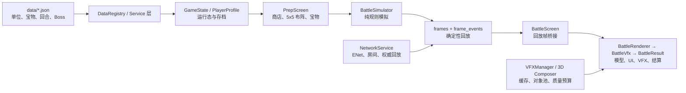

# Glory Beta 0.04

> 下面这一块由 `tools/current_health.ps1` 从各门禁的真实产物生成，是本文件里**唯一**保证反映当前状态的部分。
> 其余章节是按日期冻结的历史记录：写下时为真，之后未必。两者冲突时以生成块为准。

<!-- CURRENT_HEALTH:BEGIN -->

<!-- Generated by tools/current_health.ps1. Do not edit by hand. -->

### Current health (generated 2026-09-03T15:30:04Z)

| Item | Value |
| --- | --- |
| Commit | `90e6abd` on `main` (2 dirty tracked, 15 untracked) |
| Asset inventory | `ed99230ce8d75f20` / 2701 files |
| Gates | latest run: 87 total / 0 failing at 2026-09-03T15:27:25Z; persisted union: 88 known / 0 failing (1 older targeted/server result(s)) |
| Model material integrity | 75 models, 0 white-material suspects, 0 failing |
| APK content scan | glory-4780262-20260831_151253.apk: 3503 entries, clean |
| Last device run | 2026-08-30T04:24:41Z on 25028RN03A (passed; `glory-4780262-20260830_121542.apk`; SHA-256 `239560199c793655`; device hash verified) |

Known blockers (source: `data/qa/known_blockers.json`):

- **not_started** (unassigned, README A5) - 第三方许可总账未完成
- **in_progress** (codex, V2 P0-01 / 资源交付合同) - 资源 manifest 已更新，但可恢复 bundle/ZIP 仍属于旧库存
- **in_progress** (unassigned, V3 P0-01) - 当前 Android 启动仍超过 V3 预算，阈值尚未打开
- **in_progress** (unassigned, V2 P1-01 / V3 P2-02) - 全局动画包装模型 Android 性能仍未达标（Round 20 压力样本 16.20 FPS）
- **in_progress** (unassigned, V2 P1-04) - 晶柱与护盾已复核通过；Sky Hymn Spirit 灰色半球仍需专项修复
- **not_started** (external, V2 P1-05 人工验收) - Victory 已在动态录像出现，但 5 人识别率验收与胜利音效仍未完成

Full machine-readable detail: `reports/current_health.json`.

<!-- CURRENT_HEALTH:END -->

Godot 4.7 的 3v3 布阵自动战斗项目。本 README 同时是项目说明、资源盘点、代码审查记录和后续可由 AI 逐项执行的改进路线。原始审查依据 2026-08-15 至 2026-08-16 的工作区、Godot 4.7.0 导入/运行结果、Android 实机试玩和工程内检查场景编写；下方 2026-08-19 实施进度为当前状态，优先于后续保留的历史基线描述。

> **2026-08-23 三次复审更新：** 真机已复现启动阶段“点了没反应”的玩家感知，并确认首屏交互与 96 项 VFX 预热并发、启动数据重复加载、战斗加载反馈层级过低、弹窗缺少统一主题和输入状态反馈。具体证据、根因与可直接交给 AI 执行的任务见 [Glory V3：启动响应、交互反馈与确认 UI 复审清单](docs/GLORY_V3_启动响应与交互体验复审清单_20260823.md)。V3 不替代下方 V2 的资源/白模整改，两个清单应按各自依赖执行。

> **2026-08-22 二次复审更新：** 当前工作区的资源交付、模型和脚本解析检查已经重新出现红灯，下面 2026-08-20 的“已完成”记录只能视为历史证据，不能代表当前文件树。白模/贴图、最新 Android 真机复测、战斗观感、教程闭环和 Codex 执行顺序以 [Glory V2：白模、资源交付与真机复审优化清单](docs/GLORY_V2_白模与真机复审优化清单_20260822.md) 为准。

> 当前结论（2026-08-20）：**A1、A2、A3、A5、B4、B5、E1、E2-2A/E2-2B 与 BattlePresentationDirector D0-D6 的桌面闭环已全部完成；A4 的出包/安装/冷启动门禁已在真机跑通（Debug）。** 剩下的大块是 A4 的 Release 预设与 UI 驱动样本，以及 E3 量出来但还没动手的包体减重。**D2（PrepUI 拆分）已由同事完成；D1（NetworkService 拆分）已完成 —— 六个服务全部建成、ReplayTransferService 的压缩/分块/确认/重试四件齐了、重连补看回放已接入，协议号升到 17 且服务器已重新部署，联机回归 21/21 通过，**双设备公网实测已完成 21 回合完整对局**；详见 D1 节。**D3 仍由同事负责。后文关于“35 项不可加载”和“胶囊占位体”的文字是改造前历史基线，不再代表当前桌面结果。

## 2026-08-19 实施进度

> 状态口径：`已完成` 表示本轮约定的桌面验收已闭环；`部分完成` 表示已有可运行基础但尚未达到该项完整验收；Android 侧自 2026-08-20 起已跑通出包、安装、冷启动**以及在真机上跑完整战斗**：固定回合 1/5/20/21 的跨平台 digest 逐字段一致，实机演出指标（帧时间、显存、孤儿节点）也已录得。**仍未验的是：低端机、双设备联机、冷缓存首启，以及需要驱动备战 UI 的那部分（商店页、教学主链）**——最后一项要等同事的 D2 落地。标着「实机 digest 已验」的行指的就是前者已验、后者未验。

| 工作单 | 状态 | 已完成内容与剩余边界 |
| --- | --- | --- |
| A1 — 建立可复现资产清单 | ✅ 已完成（指纹已于 A5 更新） | 当前清单 2632 个文件，inventory fingerprint 为 `a0751fdc580e78dfe6e4023c3f55501471510d0db00d27ae5732a853faafb3fc`。历史值 `5dabb3f5…`（2,643 项）是 E2-2B 之前的状态——E2-2B 重导出了 5 个 FBX 却没重新生成清单，A5 才发现并订正。 |
| A2 — 资源交付与 Git 解耦、可追溯 | ✅ 已完成（2026-08-20 重打包并首次真正验证往返） | 当前归档 `glory-assets-a0751fdc580e78df-2fd696d1d4f2dcfc.zip`，1782 个 Git 外资源、850 个已跟踪。`restore_assets.ps1` → `ASSET_RESTORE_RESULT status=PASS copied=0 already_present=1782`，接着 `ASSET_DELIVERY_RESULT status=PASS entries=2632 missing=0 hash_mismatch=0 extras=0`。**此前从未真正跑通过**：打包脚本有三个只在 Windows PowerShell 5.1 / 非 ASCII 文件名下发作的缺陷，见 A5 一节。 |
| A3 — 让检查真正失败 | ✅ 已完成 | 缺资源失败路径与恢复后通过路径均已验证，检查不会再以空检查集或加载失败报假绿。 |
| A4 — Android 出包、实机战斗与回归门禁 | 🟡 门禁+实机跑通 / Release 未做 | `tools/android_smoke.sh` 产出可追溯证据包（commit、manifest 指纹、APK SHA-256、安装方式、冷启动 logcat、截图）。694 MiB Debug 包在 25028RN03A / Android 15 上通过：`FATAL EXCEPTION` 0、`SCRIPT ERROR` 0、PSS 362 MB。抓掉四类假结果（假绿的旧版本启动、假红的通道掉线、读不出来的证据 JSON、空过滤器导出的静默胖包）。`tools/android_baseline.sh` 已在真机跑完**四个回合**（1/5/20/21，含两个 Boss 与满配 18 敌）：**桌面/设备回放摘要每回合五字段逐字一致（C4 第 3 条）**，孤儿节点两侧皆 0，并拿到战斗截图。第 20 回合顺带暴露并修掉一个真缺陷：召唤物用同一 uid 重生时，旧尸体交还会把活着的新 actor 从注册表里抹掉，死亡演出因此被丢弃（桌面/设备同为 3 条，非 Android 问题）；已修，掉落归 0，冻结哈希不变，门禁扩到 89 项。**双设备联机验收已于 2026-08-21 完成**：服务器升到 protocol 17、手机重装新包后，电脑 + 手机同连 `34.142.168.170:8080` 跑完 **21 回合完整对局**，两端各 21 份回放、0 错误，且回放字节数互为镜像（证明本方/敌方分发正确）；详见 D1 节。实测顺带抓到并修掉一个回环从未暴露的真缺陷（离开房间后再建房永远卡在 connecting）。装机要走无线 adb：本机 USB 推大文件会把 adbd 拖挂（1 MB 推送 0.002 秒、4 MB 卡 5 分钟后connection reset）。Release keystore、商店页截图、低端机验收仍未做。 |
| E1 — 战场空间可读性 | ✅ 桌面完成 | Windows Forward Mobile 纵向切片完成；所有战斗单位经 `UnitVisualResolver → UnitActor3D`，固定两回合回放为 0 胶囊、0 可见 fallback；`BoardReadabilityLayer` 已接入准备/战斗并可持久化开关。人工盲测与 Android 验收仍待后续。 |
| E2-2A / E2-2B — 模型与贴图预算 | ✅ 桌面完成 | 75/75 模型边界检查为 0 broken、0 anomaly；241/241 FBX 加载错误为 0；78/78 wrapper 合并通过；模型预算 75 项、0 hard failure。Android ASTC、APK 排除源 FBX 及低端机满编最终战仍待后续。 |
| Director D0 — 基线与确定性证据 | ✅ 桌面完成 / 实机 digest 已验 | 当前提交 `931771c69e3f585b19e49f3bc1b846b04aa6f55d` 已完成固定 seed 的 round 1/2：完整 roster、事件/result/final-state JSON、SHA-256、actor/fallback/anchor 审计、1280×720 截图及逐帧 CSV 均已生成并独立校验；Android 证据保持暂停。 |
| Director D1 — 语义事件 schema | ✅ 桌面完成 / 实机 digest 已验 | `BattlePresentationEvent` v1 已冻结 15 个核心字段、稳定 `event_key`、独立 `presentation_seed` 与一次性未知类型告警；2738 项 schema 检查、同步/异步确定性、两回合 D0 final-state 门禁和 28/28 联机回归通过。 |
| Director D2 — 最小排程核心 | ✅ 桌面完成 / 实机 digest 已验 | 已实现 Director 生命周期、逐 tick 入队、每 `source_uid` 动作轨、去重、暂停/seek/skip/drain/dispose 和假 Registry/Adapter 测试；`BattleScreen` 已双路入队并保留 Legacy VFX。D2 不产生真实 VFX。 |
| Director D3 — 单位演员 | ✅ 桌面完成 / 实机 digest 已验 | Director 现在只经 `UnitActorRegistry.get_anchor()` 取坐标，每次播放现解析、不缓存节点；缺 actor 分类 drop，缺锚点降级到 `ActorRoot` 并进同一份一次性汇总。锚点检查由 3 抽样扩到全部 74 个可战斗单位（1067 项）、Director 检查 49/49、固定两回合 0 drop / 0 降级、四个冻结哈希不变。 |
| Director D4 — 四段普攻 | ✅ 桌面完成 / 实机 digest 已验 | 模拟层为全部单位产出 `attack_start → [projectile_spawn] → impact → hit_number → death`（`death` 此前完全不存在）；视觉按 C4 纵向切片迁移 `human_militia` / `human_archer` / `pve_sky_thunder_spirit`，其余仍走快照 diff。两个固定样本 0 `missing_actor` 掉落，切片样本播出 8 次死亡动画；D4 前后 final-state 哈希完全一致。 |
| Director D5 — 手感与运行时预算 | ✅ 桌面完成 / 实机 digest 已验 | 五个 `.tres` cue profile + `VfxProfileResolver`；**扩展**现有 `VFXQualityBudget.gd` 加三档优先级预算；`BattleVfxReview.tscn` 评审场景；切片扩面到全部单位。133/133 profile 检查、70/70 Director 通过，固定样本 0 合并、20 次降级。 |
| Director D6 — 清理旧路由 | ✅ 桌面完成 / 实机 digest 已验 | 删除三个快照 diff 函数、hit_number 旧分支与迁移期白名单；未迁移路由保留。删除前后播放计数逐项相同，回合间 orphan/tween 恒为 0。82/82 通过。 |
| B4 — 特效预算 | ✅ 桌面完成 / 实机 digest 已验 | 优先级预算补上「单条 cue 有多贵」的一半（粒子 / 附加层 / 透明叠层 / 动态光 / 并发按优先级缩放）；满配第 21 回合三档实测 orphan 全 0、无节点增长，24 次死亡在低档也全部播出。162/162 通过。 |
| E3 — 启动预热拆分与包体 | ✅ 拆分完成（含实机） / 减重未做 | 96 项拆成 `menu_minimal`(8) → `first_battle`(44) → `deferred`(44)，总量不变、顺序按需要排；修掉正式版在语言页画开发文字；修掉小怪技能热在 Boss 之后的排序错误。220/220 通过。实机上光前两阶段就 11.4 秒（桌面全量才 2.78 秒），拆分收益成立。包体构成已量出：`assets/` 占 92.0%，去掉 armeabi-v7a 只省 4.0%；减重本身未做。 |

### E2-2B 本轮落地记录

- `ally4`/`ally5` 共 5 个 FBX 从 233.3 MB 降至 19.7 MB，约减少 91.6%；可见顶点分别为 57,567 与 55,951，骨骼及动画长度保持。
- 修复 rabbit run wrapper；`dark_doom` 统一为 `nodes/root_scale=100.0`、数据 `model_visual_scale=1`，最终 span 1.909；`merc_virgo` 由 0.01 调整为 1.0，最终 span 1.888。
- 非阻塞残留：`dark_doom_run.fbx` 重导入日志仍带陈旧的内嵌 `.fbm` 贴图引用，但 wrapper 使用外部材质，运行时审计加载错误为 0。
- `tools/crystal_toon_shot.gd` 的 parse error 按当前决定暂缓，不纳入本轮范围。

### Director D0 桌面闭环记录

- 证据目录：`E1_D0_desktop_baseline_20260819/verified_931771c/`；共 28 个文件，两个 round 的 19 个 JSON 全部可解析，工具 `passed=true`、`failures=0`。
- Round 1：21 roster、46 frames、48 events；event SHA-256 `b3c5c576278b59e84569ad40d3448d32150d110b505907971f6cd2055099446a`；final-state SHA-256 `6ff92454570b6123b2f6b077d413356f27c4a5e03e041465e19ccefee5af8606`。
- Round 2：24 roster、35 frames、38 events；event SHA-256 `1239abb60f220944a79422ff8deac96579a7e5a39c66f2686edbdf069d823a82`；final-state SHA-256 `8ce66a5178f288cc45eb424c92dcebb9854844dd1e047b160d3d596ef184c29e`。
- Actor 审计：Round 1 为 21/21 完整合同；Round 2 审计时 23 个存活 actor 为 23/23 完整合同，另 1 个已死亡；两场均为 0 live actor 缺失、0 可见胶囊、0 立绘 fallback、0 缺失模型路径。
- 1280×720 Forward Mobile 逐帧数据：Round 1 平均 94.13 FPS、1% low 9.34 FPS、最大帧 132.27 ms；Round 2 平均 99.95 FPS、1% low 42.29 FPS、最大帧 29.39 ms。Round 1 的低帧尖峰是已记录的后续性能风险，不从基线报告中删除。

### Director D1 桌面闭环记录

- 证据目录：`D1_battle_presentation_schema_20260819/verified/`；`D1_VERIFICATION.json` 汇总 schema、D0 首差异、回放哈希、桌面截图/性能与测试结果，19/19 JSON 可解析。
- 冻结字段顺序：`schema_version → event_key → battle_id → tick → ordinal → type → source_uid → target_uids → skill_id → amount → is_crit → is_lethal → presentation_seed → visibility_priority → timing_hint`；旧 `uid/target_uid/crit/skill/race/kind/time` 字段继续保留给 Legacy 路由。
- `event_key = battle_id + tick + ordinal`；`presentation_seed` 从 `SHA-256(event_key)` 派生，不消费 `RngService`。专服使用权威 `room.battle_id`；固定/本地回放使用可重建的 seed/round/kind/team 身份。
- Round 1：48 个事件、48 个唯一键；D1 event SHA-256 `44e47d20451f007448022526c3dbccd652f2e5db21f04e54e6e6aa4290d71f93`。D0 final-state SHA-256 仍为 `6ff92454570b6123b2f6b077d413356f27c4a5e03e041465e19ccefee5af8606`。
- Round 2：38 个事件、38 个唯一键；D1 event SHA-256 `4f134f2b06295953e1ac07227793e6e106c172670306e6ea1ad1dcce28181ec5`。D0 final-state SHA-256 仍为 `8ce66a5178f288cc45eb424c92dcebb9854844dd1e047b160d3d596ef184c29e`。
- 两回合首差异都在 `frame_events[0][0]`：只新增 D1 核心 schema 字段，0 个旧字段被删除；按 D0 字段投影后事件值与顺序完全一致。Roster 哈希也与 D0 相同。
- 测试：`battle_presentation_event_check` 2738/2738、现有同步/异步确定性检查、28/28 隔离联机回归均通过；Forward Mobile 回放仍为 0 live actor 缺失、0 可见胶囊、0 立绘 fallback。
- 修复了基线工具读取当前玩家宠物而污染固定样本的问题：测试快照固定为空宠物，不修改 `PlayerProfile` 或实际游戏规则。

### Director D2 桌面闭环记录

- 新建 `BattlePresentationDirector.gd` 与 `BattleActionTrack.gd`：生命周期为 `IDLE → RUNNING → DRAINING → FINISHED`，并支持 `SEEKING / SKIPPED / DISPOSED`；同一 `source_uid` 串行、不同 uid 并行，死亡取消同轨尚未开始的普通攻击。
- `BattleScreen.gd` 已在每个新 replay tick 调用 `enqueue_tick()`，并把观战切换、失败、结束、跳过和退出转发给 Director；原 `_state.visual_events → BattleVfx` 路径继续作为兼容桥，D2 没有删除现有屏震、技能或伤害数字分支。
- 默认空 Adapter 会同步完成 cue，因此 D2 不新增真实 VFX、贴图、模型、音频、Tween 或池节点，也不会改变现有结果页时序；真实 Registry 锚点、profile、预算和效果分别留给 D3-D5。
- 测试：`battle_presentation_director_check` 36/36（含跨局清理）、D1 schema 2738/2738、确定性 203 帧三份哈希一致、28/28 隔离联机回归通过。
- 固定两回合完整 `BattleScreen` 回放通过：Round 1/2 的 D1 event SHA-256 与 D0 final-state SHA-256 均完全不变，两场 repeatable，0 live actor 缺失、0 可见 fallback。
- 证据：`D2_battle_presentation_director_20260819/D2_VERIFICATION.json` 与其 `baseline/` 目录；修改前备份在 `D2_prechange_backup_20260819/`。APK 与冷启动已随 A4 跑通；本项的实机演出指标、跨平台 digest 与 ASTC 仍未验。

### Director D3 桌面闭环记录

- 改动前状态核对：`UnitVisualResolver`、`UnitActorRegistry`、`UnitActor3D` 六节点合同和立绘 fallback 早在 E1 就已落地并在战斗中运行（`BattleRenderer.gd` 建模时注册 actor）。D3 唯一的实质缺口是 `BattlePresentationDirector` 把 registry 存进 `configure()` 后从未读取过，因此没有任何 cue 解析过锚点。
- Director 新增按事件类型的锚点契约：`attack_start` / `projectile_spawn` / `skill_cast` / `unit_skill_proc` / `mother_execute` 取 source `CastAnchor`，`death` / `summon` 取 source `FootAnchor`；`impact` / `projectile_spawn` / `shield` / `buff_apply` 取 target `HitAnchor`，`hit_number` / `heal` 取 target `HeadAnchor`；`skill_shake` 按清单第 3 节只交镜头，不需要 actor。
- `hit_number` 刻意不要求 source 锚点：清单第 3 节写明「不得独立假定攻击者」，且持续伤害/治疗的施法者可能已死亡注销。
- 分级处理：缺 actor → `cue_dropped(event_key, "missing_actor:source|target")`，同键同因只报一次，不阻塞同 tick 其他事件；有 actor 但缺锚点 → 回退 `ActorRoot` 并写入 `UnitVisualResolver.report_failure()` 的同一份一次性汇总（consumer 为 `director`），不 drop。AoE 只丢失部分目标时保留 cue，全部目标失效才 drop。
- 清单 §5.4 合规：解析在播放时进行，读出 `Vector3` 后立即丢弃节点引用；Director 不持有任何 `Node` 或 `NodePath`。解析结果以 `_resolved_anchors` 附在传给 adapter 的副本上，不写回 replay，因此不影响事件哈希。
- `BattleScreen` 现在让 Director 以暂停状态开始，等 `_prepare_battle_models()` 注册完全部 actor 后再恢复播放；观战切换在 `_refresh_visuals()` 重建阵容后同样恢复。这是预防性修正：`_start_replay()` 会在分帧建模完成前就入队 tick 0。
- 测试：`unit_visual_resolver_check` 由 328 项扩到 **1067/1067**（74 个可战斗单位全量六节点合同、五锚点、`FeetAnchor`/`BodyAnchor` 兼容别名、跨局 `clear()` 后整体失效、坏模型路径 → 立绘 fallback 且资源路径恰好上报一次）；`battle_presentation_director_check` **49/49**（原 36 项 D2 断言全部保留且改为真实解析路径，新增 13 项 D3 断言）；`battle_presentation_event_check` 2738/2738；`determinism_check` 203 帧三份哈希一致；handshake / persist / reconnect / channel 四项联机检查全部 exit 0。
- 固定两回合完整回放（1280×720、Forward Mobile）：Round 1 解析 46 个 cue、46 个锚点，Round 2 解析 36 个 cue、36 个锚点；两场均为 **0 drop、0 锚点降级、0 live actor 缺失、0 可见 fallback、0 空 uid**。48 与 46 的差额是 2 个 `skill_shake`（按契约不需要 actor），38 与 36 同理。解析数为 0 现在会直接判失败，避免空结果被当成通过。
- 四个冻结哈希逐字不变：Round 1 event `44e47d20451f007448022526c3dbccd652f2e5db21f04e54e6e6aa4290d71f93`、final-state `6ff92454570b6123b2f6b077d413356f27c4a5e03e041465e19ccefee5af8606`；Round 2 event `4f134f2b06295953e1ac07227793e6e106c172670306e6ea1ad1dcce28181ec5`、final-state `8ce66a5178f288cc45eb424c92dcebb9854844dd1e047b160d3d596ef184c29e`。两场 repeatable。
- 已知边界：`BattleScreen` 的 tick 0 顺序修正在本样本中**没有被触发**——两回合 tick 0 都只有 `skill_shake`，首个需要锚点的事件在 Round 1 的 tick 8、Round 2 的 tick 5，远晚于建模完成。缺 actor 路径由 Director 检查用合成夹具覆盖。
- 本阶段不产生任何真实 VFX、profile、池、Tween 或音频；adapter 仍为 null，cue 与 D2 一样内联完成。`BattleCueRequest` 按清单 §2/§7 的归属推迟到 D4-D5（它的 profile 字段来自 D5 的 `VfxProfileResolver`）。
- 证据：`D3_battle_presentation_actors_20260819/D3_VERIFICATION.json` 与其 `baseline/`；修改前备份在 `D3_prechange_backup_20260819/`。APK 与冷启动已随 A4 跑通；本项的实机演出指标、跨平台 digest 与 ASTC 仍未验。

### Director D4 桌面闭环记录

- **改动前的真相**：起手/命中/死亡并非"没有"，而是由 `BattleVfx._refresh_battle_vfx()` 的**快照 diff** 驱动（普攻看 `attack_count` 增量、受击看 `hp` 增量、死亡看 `alive` 翻转），只有 4 个类型走 `_play_visual_events`。所以 D4 的价值是把它们迁到事件、让 Director 拿到时序控制权，而不是从零造效果。唯一真正缺失的是死亡视觉——`_sync_3d_model_nodes` 在单位离开 living 集合时直接 `queue_free()`，模型是瞬间消失的。
- **迁移必须原子**：每迁一个视觉，产出事件、接 Director、关掉对应 diff 分支必须在同一步完成。只加事件不关 diff 会让每个效果播两遍。靠 `BattlePresentationSlice.gd` 一份白名单被 adapter 与 `BattleVfx` 共读来结构性保证，路由规则是「事件 `source_uid` 指名的单位说了算」。
- **C4 切片**：`human_militia`（近战）+ `human_archer`（远程）+ `pve_sky_thunder_spirit`（雷鸣灵）。雷鸣灵在 `data/pve/pve_monsters.json` 里存在，但怪物由 `hash(shared_seed, 回合, "monster")` 确定性挑选，冻结 seed 20260807 下 21 个回合一个都不刷。探针（`tools/pve_round_monster_probe.gd`）找到 seed 20260823 的第 1 回合会刷出它，因此**新增第二个固定样本**承载字面 C4 组合，完全不动作为回归门禁的冻结样本。
- **模拟层**：`DamageService` 新增 `emit_attack_start` / `emit_impact` / `emit_death`，走 `hit_number` 已有的 `state.visual_events` 通道，不消费 `RngService`、不读写战斗状态；三处真实死亡点全部接上。事件对**全部单位**产出（按 unit_id 过滤会把演出关注点塞进确定性层，且每次扩面都要重冻一次哈希）。
- **表现层**：`LegacyBattleVfxAdapter` 把 cue 翻译成既有能力，不新增任何美术；`BattleVfx` 新增单体入口（批量 diff 路径原样保留给未迁移单位）；死亡是新写的下沉+淡出 tween，满足清单 §6「不能直接消失」。事件带模拟器的真实目标，所以切片单位的攻击不再靠 `_nearest_enemy_target()` 猜。
- **结果页门禁**：adapter 使 cue 变异步后 `has_blocking_cues()` 才有意义，`_finish_replay` 现在真正等待关键 cue，上限 3 秒；跳过会先清空队列因此立即返回。
- **两处被证据推翻的设计**：① 缺 **target** actor 改为降级而非 drop——渲染器会在击杀者的 impact/数字 cue 还排在 0.12s 起手后面时就 prune 掉尸体，原规则正好吞掉最该看见的致命一击（修前 Round 1 掉 8 条、Round 2 掉 7 条，修后 0）。缺 **source** actor 仍然 drop。② 死者的尸体改为在**事件入队时**认领：清单 §4.3 明确保留进行中的动作，所以死亡 cue 会排在它后面，而渲染器更快。曾尝试中断进行中的动作，因与 §4.3 和 D2 的 `death_cancel_queue` 断言冲突而撤回——接管尸体生命周期才是正确解法。
- **测试**：Director 50/50、锚点 1067/1067、schema **9787/9787**（新事件类型使覆盖从 2738 自动扩大）、确定性 203 帧三份哈希一致、handshake/persist/reconnect/channel 四项 exit 0、两个固定样本 `passed=true failures=0`。
- **哈希重新冻结**：事件哈希 Round 1 `310426f76d73a80fb1d691bad711b61f1415fe4f2e7844776138f4beffacef1f`、Round 2 `7d2e60fcd4523fca8785d10cefb0e780a5b2b7a1217b241a11eedbdc9ea0f365`（D4 新增事件所致，按 D1 流程重冻）。final-state Round 1 `186f158728e2fdac189d2aac832e1da760af9644635e997b3bb3bb74a1cef505`、Round 2 `443d17206fd1edfe3e36e7ddfbd9c02a909c0d0b99feafe3b3ee0e584b7ea026`——**这两个不是 D4 改的**，是本会话进行中的上游合并 `e50022b` 改了 `name_en`（`Ancient Tree` → `Elder Treant`），战斗帧逐行零差异；隔离实验（同一提交、撤回 D4）复现了同样的值。**D4 前后 final-state 完全一致**，即 D4 只改事件流不改战斗。
- **边界**：只迁移 3 个单位；未新增美术；**C4 验收第 3 条与第 5 条都已关闭**：APK 能出、能装、能冷启动，且同一 commit 下桌面与真机的回放摘要五个字段逐字一致（见 A4 的实机小节）。C4 就切片范围而言已完整关闭。
- 证据：`D4_battle_presentation_basic_attack_20260819/D4_VERIFICATION.json` 与其 `baseline_regression/`、`baseline_slice/`；修改前备份在 `D4_prechange_backup_20260819/`。

### Director D5 桌面闭环记录

- **五个 profile**：`data/vfx/battle_cues/` 下的 `basic_melee` / `basic_ranged` / `crit` / `heal` / `death`，由 `BattleCueProfile.gd`（`Resource`）承载清单 §6 要求的全部十三个字段。新增 `battle_cue_profile_check` 逐项校验：字段齐全、时长非零、锚点必须落在 D3 六节点合同内、`fallback_profile` 不得悬空、低档覆盖只能让 cue 更便宜。
- **`VfxProfileResolver`**：按 `type + skill_id + race + quality_tier` 选择（race 限定 id 先查、目前无对应文件，是留给逐种族美术的扩展点）。缺 profile 时退回内建的最廉价 cue，并按 `type/profile` 聚合成一条告警，符合 §4.2。
- **预算是扩展而非新建**：`effects/vfx3d/core/VFXQualityBudget.gd` 原有的 8 个静态限流函数管的是单个特效；D5 在同一文件追加管**排程**的部分——每 tick 起播上限、存活上限、合并窗口、降级系数。记账单位刻意选 replay tick 而不是渲染帧，因为它是实时与回放唯一一致的时钟。
- **优先级规则**：critical 不设上限、永不合并、收招不缩短；important 超预算先让出收招尾巴；ambient 仅在**溢出且同目标重复**时合并。固定样本实测 0 合并、20 次降级——即没有任何 cue 被吞掉。
- **评审场景**：`scenes/debug/BattleVfxReview.tscn` 可固定 seed、选回合、切 `LOW/MEDIUM/HIGH` 与 `0.25×/0.5×/1×/2×`，一键保存截图与指标 json。
- **补上 §8 的真实 seek/skip 测试**：D2 那批跑在会内联完成的空 adapter 上，结构上不可能留下待触发计时器，因此证明不了任何事。新用例通过真实 `SceneTreeTimer` 完成 cue，断言 seek 与 skip 之后都不留下能回调的计时器，且旧计时器不会迟到地补完 cue。
- **修掉的五个缺陷**（都是实测发现，不是推测）：
  1. `attack_start` / `projectile_spawn` / `impact` 被判成 **ambient**——`_default_visibility()` 是 D1 写的，没有这几个类型的分支。后果是它们被卷进 ambient 合并、不被 `has_blocking_cues()` 当作阻塞、DRAINING 时会被当非关键丢弃。按 §3 修正后，切片样本 Round 2 从「39 条被合并」变成「0 合并、20 次降级」。
  2. 合并被无条件执行——§4.4 的合并是**溢出时**的手段，预算充足时合并等于白丢伤害数字。
  3. 合并窗口把 cue 和它自己比对——key 在判定前就写了，导致每条 ambient 都像是重复。改为只记录**真正开播**的 cue。
  4. 存活计数只增不减——内联完成与 adapter 拒绝两条路径绕过了递减，计数最终会让一切都显得超预算。
  5. `cue_play_basic_attack` 缺少批量 diff 路径里的 `human_king` 与 `mirror_clone` 特例——扩面到全部单位时会给这些单位多画一次挥砍。
- **边界**：五个 profile 的 `vfx_scene` 全部为空。D5 交付的是排程、时序与预算，不是新美术；画面仍是既有资源加 D4 那个代码写的死亡淡出。`camera_mode` 已进 profile 并被校验，但还没有 `CameraFeelAdapter` 消费它；清单里可选的 Juicee adapter 未引入。
- 证据：`D5_battle_presentation_feel_20260819/D5_VERIFICATION.json`；备份在 `D5_prechange_backup_20260819/`。

### Director D6 桌面闭环记录

- **删除**：`BattleVfx` 的 `_collect_attack_events`、`_play_melee_slashes`、`_play_ranged_projectiles`、`_refresh_battle_vfx` 里的两处调用点、`_play_visual_events` 的 hit_number 分支，以及 `BattlePresentationSlice.gd` 与全部 `is_migrated` 闸门。adapter 里的未迁移早退、`_unit_id_for` 与 `skipped_unmigrated` 一并移除。`slice_*` 更名为 `cue_*`——「切片」这个概念已经不存在，留着名字会误导。
- **保留**（清单要求兼容桥留到各自阶段迁移）：`mother_execute`、`unit_skill_proc`、`skill_shake`、Boss 与种族技能演出、护盾/层数/治疗/复活的 diff 分支，以及 `_play_race_basic_attack`、`_play_attack_unit_procedural`、`_spawn_hit_number` 三个仍被 cue 路径调用的辅助函数。
- **三条不可回归条件各有证据**：
  - *无重复播放*：删除前后 adapter 的分类播放计数**逐项完全相同**（回归样本 13/33/45/9，切片样本 4/10/16/8），证明删掉的确实已是死代码；另加源码级断言，一旦这三个函数、白名单引用或白名单文件复活就直接失败。
  - *无跨局残留*：在上一场 `BattleScreen` 释放之后、下一场创建之前采样，回合间 orphan 恒为 0、tween 恒为 0。
  - *无节点/内存增长*：同一组采样显示节点数 12 → 31 → 31（首战预热后不再上涨）。节点增长超 200、任何 orphan 增长或回合间仍有 tween 都已是基线工具的硬失败。
- **边界**：`BattleVfx` 仍是个大类，承载技能、Boss 与状态演出——D6 只移除了 Director 已接管的普攻、伤害数字与死亡三条路由。adapter 仍叫 `LegacyBattleVfxAdapter` 且仍回调 `BattleVfx`；用真正 `.tres` 驱动的场景取代它是 D6 之后的事。
- 证据：`D6_battle_presentation_cleanup_20260819/D6_VERIFICATION.json`；备份在 `D6_prechange_backup_20260819/`。

### 当前下一步：Director 之后

1. ~~B4 / E3~~：桌面部分已完成（预算分档 + 预热分阶段），实机也验了预热分阶段的收益。**包体构成已量出**（`assets/` 92.0%，三个暗族模型占整包 17.9%，388 张贴图没做 VRAM 压缩），但减重本身没动手；ASTC 铺开与低端机实测仍未做。
2. README 的代码/联机 D1、D3：`NetworkService` 拆分、服务器权威回放、重连与确定性加强。
3. ~~A5~~：桌面部分已完成（许可总账、打包排除、备份与残留清理）。`exclude_filter` 已用真实 APK 验过，全部生效。**「FBX 分仓」这条要重新定性**：APK 里 0 个原始 `.fbx`，Godot 本来就只打包导入产物，所以分仓对包体收益是 0——它是仓库卫生与许可问题，不是体积问题。

### Director D0-D6 全部完成后

1. ~~B4 / E3~~：已完成拆分并在真机验证——暖着色器缓存下实机 96/96 要 8.13 秒，而桌面全量才 2.78 秒（冷缓存更慢，引用时务必带上缓存状态）；拆分的收益只有在手机上才看得见。包体减重仍未做。
2. README 的代码/联机 D1、D3：拆分 `NetworkService`，加强服务器权威回放、重连和确定性；双设备/Android QA 待恢复移动端工作后进行。
3. A5：清理运行资源与历史备份，完成第三方来源和许可证总账。
4. A4 的出包/安装/冷启动门禁已补上。仍缺的实机项：E1/E2/E3 与 Director D0/D5/D6 的**实机演出指标与跨平台 digest**、ASTC、低端机与双设备联机——它们都需要脚本在设备上驱动 UI 跑完一场战斗，而不只是冷启动。

## 目录与运行前置条件

当前外层目录是交付容器，真正的 Git/Godot 工程是 `GLory-v1.0/`：

```text
GLory/
├── BetaV9.apk                 # 现有候选 APK，约 976 MiB；不是本次从源码导出的产物
├── assets/                    # 完整交付资源包，约 1.3 GiB，但位置不在 Godot 工程根
└── GLory-v1.0/                # Git 根 / Godot 项目根
    ├── project.godot
    ├── assets/                # 本机运行时叠加后约 1.4 GiB；Git 默认忽略大资源
    ├── data/                  # 单位、宝物、回合、Boss、佣兵等 JSON 数据
    ├── scenes/                # 主菜单、准备、战斗、房间及调试场景
    ├── scripts/               # 规则、数据服务、存档、网络与联机协议
    ├── effects/               # 2D/3D 特效、特效配方与外部参考包
    ├── tools/                 # 确定性、经济、联机、资源及性能检查场景
    └── docs/                  # 规则、数值、经济、状态信封和联机审计文档
```

### 当前本机闭环与团队交付闭环

资源运行时唯一位置仍是工程内的 `assets/`。大资源继续受 `.gitignore` 管理，但 A2 已不再依赖人工叠加：`assets.manifest.json` 给全部资源建立稳定 SHA-256 身份，`assets.bundle.json` 指向本地内容寻址 ZIP，`tools/restore_assets.ps1` 在复制前验证归档、路径表和每个文件。完整操作见 `docs/ASSET_DELIVERY.md`。

当前本地交付闭环：

1. Git 克隆代码后，把与 `assets.bundle.json` 同版本的 ZIP 放在描述文件旁，或显式传给 `tools/restore_assets.ps1 -ArchivePath ...`。
2. 恢复脚本只补缺失文件；遇到目标文件内容不一致时默认拒绝覆盖。恢复后自动运行 2643 项全量 SHA-256 与额外文件门禁。
3. 当前 ZIP 只保存在本机 `../build/assets/`，`storage_uri` 为空：尚未上传对象存储，也未提交 Git。团队共享地址和正式提交是后续外部动作。
4. 旧 APK 的安装成功不能证明当前源码可用——这条现在由 `tools/android_smoke.sh` 强制：它记录 commit、manifest 指纹与 APK SHA-256，安装失败就停在冷启动之前，`--skip-install` 也必须先比对机上 APK 的哈希。

### `export_presets.cfg` 是什么

这是 Godot 放在项目根的“导出配方”文件：它指定平台、包名、版本、导出过滤规则、架构和可选签名信息。当前本机有一个被忽略的 `Android Debug` 预设，包名为 `com.glory.game`，使用 Godot 默认 Debug 签名，**不含私钥或密码**。正式上架必须另建 Release 预设并由私有 keystore 签名；Debug 预设不能用于发布。

建议先做以下无密钥检查：

```bash
cd GLory-v1.0
/Volumes/repository/乐工坊/tools/godot/Godot.app/Contents/MacOS/Godot --version
# 期望：4.7.x

test -f assets/ui/menu_bg.png
test -f assets/models/units/god_arbiter_animated/god_arbiter_animated.tscn
test -f export_presets.cfg
```

全部通过后才允许导出：

```bash
/Volumes/repository/乐工坊/tools/godot/Godot.app/Contents/MacOS/Godot \
  --headless --path . --export-debug "Android Debug" ../build/Glory-debug.apk
adb push ../build/Glory-debug.apk /data/local/tmp/Glory-debug.apk
adb shell pm install -r /data/local/tmp/Glory-debug.apk
```

## 玩法

Glory 的核心是“布阵决策 + 自动战斗回放”，不是即时微操游戏。

1. 玩家在 4×4 准备棋盘购买、升星和布置普通单位；普通单位上限 7，宝物可提高到 8。
2. 佣兵占棋盘格，但不占普通单位上限、不吃宝物、不参与羁绊，也不能升星。
3. 战斗将布阵转换为带移动、射程、目标选择、攻速、控制、护盾、减防、持续伤害和硬超时结算的 2D 模拟；画面用 2.5D/3D 单位与特效播放回放。
4. 回合 5、10、15、20 是 Boss；6、12、18、21 是 PVP。没有在线对手时，PVP 回合降级为 PVE。
5. 第 21 回合本身是最终战：双方阵营生命未归零时，各按阵营生命召唤 1 个阵营援军。
6. 每 4 回合后抽 3 选 1 宝物；四个种族（神、暗、亡灵、人类）提供羁绊与技能联动。
7. 联机目标是 3v3、服务器权威结算和回放下发；当前实现含 ENet 房间、准备、重连、席位接管、回放压缩及状态恢复脚手架。

完整规则见 [`docs/Beta 0.04.md`](docs/Beta%200.04.md)、数值见 [`docs/Beta 0.04 数值总表.md`](docs/Beta%200.04%20数值总表.md)。其中种族关系系统当前由 `RaceRelationService.ENABLED = false` 关闭；黄金祭坛的“五件套 +100 金”仍未实现。

## 架构



### 分层现状

| 层 | 主要位置 | 职责 | 审查判断 |
| --- | --- | --- | --- |
| 配置与全局状态 | `project.godot`、`scripts/autoload/` | 本地化、存档、随机数、数据、玩家状态、网络、VFX | Autoload 边界明确；`project.godot` 同时出现正常 `config_version` 与乱码 BOM 键，建议清理。 |
| 数据与规则 | `data/`、`scripts/{battle,economy,units,treasure,boss}/` | 数值表、羁绊、伤害、状态、经济、Boss、宝物 | 数据驱动的方向正确，经济/确定性检查已有基础。 |
| 准备阶段 | `scenes/prep/` | 棋盘、商店、宝物、UI、模型摆放 | `PrepUI.gd` 约 2406 行，职责过多；当前继承链还出现解析错误。 |
| 战斗模拟 | `scripts/battle/` | 时间步、目标、伤害、状态、结果、回放 | `BattleSimulator` 与可视化事件分离的方向正确；最重 3v3 最终战的服务器同步计算仍需容量规划。 |
| 战斗呈现 | `scenes/battle/`、`effects/` | 模型、血条、回放帧、特效、屏震、结算 | `BattleScreen → BattleResult → BattleVfx → BattleRenderer → BattleArena` 为五层脚本继承；过深，演出改动风险高。 |
| 网络 | `scripts/autoload/NetworkService.gd`、`scripts/multiplayer/` | 房间、席位、重连、状态、回放压缩 | 有权威回放、持久化及重连测试；`NetworkService.gd` 约 4264 行，是最高优先级拆分热点。 |

## 美术与资源盘点

### 数量与体积

完整资源包原始交付位于外层 `../assets/`，约 1.3 GiB；2026-08-16 已无覆盖叠加进本机 `GLory-v1.0/assets/`，因此当前工程内 `assets/` 约 1.4 GiB。下表描述该完整包的组成：

| 区域 | 文件数 | 约体积 | 内容 |
| --- | ---: | ---: | --- |
| `models/` | 393 | 1070.5 MiB | 单位、佣兵、Boss、PVE 怪、阵营援军、战场水晶及 FBX 动画/贴图 |
| `ui/` | 490 | 224.1 MiB | 主菜单、房间、商店、卡牌、种族、角色、宝物、按钮 |
| `board/` | 29 | 22.4 MiB | 准备与战斗场地、前景遮挡、水面、格子标识 |
| `audio/` | 12 | 13.3 MiB | 菜单、准备、PVE、PVP BGM 与 UI 音效 |
| `vfx/` 与纹理 | 25 | 约 2.6 MiB | 技能、状态与程序化效果辅助纹理 |

叠加前工程根仅有 556 个文件、约 130 MiB，静态扫描到 272 个明确资源文件引用，其中 115 个缺失。叠加后主场景、准备界面、商店、战斗背景、音频和首个 PVE 教程已可运行，说明“资源在外层导致主场景无法加载”的阻断已解除。

这不等于模型资源合格：当前 `model_bounds_check` 仍报告 **35 个不可加载/缺失场景**，并列出缺脚本、缺 `.tres` 材质和大量单位/佣兵的预期 `.tscn` 路径。已加载的若干模型还出现 `span=0` 或 `span=0.019`，所以角色模型、骨骼、材质和动画的全量验收仍不成立。更严重的是检查进程仍以 0 退出，属于假绿。

### 视觉审查

优点：主菜单与森林战场背景的低多边形童话风统一，留有大面积中心空间；宝物卡的石质边框、图标和大字号收益信息具备辨识度。神/暗/亡灵/人类的视觉主题也可以发展为稳定的颜色语言。

主要问题：

- 实机准备阶段的格位、候补区、商店、河流与森林背景已形成统一的低多边形童话风，但商店弹窗会覆盖待命区，必须点击“商店外空白处”才能收起，界面没有关闭提示；这是教学阶段的真实可用性问题。
- 实机战斗中敌方部分单位能显示怪物模型，而民兵、弓箭手、商人显示为蓝色胶囊占位体，整备阶段也只显示名称与星级文字。这使角色身份、站位和合成收益都难以一眼理解，是当前战斗效果差的首要根因，而不只是缺少粒子特效。
- 第二场 PVE 从进入战场到宝藏选择约 2 秒，战斗日志/伤害数字可见但技能、受击、死亡几乎来不及阅读；开始预热会加载 96 项技能/外部场景，实机耗时约 11.8 秒，期间出现 6–7 FPS 和最长约 1.26 秒的处理时间。高性能 Adreno 829 上预热完成后可到约 90 FPS，但显存日志峰值约 646 MiB（贴图约 549 MiB），不能据此声称低端机安全。
- 战斗现在同时混合 2D 雪碧、3D 模型、程序化材质、多个外部 VFX 包。实机观察到水晶边界、怪物模型和伤害数的风格不完全一致；应先建立“可用角色呈现 + 命中时序”的统一语言，再增加高频粒子。
- 完整资源包内存在备份目录、`New folder`、`desktop.ini`、同名变体和大尺寸 FBX/PNG；版本库还提交了约 282 MiB 的 `backups/`。这些内容增加导入时间、APK 体积和误引用风险。
- 最大单张模型贴图接近 30 MiB，且包含大量 FBX。移动端需按设备档位设置导入尺寸、ASTC 压缩和模型 LOD，而不是直接随源文件打包。

### 第三方资源与许可

`effects/vfx3d/vfxv2/` 包含 Binbun、Starter Vfx、Demo 等参考包。当前仅发现 Binbun `BattleFX` 与 `ElementalMagicFX` 的 CC0 许可证；其余包和完整美术资源没有统一的来源/许可清单。**在公开发布或商店上架前，必须为每个可发布资源建立来源、作者、许可证、是否允许再分发、原始链接和 SHA-256。**

不要假定“文件在项目内”就拥有商业再分发权。字体 `Knewave` 自带 OFL 文本，但模型、贴图、音频、AI 生成与外部压缩包均需单独核实。

## 本次验证记录

以下是当前环境的实际结果。`--quit-after` 会强制以 0 退出，即使脚本内部报错，因此不能将进程退出码单独当作通过证据。实机结果仅覆盖一台横屏 Android 16 设备，不能外推到低端机、竖屏、联机或商店发布。

| 项目 | 结果 | 证据与范围 |
| --- | --- | --- |
| Godot 版本与完整资源导入 | 部分通过 | Godot `4.7.stable` 导入 930 个新增资源并注册脚本类。发现 `backups/` 与正式资源 UID 重复；多份 FBX 的外部贴图缺失，例如 `dark_imp_motong`、`dark_queen`、`god_arbiter`。 |
| 确定性回放 | 通过（有限范围） | `determinism_check`：同进程、同 seed 的同步两次与异步一次哈希一致，203 帧。未覆盖跨平台/多 seed/全技能集。 |
| 经济结算 | 通过 | `economy_settle_check` 所有用例通过，包括 PVE/PVP/Boss、利息、连败、刷新、击杀金。 |
| 存档/房间持久化 | 通过 | `persist_check` 成功保存两个房间和 token。 |
| 重连/席位规则 | 通过 | `reconnect_check` 的预留、AI 接管、leader 转移、换位恢复和对局中禁换位全部通过。 |
| 协议握手 | 通过（仅正常路径） | `handshake_check` 的 `ok` 用例通过；仍需版本不匹配、畸形包与真实两端设备验证。 |
| 水晶规则 | 通过 | `crystal_demo_rules_check` 的 PVE/PVP/最终战归属规则全部通过。 |
| 战斗模拟性能 | 有测量值 | 最坏 3v3 最终战：单场中位 428.7 ms、两场约 857.4 ms；回放原始 5.32 MiB、Zstd 后 98.3 KiB。服务器单线程容量必须据此压测。 |
| 准备棋盘烟测 | **失败（假绿）** | 资源叠加后不再卡在 `PrepDetails` 解析；但 `tools/board_4x4_smoke_node.gd:36` 断言 `NetProtocol.sanitize_board()` 对旧 25 格盘面迁移后仍有 2 个非空格，实际失败而进程退出码仍为 0。 |
| 主场景运行 | 通过（有限范围） | `Main.tscn` 能启动，完成 96 项 VFX 预热并进入语言/教学界面；强制退出时有资源泄漏诊断，不能替代长期运行测试。 |
| 资源依赖扫描 | 不完整 | 扫描到 203 个待问依赖文件、254 张被引用 PNG；一个 Binbun 场景的依赖查询失败，报告明确标为不可信。 |
| 模型边界/骨骼检查 | **失败（假绿）** | 完整资源后已有部分模型被检到，但 `model_bounds_check` 仍报 35 个 broken scene；`dark_scythe` 缺脚本、`dark_doom` 缺材质，多个神/暗/亡灵/人类/佣兵场景路径不存在。进程退出码仍为 0。 |
| Android Debug 导出 | 通过但有资源告警 | 生成 `../build/Glory-debug.apk`，609 MiB，SHA-256 `a30f160b6b32dd69fbca6e98af810cbee482062e7f084ecebff951366e960db5`，applicationId `com.glory.game`，版本 `1.0.0-debug`。导出同时打印缺脚本、缺贴图和缺 Binbun 场景错误，说明“能出包”不等于全资源正确。 |
| ADB 实机安装与启动 | 通过 | vivo V2527A，Android 16 / API 36，Adreno 829。`adb push` 后 `pm install -r` 成功，设备记录的包版本为 `1.0.0-debug`，安装时间 2026-08-16 16:16:45；冷启动进入 Godot Vulkan Forward Mobile，无 `FATAL EXCEPTION` 或 Godot `SCRIPT ERROR`。 |
| 实机教学主链 | 通过（单机、有限范围） | 语言选择 → 中文 → 商店打开/选卡/采购 3 名单位 → 拖拽上阵 → 首场 PVE → 民兵二星合成 → 第二场 PVE → 宝藏三选一 → 回到整备，均由 ADB 真实触控完成，进程持续存活。 |
| 实机战斗观感/性能 | 发现 P1 问题 | 首场预热约 11.8 秒；实机最高日志 FPS 约 90，但预热期最低 6–7 FPS、处理时间约 1.26 秒，纹理显存峰值约 549 MiB。玩家单位在战斗中显示为胶囊占位体；第二场战斗约 2 秒即进入奖励，特效与技能不可读。 |

### ADB 回归脚本

在已授权 USB 调试的设备上，按以下顺序执行。vivo V2527A 上直接 `adb install` 曾在增量会话中停滞；推送后让设备本地 `pm install` 更可诊断。不要用 `BetaV9.apk` 宣称当前代码已验收。

```bash
adb devices -l
adb push ../build/Glory-debug.apk /data/local/tmp/Glory-debug.apk
adb shell pm install -r /data/local/tmp/Glory-debug.apk
adb shell pm path com.glory.game
adb shell monkey -p com.glory.game 1
adb logcat -d -v brief | grep -E 'FATAL EXCEPTION|E Godot|ERROR|SCRIPT ERROR'
adb exec-out screencap -p > /tmp/glory-launch.png
```

最低实机验收路径：冷启动 → 主菜单 → 单人教学 → 商店购买/拖拽/出售 → 宝物选择 → PVE 战斗回放 → 结算 → 重启后存档恢复；随后用两台设备完成 3v3 建房、入房、Ready、掉线 20 秒内重连、AI 接管、最终结算和回放重播。

## 审查结论与优先级

### P0：必须先解决

1. **资源交付仍不可复现。** 本机资源叠加已解除启动阻断，但大资源和 `export_presets.cfg` 都未进入可验证交付；新机器无法只靠 Git 恢复当前可玩状态。必须提交 manifest、版本号与哈希，不提交大资源或密钥。
2. **模型资产仍大量不完整。** `model_bounds_check` 仍有 35 个 broken scene，且导出日志含缺脚本、缺材质和缺贴图。实机中我方单位退化为胶囊占位体，直接损害玩法可读性。
3. **失败的测试会假绿。** 准备棋盘烟测已暴露旧 25 格迁移失败，模型检查也打印硬错误，但二者仍以 0 退出；CI 必须把这些条件转换为非零退出码。
4. **Android 只完成 Debug QA，不具备发布资格。** 当前 Debug 包可安装启动，但没有 Release 私钥签名、体积门槛、低端设备证据、许可证总账或双设备联机验收。

### P1：上线前处理

1. **单体脚本。** `NetworkService.gd` 约 4264 行，`PrepUI.gd` 约 2406 行，`UnitSkillVFXComposer3D.gd` 约 1597 行；当前修改极易产生跨功能回归。
2. **战斗呈现耦合（已部分解除）。** ~~主角缺席~~：`unit id → 可加载 prefab → 正确锚点` 已在 E1/D3 修好，桌面固定回放 0 胶囊；普攻、伤害数字与死亡已由 `BattlePresentationDirector` 接管，`BattleVfx.gd` 里对应的快照 diff 分支已在 D6 删除。**仍然成立的部分**：`BattleVfx.gd` 依旧承担技能逻辑、Boss/种族 2D/3D 特效、屏震与池管理，五层深继承链（`BattleScreen → BattleResult → BattleVfx → BattleRenderer → BattleArena`）也没有拆，每一层仍难以独立测试。
3. **资源治理缺失。** 282 MiB 备份、重复变体、非资源文件和未量化的外部许可会污染发布包；`dep_scan` 对动态路径只能保守保留 83.8 MiB。
4. **网络生产就绪度不足。** 文档仍列出 relay/NAT、回放传输恢复、两端人工网络 QA、leader 公平规则等未完成项。不要把本地 ENet 测试等同公网联机。
5. **启动与战斗预算过重。** 96 项预热实际约 11.8 秒、峰值纹理显存约 549 MiB；即便测试机预热后 90 FPS，也不能接受把这个负担留给所有设备。

### P2：体验与可维护性

1. 种族关系系统被关闭，需明确是删减、延后还是恢复的产品路线，避免 UI/数据/协议长期留死代码。
2. 主菜单头像框仍有待补角色立绘的 TODO；需要定义安全区、横竖屏、字体回退、无障碍对比度和低端机 UI 基线。
3. 商店打开后以“点击空白处”收起，没有显式关闭 affordance，且会覆盖待命区；教程箭头依赖屏幕坐标，移动端新手易迷失。
4. 高面数/大贴图资源缺少自动 LOD、纹理预算和 APK 体积门槛；当前真实 Debug APK 已为 609 MiB，仍远超常规移动冷启动和分发的舒适区。

## AI 可执行优化清单

下面每项是可以单独交给 AI 落地并验收的工作单。顺序不可颠倒：先保证资产、构建和测试可信，再做战斗表现升级。

### A. 构建、资源与质量门禁

#### A1 — 建立可复现资产清单（P0）

- **输入：** 批准的完整 `assets/` 包与 `data/`、场景、脚本引用。
- **实施：** 新建 `tools/asset_manifest_check.gd` 和 `docs/ASSET_MANIFEST.md`；扫描所有 `res://assets/` 显式引用、运行时目录引用、FBX/GLB 场景、音频和字体，输出 `path / type / size / sha256 / required-by / source-license-id`。
- **挂接点：** 复用 `scripts/assets/BattleAssetManifest.gd`、`BattleAssetService.gd` 和现有 `tools/dep_scan_node.gd`，但不要以 `ResourceLoader.get_dependencies()` 失败后继续报绿。
- **验收：** 空资源/错层级时非零退出；完整资源时 0 缺失；报告能区分运行时必需、仅编辑器、仅备份、仅第三方参考。

#### A2 — 将资源交付与 Git 解耦但可追溯（P0）

- **状态（2026-08-19）：本地闭环完成。** `assets.manifest.json` 使用 schema 2 和稳定库存指纹；`.gitattributes` 固定清单覆盖文本资源为 LF；`assets.bundle.json` 记录归档 SHA-256 与 1790 个外置路径。
- **实施：** `tools/package_assets.ps1` 校验 2643 项后生成内容寻址 ZIP；`tools/restore_assets.ps1` 先在临时目录安全解压、逐项校验，再补入工程；`tools/asset_delivery_check.tscn` 是只读硬门禁。
- **规则：** 工程内 `assets/` 是唯一运行时位置；ZIP 是待恢复工件，不是 Godot 资源根。大资源不进 Git，manifest、bundle 描述、脚本和 `.gitattributes` 应进 Git。
- **验收结果：** 冷克隆缺包时退出码 1 并精确报告 1790 个缺失；恢复、首次完整导入后 2643 项全部匹配、0 extras；单文件篡改被非零退出码拦截；模型、骨骼、棋盘与依赖门禁复跑通过。
- **未完成的外部动作：** ZIP 尚未上传对象存储，`storage_uri` 仍为空；当前工作区也尚未由用户批准提交。

#### A3 — 让检查真正失败（P0）

- **实施：** 修复 `tools/board_4x4_smoke_node.gd`、`model_bounds_check.gd`、`skel_check`、`dep_scan_node.gd`：捕获 parse/load/缺资源/空检查集/依赖查询错误，汇总后 `get_tree().quit(1)`；任何空检查集须标为 `SKIP` 而不是 `PASS`。
- **挂接点：** `NetProtocol.sanitize_board()` 对 25 格旧存档的迁移、`model_bounds_check.gd` 的 35 个 broken scene、FBX 外部贴图缺失和 Binbun 依赖查询失败都应成为明确断言。
- **验收：** 资源被临时移走时 CI 红；恢复后全绿；日志含失败文件、消费者和修复建议。

#### A4 — Android 出包与设备回归门禁（P0）

- **状态（2026-08-20）：出包 + 安装 + 冷启动门禁已跑通（Debug）；Release 预设、教学主链与低端机验收未做。**
- **实施：** 保留无密钥 `Android Debug` 预设用于 QA，用私有 CI secret/本地安全钥匙串提供 Release 预设；新增 [tools/android_smoke.sh](tools/android_smoke.sh)，记录 Git commit（含未提交文件数）、manifest 指纹、Godot 版本、APK SHA-256、包名、安装方式与机上路径、冷启动 pid/`FATAL EXCEPTION` 数/`SCRIPT ERROR` 数/PSS、logcat 与截图。
- **为什么不用编辑器的 Remote Deploy：** 它只回答「能不能跑起来」，装的是临时 APK，装完即弃——没有哈希、没有 commit 关联、没有 logcat、没有截图。而 A4 的全部意义在于可追溯性。

- **通过样本（`A4_android_smoke_20260820/pass_run/smoke.json`）：**

  | 项 | 值 |
  | --- | --- |
  | APK | `glory-29df28f-20260820_134112.apk`，694.0 MiB |
  | SHA-256 | `562f82014282222e86ae6c0062cd11dc92c2312f1d568944ea48786dacff7869` |
  | 机上 APK | 与本地逐字节一致 |
  | 设备 | 25028RN03A / Android 15 / API 35 / arm64-v8a |
  | 冷启动 | pid 19364，`FATAL EXCEPTION` 0，`SCRIPT ERROR` 0，PSS 362 MB |
  | 截图 | 语言页正常渲染，见 `pass_run/launch.png` |

- **实测改了两条安装策略：**
  1. **694 MiB 的 streamed install 会把设备的 adbd 拖挂成 offline**，之后连 `adb shell` 都执行不了，只能在手机上重开 USB 调试才能恢复。脚本现在对 ≥300 MiB 的包直接走 `adb push` + `pm install`，根本不试 streamed install。
  2. **即便改成 push，推完 694 MiB 后通道仍有很高概率掉线**（USB 和无线各中过一次）。安装本身是成功的——`pm install` 打了 `Success`、`dumpsys` 里 `lastUpdateTime` 也确实更新了——掉的只是随后的校验。
  - 另外 Git Bash 的 MSYS 路径转换会把设备侧的 `/data/local/tmp/...` 改写成 Windows 路径，所有带设备路径的 adb 调用现在都加了 `MSYS_NO_PATHCONV=1`。

- **这一项真正的产出是四类"假结果"被抓住并堵死，值得单独记：**
  1. **假绿：** 安装失败后脚本照样报出 pid/内存/零错误——因为 monkey 把设备上**原有的旧版本**拉起来了。现在只要安装步骤留下任何一条失败，就立刻写一份 `stopped_before=launch` 的证据并停住。**一个漂亮的旧版本启动报告，比没有结果更坏。**
  2. **假红：** 有一次报 `not_installed`，但包其实装上了，只是通道在推包后断了。现在 `_wait_transport()` 会先轮询 `adb get-state` 最多 60 秒（其间尝试 `adb reconnect`），仍然连不上就报 `device_lost_after_install` 而不是 `not_installed`。**假的失败会让下一个人去查一个并不存在的安装问题。**
  3. **证据读不出来：** `smoke.json` 一度不是合法 JSON。三个原因叠在一起：`set -o pipefail` 下 `grep -v` 无匹配时返回非零，导致 `|| echo '[]'` 兜底**也**执行了，写出两行 `[]`；Windows 上 Python 的文本 stdout 把 `\n` 翻成 `\r\n`，CR 混进了值里；Python 又用系统 ANSI 码页解 stdin，把 bash 传来的 UTF-8 中文失败原因解成乱码。现在失败列表由单次 Python 调用生成，二进制读入、显式 UTF-8 解码、`ensure_ascii=False` 二进制写出；**脚本最后会解析自己写出的 `smoke.json`，读不出来就报 `evidence_unparseable`**。损坏的那份留在 `A4_android_smoke_20260820/broken_evidence_before_fix/` 作对照。
  4. **静默变胖的导出：** `export_presets.cfg` 在 `.gitignore` 里且从未进过 git，新克隆一份代码出包时 `exclude_filter` 是空的，`backups/` 会被打进 APK——导出照样报成功。脚本现在在**导出之前**就检查，空过滤器直接停在 `stopped_before=export`。配套的模板与漂移门禁见 A5。
  5. 顺带修掉一个误导性兜底：编码器万一挂掉，原来会写 `failures: []`——在一次失败的运行上宣称"零条失败"。现在兜底是 `["failure_list_encoding_error"]`，空列表只在真的没有失败时才出现。

- **`--skip-install` 的边界写死在代码里：** 它存在的唯一理由是重推大包会拖挂 adbd，不是为了图快跳过验证。用它时脚本会算机上 `base.apk` 的 SHA-256 与本地逐位比对，不一致就报 `skip_install_hash_mismatch`。**跳过安装可以，跳过"机上跑的确实是这一份"不行。**

- **实机跑完整一场战斗（2026-08-20 新增）。** 冷启动只证明进程活着，A4 验收里的「首场战斗截图」和 C4 验收第 3 条（桌面/Android digest 一致）都要求真的在设备上跑一场。新增 [tools/android_baseline.sh](tools/android_baseline.sh)：同一 commit 下先跑桌面基线、再驱动设备跑同一场固定战斗，然后逐字段比对回放摘要。
  - **为什么必须是同一 commit 的两次运行，而不是拿设备结果去比证据目录里的旧哈希：** 那些哈希是历史提交的产物。对不上时你分不清「跨平台不一致」还是「这中间有人改了战斗」——而这两件事的处理方式完全相反。
  - **三条入口逐条在真机上验过，前两条都不通：** ① 位置参数覆盖主场景——**无效**，传 `res://scripts/qa/battle_presentation_baseline.tscn` 跑起来的还是正常游戏（导出包的主场景来自 pack）。② `am start --esa command_line ...`——**参数根本到不了 Godot**。同一个包，无参数 53 行 godot 日志、加 `--verbose` 52 行，没有差别；原因是导出的入口是 `GodotAppLauncher`，真正的 `GodotApp` 没有 exported（直接 `am start` 它会 `SecurityException`），launcher 转发时把 extras 丢了。③ `assets/_cl_` 确实在包里，但那是导出时烘进去的，改它要重签名。**所以最后用文件触发**：`adb shell run-as` 往 `user://device_harness.json` 写标记，然后正常启动。
  - **⚠ 我第一次把 ② 测成了「生效」，为此白出了一次包。** 当时用 `grep -c 'godot'` 数 logcat 行数，`--verbose` 让数字从 250 涨到 1035，看着像是生效了——其实那些行大多是框架日志里的**包名** `com.godot.game` 被匹配到。改用 `logcat -s godot` 按 tag 过滤才看清是 53 vs 52。**教训：数一个到处都出现的词的出现次数，不是测量。**
  - **入口做成 autoload 而不是改 `Main.gd`：** `Main.gd` 是同事 D2（PrepScreen 拆分）正在动的文件，一个诊断入口不值得在那里制造冲突。[scripts/autoload/DeviceHarness.gd](scripts/autoload/DeviceHarness.gd) 注册为 autoload，看到命令行 `--device-baseline`（桌面）或 `user://device_harness.json`（设备）就切到 D0 记录器场景；两者都没有时只在 debug 构建打一行「未接管」。**标记文件读完立刻删**——跑到一半崩了的话，留着它会让之后每一次正常启动都被诊断劫持，玩家会发现游戏变成了一个跑不完的测试场景。
  - **autoload 这条路的代价我先兑掉了：** `Main._ready()` 仍会先跑一次并启动 VFX 预热，而预热挂在 `root` 上、跨场景存活——它会一边编译着色器一边读闪存，正好污染要测的那两件事。所以 `VFXWarmup.start()` 加了一道守卫，harness 接管时直接跳过预热。
  - **复用 D0 记录器，不另写设备版：** 两侧跑的是同一个 `battle_presentation_baseline.gd`、同一份 `ReplayDigest` 和 `FixedBattleFixture`。另写一个设备版意味着两套规范化，那样比出来的「一致」什么都不能证明。设备侧唯一的差别是参数来源——Android 上参数来自标记文件而不是命令行，所以 `OS.get_cmdline_user_args()` 是空的，工具在那时改读 `DeviceHarness.tool_args`。
  - **设备侧刻意保留截图。** 记录器会截战斗的 start/mid/end，那正是 A4 要的首场战斗截图，而且它直接渲染 `BattleScreen`，**完全不经过备战 UI**——所以这半不碰 D2。桌面那边关掉截图纯粹是为了跑得快，截图不参与哈希。
  - **完成信号取磁盘产物，不取 logcat。** 这台设备每 16 ms 刷一条 `CompositionEngine`，几分钟就把 logcat 环形缓冲挤爆——第一次跑时引擎日志被**全部驱逐**，导致分不清「没跑起来」和「跑了但看不到」。现在轮询 `manifest.json`（记录器最后写的东西），它不会被任何东西驱逐；logcat 仍然存档，但按 `-s godot` 过滤后再存。
  - **比对只比 digest，不比性能。** 帧率和内存两个平台本来就不同，那不叫不一致；要证明的是「同一份回放在两边算出同一个结果」。
  - **退出码分三种，不合并：** 一致（0）、比过了但不一样（1）、有一侧根本没结果（2）。合并成一个的话，设备侧没跑起来会被读成跨平台不一致，然后有人去查一个并不存在的确定性问题——和前面 `not_installed` 那个假红是同一类错误。
  - **三条路径都在桌面上验过**：两侧一致 → `identical` 五个字段全 OK；篡改设备侧 `final_state_sha256` → `differs` 并点名该字段；设备侧缺结果 → `digest_incomparable` 而不是 `digest_mismatch`。
  - **实机结果（2026-08-20，commit `eee8268`、`dirty_tracked=0`）：桌面与真机的回放摘要五个字段逐字一致。**

    | 字段 | 桌面 | 设备 |
    | --- | --- | --- |
    | `roster_sha256` | `42e00a5b…` | 相同 |
    | `replay_sha256` | `7a6667c5…` | 相同 |
    | `frame_events_sha256` | `6d3dd1f7…` | 相同 |
    | `final_state_sha256` | `186f1587…` | 相同 |
    | `repeatable` | `true` | 相同 |

    **这就是 C4 验收第 3 条。** 设备 25028RN03A / Android 15 / arm64-v8a，两侧同为 MEDIUM 档，`sim_elapsed_sec` 都是 4.500。
  - **同一场战斗的实机演出指标（截图不计入计时）：**

    | 指标 | 桌面 | 设备 |
    | --- | ---: | ---: |
    | 平均 FPS | 143.56 | 25.60 |
    | 1% low FPS | 67.25 | 7.19 |
    | p95 帧时间 | 7.14 ms | 69.98 ms |
    | 最差单帧 | 42.33 ms | 144.89 ms |
    | 峰值显存 | — | 227.5 MB |
    | 峰值贴图 | — | 144.8 MB |
    | **孤儿节点** | **0** | **0** |
    | 模拟首算耗时 | 40.6 ms | 183.0 ms |

    **孤儿节点两侧都是 0** ——演出层在真机上同样把池化的东西全部释放了，没有跨回合泄漏。
  - **⚠ 这是暖着色器缓存的数字。** 设备上 `files/shader_cache` 从更早的启动就存在，所以它不代表玩家首次安装后的体验；冷缓存首启仍未测。
  - **战斗截图已拿到**（`start/mid/end`，1640×720，各带 SHA-256），而且**没有经过备战 UI**——记录器直接渲染 `BattleScreen`，所以这半不碰同事的 D2。截图里单位身上的蓝色泡泡是**护盾特效**（已与项目负责人确认），桌面同一回放帧的截图一模一样，不是 Android 侧的问题。
  - **20+ 回合与两个 Boss 样本也已跑完（回合 5 / 20 / 21）：四个回合的摘要全部逐字一致。** Boss 出现在第 5、10、15、20 回合，所以取了第 5 回合（首个 Boss）、第 20 回合（Boss + 满配 18 敌，最重的组合，也是唯一有召唤物的）、第 21 回合（满配无 Boss，与 B4 的档位压测同一回合）。

    | 回合 | 内容 | digest | `missing_actor` 掉落（桌面/设备） |
    | ---: | --- | --- | --- |
    | 1 | 首场 | identical | 0 / 0 |
    | 5 | 首个 Boss | identical | 0 / 0 |
    | 20 | Boss + 满配 18 敌 | identical | **3 / 3** |
    | 21 | 满配无 Boss | identical | 0 / 0 |

  - **⚠ 第 20 回合暴露了一个真缺陷，已修：镜像领主召唤出的 3 个镜像，死亡演出被丢弃。** 事件是 `local:20260807:20:boss:team0:{40:11, 55:1, 96:14}`，全部 `missing_actor:source`，受害者是 `enemy_mirror_1/2/3`。桌面与设备的掉落数都是 3，确定性一致——不是 Android 的问题；第 5 回合（另一个 Boss）和第 21 回合（无 Boss）都是 0，所以也不是 Boss 回合的问题。共同因素是**会重复召唤、复用同一 uid 的召唤物**。
  - **根因不是我一开始猜的那个，是打点测出来的。** 我先怀疑 `cue_claim_corpses()` 里的 `_cue_corpses.has(uid)` 跳过了重复认领，但打点显示第 20 回合 tick 40 的认领**是成功的**（`claim OK`），却仍被丢弃。决定性的一行是 release 时的 `held_null=false held_is_mine=false`：

    ```
    [PROBE] claim OK      uid=enemy_mirror_1 tick=32
    [PROBE] release       uid=enemy_mirror_1 held_null=false held_is_mine=false
    [PROBE] claim OK      uid=enemy_mirror_1 tick=40
    [PROBE] director DROP uid=enemy_mirror_1 type=death tick=40
    ```

    **真正的原因**：`release_death_actor()` 按 uid **无条件**注销。镜像在上一具尸体的死亡动画还没播完时就被重新召唤，新 actor 已经注册到同一个 uid 上；旧尸体播完时的注销抹掉的是**活着的那一个**，于是它随后的死亡被 Director 判成 `missing_actor:source`。
  - **修法：把规则放进注册表，而不是叮嘱调用方。** 新增 `UnitActorRegistry.unregister_if_holds(uid, actor)`，只在注册表里存的还是自己那一份时才注销；`release_death_actor()` 改用它。放在注册表里是因为调用方拿不到「注册表现在存的是谁」这个信息，只能想当然按 uid 删——而注册表拿得到。
  - **验证**：第 20 回合 `missing_actor_drop_count` 3 → **0**，`passed=true`；1/2/5/20/21 五个回合掉落全为 0；**两个冻结哈希逐字节不变**（`replay_sha` 修复前后完全相同，说明只动了演出、没碰模拟）；D2 的 `death_cancel_queue` 断言仍然通过——上次我在这一块猜着改，就是把它弄坏了。
  - **加了门禁**：`battle_presentation_director_check` 从 82 项扩到 **89 项**，直接对 `UnitActorRegistry` 断言「交还旧尸体不得注销已被重生占用的 uid」。**把 bug 塞回去验证过它真会红**（`respawn_release_stale` + `respawn_actor_evicted` 两条），还原后回绿。
  - **两侧本来就该不同的东西**：`budget_merged_ambient`（第 20 回合桌面 126 / 设备 295）和锚点降级数（20 / 65）差异很大，那正是优先级预算在慢设备上多丢环境层特效——它就是干这个的，digest 不受影响。
  - **仍未做：** 商店与备战页截图（需驱动备战 UI，正是 D2 的地盘）；低端机与双设备联机；冷缓存首启测量；**上面这个修复本身还没在真机上复验**——设备上装的是修复前的包，逻辑与平台无关（两侧掉落数一模一样），但那是推论不是实测。
  - 证据：`A4_device_battle_20260820/A4_DEVICE_BATTLE_VERIFICATION.json`、`digest_comparison.json` 与 `digest_comparison_rounds_5_20_21.json`，以及两侧的 `round_01/05/20/21`（`hashes.json`、`summary.json`、`frame_performance.csv`、审计与截图）。`round_01` 保留 start/mid/end 全套截图，其余各回合只留 `mid.png` 以控制目录体积，完整套在 `build/` 下。
  - **加 autoload 没有改变任何行为**：重跑桌面基线，`hashes.json` 与 `D6_battle_presentation_cleanup_20260819/baseline_regression/round_01/` **逐字节相同**；经 harness 接管跑出来的哈希与直接跑也完全一致。

- **验收：** 每一份 QA APK 都能反查到源码 commit 和资源 manifest；安装、启动、语言页截图、无 `FATAL EXCEPTION` 已是必经门并已通过。**商店与首场战斗截图仍未接入**——它们需要脚本驱动 UI，目前只做到冷启动。
- **清单第 8 节现在一项未打勾都没有了（2026-08-20）。**
  - **回放测试** —— 「desktop/Android 跨平台一致性」已验：同一 commit 下回合 1/5/20/21 的五个摘要字段逐字一致。
  - **真机测试** —— 三个样本跑完（第一场、20+ 回合、Boss），无 `SCRIPT ERROR`、无结果页抢跑、无持续节点增长（跨回合残留 14→24→36，orphan 与 tween 全程 0），FPS/显存/draw call/**粒子数**/dropped cue 全部记录在案。补齐过程中新增了两项原本根本没采集的指标：粒子数（Godot 4 没有内置监视器，只能每 6 帧走一次场景树取峰值）和结果页抢跑断言。
  - **粒子那项差点做成假指标**：最初从 `_screen` 往下遍历，三个回合全读 0——`VFXManager._get_parent()` 把特效挂到 `get_tree().current_scene`，那是 `_screen` 的**兄弟节点**。改从 `current_scene` 走才读到真实数字，且随负载递增。**一个永远读 0 的指标比没有指标更坏。**

- **⚠ 收尾时在真机上抓出并修掉第二个缺陷，而且它推翻了我上一条结论。** 修完召唤物重生那个 bug 后我写过「逻辑与平台无关，真机上应该也归 0」——**实测是 3 → 2，没归 0**。剩下的 2 条是另一回事：tick 15 的 `attack_start`，source 是 `enemy_mirror_1/2`，正是镜像被召唤出来的那一刻；**桌面 0 条、设备 2 条**。
  - **机制用已有数据就证明了，不必打点**：`frame_performance.csv` 里每渲染帧推进的回放帧数，桌面恒为 1（916 次 0、231 次 1），设备出现 2（26 次）和 3（2 次）——第 20 回合在设备上只有 9.0 FPS，**回放要追帧**。追帧时 `_apply_replay_frame()` 会把跳过的 tick 一次性全部入队，而建模要等循环之后的 `_refresh_visuals()`；那批 tick 里刚被召唤的单位还没有 actor。
  - **修法与死亡那条对称**：原来只有 `cue_claim_corpses()`（把**要死的**身体扣下来，免得被先释放），现在补上 `_spawn_actors_for_tick()`（把**刚出生的**身体建出来，免得它还不存在）。两条是同一句话：让渲染层在 Director 排这一 tick 之前就绪。
  - **真机复验**：设备侧记录器 `passed=true`、failures 空，第 20 回合掉落桌面 0 / 设备 0。**这个 bug 只在真机上现形，所以只有真机跑过才算数**——桌面从不追帧，桌面的绿替不了它。
  - **门禁 89 → 93 项**，断言两个调用都必须出现在 `enqueue_tick()` 之前。做成源码顺序断言而非行为断言：桌面永远不追帧，行为测试怎么跑都是绿的。
  - **这条断言第一版自己就是假绿**：写成 `find("_spawn_actors_for_tick(")` 会命中函数定义（在文件靠前处），把调用挪到 `enqueue_tick` 之后照样通过。是在做「把 bug 塞回去」验证时**没变红**才发现的。改成匹配完整调用式后确认会红。**这说明「塞回去验证」这一步不能省，否则交付的是一个永远不会响的警报。**

- **⚠ 顺带修掉 `android_baseline.sh` 自己的一个假绿。** 冷缓存那轮设备 manifest 写着 `passed=false`、两条 `director_missing_actor`，**脚本却报了 PASS**——它只判桌面记录器那一份。「两边算出同一个结果」和「设备上演出没问题」是两件事。现在取回产物后会读 `device/manifest.json`，`passed` 为假或 `failures` 非空都报 `device_recorder_reported_defects`；manifest 缺失单独报错而不是当作通过。

- **冷缓存首启已测（`--cold-cache`）。** 此前所有设备数字都是暖着色器缓存下取的，不代表玩家装完游戏第一次打开。清掉 `files/shader_cache` 后回合 1 平均 **20.7 FPS**，暖缓存是 **25.6 FPS**——首启确实更慢。**引用设备帧率必须带上缓存状态**，否则下一个人会以为数字漂了。

- **仍未完成：** Release 预设与私有 keystore（本次是 Debug 构建，**不得当作 Release 验收**）；教学主链的实机驱动与商店页截图（需驱动备战 UI，D2 地盘）；体积预算与最大增量阈值；低端机与双设备联机验收；冷缓存首启测量。（20+ 回合与 Boss 样本已完成，见上面的实机小节。）
- 证据：`A4_android_smoke_20260820/A4_VERIFICATION.json` 与 `pass_run/`（`smoke.json`、`install.log`、`launch.log`、`logcat_full.log`、`logcat_errors.log`、`launch.png`）；备份在 `A4_prechange_backup_20260820/`。

#### A5 — 资源瘦身与许可总账（P1）

- **状态（2026-08-20）：桌面部分完成；FBX 分仓与 APK 体积验收未做。**
- **最重要的发现是许可，不是体积：** 启动预热真正实例化的 8 个外部 VFX 场景里，**有 5 个来自完全没有许可证文件的包**——Binbun Vol 1 的 `beam_vfx` / `loot_effects`，以及整个 `Starter_Vfx`（5.5 MB）。它们不是可有可无的参考素材，是战斗里真会播的效果。已确认可再分发的只有 Binbun Vol 2 的两个 CC0 包和 Knewave 字体（OFL）。详见新建的 [THIRD_PARTY_NOTICES.md](THIRD_PARTY_NOTICES.md)。
- **`export_presets.cfg` 原本 `exclude_filter=""`，两个预设都一个字都没排除**——这就是 609 MB APK 的直接原因。现已排除 `*.bak`、`backups/`、`Demo_GodotVFX`、`New folder`、`desktop.ini`、`Thumbs.db`。
- **刻意没有排除 `*.fbx`：** 21 个 FBX 是**运行时依赖**，被 5 个阵营援军 wrapper 和 2 个双生守门人 wrapper 通过 `idle_scene_path` / `attack_scene_path` / `run_scene_path` 直接引用。排除它们等于让这 7 个单位没有模型。README 原文把「FBX 源文件与运行时分仓」写成简单挪目录，**按字面做会弄坏游戏**；真要分仓得先把这些单位转成 `.glb/.tscn`，那是 E2 的活。
- **清理成果：** 删除 110 个已跟踪的 `.bak`/`.backup` 源码残留（`effects/vfx3d/units` 27 个、`scenes/battle` 17 个最多）；删除 `desktop.ini` 与 `race_logos/New folder`（8 个重复种族 logo）；`backups/` 282 MB、550 个文件迁出 git 跟踪并加入 `.gitignore`（本地磁盘副本保留）。
- **删 `backups/` 前先验证过一件事：** 7 个 wrapper 引用的 21 个 FBX 全部在 `assets/` 内，不是只存在于备份里。确认无误才动手。
- **顺带发现 A1 的指纹早就过时了。** 三代指纹：`5dabb3f5…`（已提交，E2-2B 之前）→ `4608939d…`（同样 2643 条，但 9 个文件哈希不同：E2-2B 重导出的 5 个 `formation_ally_4/5` FBX、3 个 `.import` 和 `PetRabbitAnimated.gd`）→ `a0751fdc580e78dfe6e4023c3f55501471510d0db00d27ae5732a853faafb3fc`（A5 删除 11 项后）。**E2-2B 改了资源却没重新生成清单**，这次一并订正。
- **A2 交付包已重打并首次真正验证往返（2026-08-20）。** 新归档 `glory-assets-a0751fdc580e78df-2fd696d1d4f2dcfc.zip`（2.24 GB、1782 个 Git 外资源），`inventory_sha256` 与清单一致，`stale` 标记已随脚本整体重写消失。`restore_assets.ps1` 报 `copied=0 already_present=1782`，随后的 `asset_delivery_check` 2632/2632 全通过。
- **重打过程中挖出打包工具的三个缺陷，全部只在 Windows PowerShell 5.1 或非 ASCII 文件名下发作**——脚本显然是在 PowerShell 7 下写的，那边每个默认值恰好都是对的。而清单里有 **252 个中文路径**（`assets/ui/codex_portraits/*.png`），所以三个都是真实存在的故障：
  1. `Get-Content -Raw` **没写 `-Encoding UTF8`**（两个脚本共 3 处）。5.1 对无 BOM 文件按 ANSI（1252）解码，`云羽鹰.png` 变成 `云羽鹰.png`，重算的指纹对不上清单，打包直接拒绝启动。
  2. **只 `Add-Type` 了 `System.IO.Compression.FileSystem`**，而 `ZipArchive` 在 `System.IO.Compression` 里，5.1 下第 145 行报 `Unable to find type`。又因为 `finally` 里无守卫地调 `$zip.Dispose()`，严格模式下先抛异常导致 `$zipStream` 从未释放，留下一个被占用的 0 字节文件，其清理失败又把真正的错误盖住了。
  3. **`ZipArchive` 的 `entryNameEncoding` 传了 UTF-8 而不是 `$null`**。显式传编码会让 .NET 用它写条目名却**不设 EFS 语言编码标志位**，读取方退回 CP437，252 个中文条目名全成乱码，`restore_assets.ps1` 报 `Archive file list does not match bundle descriptor`。**这意味着 A2 的冷克隆恢复对这批资源从来就没成功过。**
- **三个缺陷都已加门禁锁住：** 新增 `tools/asset_tooling_check.tscn`（14 项），对两个 `.ps1` 做源码级断言——`Get-Content` 必须带 `-Encoding UTF8`、用 `ZipArchive` 就必须 `Add-Type` 两个程序集、`entryNameEncoding` 必须是 `$null`、`Dispose()` 必须有空值守卫。**逐条把 bug 塞回去验证过它真会红**（分别产生 1/1/2/1 条失败），还原后回绿。之所以做成源码断言而不是行为断言：真跑一次脚本要重打 2.4 GB，太重了当不了门禁。
- **两个旧归档已删**（`37e7f6e7…`、`5dabb3f5…`，各 2.6 GB，释放 5 GB）。它们都早于条目名修复，中文条目名是乱码，本来就永远恢复不出那 252 个资源，属于已知损坏而非仅仅过期。
- **验证：** `asset_manifest_check` 2636/2636、`asset_delivery_check` 2632/2632、`model_bounds_check` 75/75；演出侧 Director 82/82、profile 162/162、预热 220/220、锚点 1067/1067 全部保持通过——确认删掉 110 个 `.bak` 没弄坏任何东西。新的 `exclude_filter` 已在 2026-08-20 用真实 APK 验过（3548 个条目全扫）：`*.bak`/`*.backup`、`backups/`、`Demo_GodotVFX`、`New folder`、`desktop.ini`、`Thumbs.db` **一条都没漏进去**。
- **`exclude_filter` 原本不随仓库走，这是个真实的交接缺口，现已用「模板 + 漂移门禁」补上。** `export_presets.cfg` 在 [.gitignore](.gitignore) 第 5 行被排除（合理：Release 预设会把 keystore 口令明文存在里面），而且根目录那份**从来没进过 git**。所以同事新克隆一份代码出包，`exclude_filter` 是空的，`backups/`、`*.bak`、`Demo_GodotVFX` 会被静默打进 APK——导出照样"成功"，只是包大几百 MB。
  - **`export_presets.template.cfg` 已提交**，是去掉密钥字段后的完整副本。新克隆直接 `cp export_presets.template.cfg export_presets.cfg` 就有了正确的过滤器，keystore 各自在编辑器里设。
  - **往 git 里放一份实文件的副本，副本一定会漂——所以不靠纪律，靠门禁。** 新增 [tools/export_presets_check.tscn](tools/export_presets_check.gd)：只要本机预设改了而模板没重新生成，检查就红，并**点名是哪个字段**（例如 `[preset.0] exclude_filter 值不同`）；结构性差异则报到具体行号。重新生成用 [tools/export_presets_template.tscn](tools/export_presets_template.gd)，一条命令。
  - **「哪些字段算密钥」只写一遍。** 生成器和检查器共用 [tools/ExportPresetsTemplate.gd](tools/ExportPresetsTemplate.gd) 里的 `SECRET_KEYS`，所以两者不可能对密钥范围产生分歧，也不可能出现「检查通过但生成器不会产出这份模板」。
  - **刻意不失败的一种情况：** 本机没有 `export_presets.cfg` 时（新克隆的正常状态）检查**通过**，只给一条提示。在那里报红只会训练大家无视这个检查；真正要拦的出包动作已由 `android_smoke.sh` 在导出前拦住了。
  - **门禁另外锁死两件事：** 模板里的密钥字段必须是空值（否则口令会随模板进 git），以及 `.gitignore` 里必须仍然忽略 `export_presets.cfg`。
  - **六种故障逐条塞回去验证过它真会红**：本机改了没同步模板、模板过滤器为空、模板混进 keystore 口令、模板文件丢失、`.gitignore` 被削弱、以及新克隆无实文件（这条应当通过——确认它通过）。还原后回绿。

- **「FBX 分仓」这条要重新定性（2026-08-20 实测）：** APK 里**一个原始 `.fbx` 都没有**——Godot 导出只打包 `.godot/imported/` 下的导入产物，源文件从来就不进包（FBX 导入产物 242 个、96.4 MiB，那是模型本身，分仓省不掉）。所以 README 原文把分仓当作**体积**手段是错的，它的收益是仓库卫生与许可可追溯，不是包体。真正的体积大头见 E3 的实测表。
- **仍未完成：** FBX 分仓（需先转格式，但目标应改成仓库卫生而非体积）；`assets/models`、`assets/ui`、`assets/audio`、`assets/board` 仍然完全没有来源与许可记录——这是许可总账最大的缺口，已写进 `THIRD_PARTY_NOTICES.md` 第 5 节。
- 证据：`A5_asset_and_license_20260820/A5_VERIFICATION.json`；备份在 `A5_prechange_backup_20260820/`。

### B. 战斗表现重构（P1，先做纵向切片）

#### B1 — 固化“战斗事件契约”

- **目标：** 保留当前模拟与回放分离的优势，禁止渲染资源反向进入战斗规则。
- **现有挂接点：** `DamageService.gd` 已写入伤害数字事件；`BattleSimShared.gd` 产生 `skill_shake`；`BattleScreen.gd` 把 `frame_events` 回灌；`BattleVfx.gd::_play_visual_events()` 消费事件。
- **实施状态（2026-08-19，桌面已完成）：** 已新建 `scripts/battle/BattlePresentationEvent.gd`，在代码和本 README/Director 清单这两份主 MD 内冻结 schema，不另建重复进度 MD。每项固定包含 `event_key`、`battle_id`、`tick`、`ordinal`、`type`、`source_uid`、`target_uids`、`skill_id`、`amount`、`is_crit`、`is_lethal`、`presentation_seed`、`visibility_priority`、`timing_hint`。
- **验收：** Windows/桌面同一 replay 的事件 SHA-256、字段顺序、唯一键和 seed 已通过；VFX schema 改动没有改变 D0 final-state。Android 跨平台 SHA-256 仍按用户要求暂停，不能写成通过。

#### B2 — 新建 `BattlePresentationDirector`，替代 `BattleVfx` 的硬编码路由

- **新文件：** `effects/runtime/presentation/BattlePresentationDirector.gd`、`BattleActionTrack.gd`、`UnitActorRegistry.gd`、`VfxProfileResolver.gd`、`VfxPool3D.gd`、`data/vfx/battle_cues/*.tres`。
- **实施状态（2026-08-19，桌面 D0-D6 已闭环）：** `BattlePresentationDirector.gd`、`BattleActionTrack.gd`、`UnitActorRegistry.gd`、`VfxProfileResolver.gd`、`BattleCueProfile.gd`、`adapters/LegacyBattleVfxAdapter.gd` 与 `data/vfx/battle_cues/*.tres`（五个）均已落地；`BattleScreen` 逐 tick 入队，普攻/伤害数字/死亡的旧快照 diff 路由已在 D6 删除。
- **`VfxPool3D.gd` 未新建，且这是有意的：** 伤害数字复用 `BattleVfx` 已有的 32 个 Label 轮转池，3D 特效复用 `VFXManager` 与 `VFXBlockRoot` 的既有池与并发控制。再造一个池只会多一份要维护的生命周期。若将来 `.tres` 引入真正独立的特效场景，再按需补。
- **职责：** Director 订阅 `BattlePresentationEvent`，根据 `skill_id + race + quality_tier + priority` 解析 profile，再向 2D/3D pool 下发“预备、飞行/动作、命中、余烬”四段；`BattleVfx` 只保留迁移期的 legacy adapter，逐步退出硬编码事件路由。
- **迁移顺序：** 先迁移普通近战、普通远程、暴击、治疗、护盾、死亡六种高频事件；再迁移一个 Boss 和一个种族标志技能；最后迁移全角色技能。每次只删对应旧分支。
- **验收：** 同一事件只由一个 profile 播放；seek/暂停/重播不重放已消费事件；缺 profile 时播放低成本 fallback，并输出一次可聚合告警。

#### B3 — 用“读秒—动作—命中—结果”建立可读性

- **状态（2026-08-19）：节奏已落地，人工评分未做。** 下列时长已写进 `data/vfx/battle_cues/*.tres` 并由 Director 排程执行（近战 120/80/150 ms，远程 120/80/100 ms，暴击 160/120/250 ms，死亡 350 ms 淡出）。空间规则也已满足：所有 cue 只经 `UnitActorRegistry.get_anchor()` 取世界坐标，没有任何屏幕绝对坐标。**尚未完成的是验收本身**——「不看日志区分七类效果」的盲测、以及 10 个固定种子 15 秒关键帧的人工评分都还没进行；`BattleVfxReview.tscn` 是为此准备的工具。
- **每个攻击的最小节奏：** `0.08–0.16s` 蓄势（朝向、武器/手部亮起）→ 动作/投射物 → 命中闪白/受击后退/伤害数 → `0.15–0.45s` 残留。Boss 技能另加危险范围和可打断读条。
- **空间规则：** 所有特效从 `BattleRenderer` 已建立的 `world_cast`、`world_hit`、`world_head`、`world_foot` 锚点取位；禁止用屏幕绝对坐标。友方使用冷色、敌方暖/红色，控制效果使用独立轮廓与图标。
- **验收：** 在 60 FPS 和低画质下，观察者能不看日志区分普攻、暴击、治疗、护盾、控制、死亡和 Boss 大招；录制 10 个固定种子的 15 秒关键帧进行人工评分。

#### B4 — 控制特效预算，而非只堆素材

- **状态（2026-08-19）：桌面完成 / Android 暂停。** D5 落地了预算的「排程」一半（每 tick 起播上限、存活上限、合并窗口、降级系数），B4 补上了「单条 cue 有多贵」的另一半：`particle_count_for` / `auxiliary_layers_for` / `distortion_layers_for` / `allow_dynamic_light_for` / `max_simultaneous_effects_for` 按**可见性优先级**在档位允许值之上再缩放，`VFXBlockRoot.can_spawn_block(priority)` 的 3D 闸门也随之分档（critical 不设限，理由同它原有的 `force=true`）。优先级以环境上下文传给生成路径（`begin_cue_priority` / `clear_cue_priority`），与 `DamageService.set_hit_context()` 同一形状——因为中间隔着几层 composer，没有理由让它们知道演出优先级。
- **满配压力实测（第 21 回合最终战，26 单位 / 259 帧 / 1059 事件，1280×720 Forward Mobile）：**

  | 质量档 | 平均 FPS | 1% low | 降级次数 | 合并次数 | 峰值节点 | 峰值 orphan |
  | --- | ---: | ---: | ---: | ---: | ---: | ---: |
  | LOW | 89.3 | 23.8 | 179 | 8 | 1217 | 0 |
  | MEDIUM | 86.8 | 24.0 | 25 | 2 | 1246 | 0 |
  | HIGH | 85.6 | 23.1 | 14 | 1 | 1304 | 0 |

  档位越低降级越多，正是预算该有的方向；三档 **orphan 全为 0、回合间无节点增长**，满足「低档满配无持续节点增长」。24 次死亡在三档全部播出——critical 从不被合并或丢弃。基线工具为此新增 `--rounds` 与 `--tier`。
- **仍未完成：** 只有已迁移的 cue 路径带优先级；技能、Boss 与状态特效仍走旧 diff 路由，用的是不带优先级缩放的档位配额，要等它们各自迁移。丢弃事件数记在 `director_audit.json` 而不是 README 原文说的 CSV 里。移动端无法验证（Android 暂停）。
- 证据：`B4_vfx_budget_20260819/B4_VERIFICATION.json`；备份在 `B4_prechange_backup_20260819/`。
- **实施：** 扩展现有 `VFXQualityBudget.gd`，为 `critical / important / ambient` 设每帧 spawn、存活节点、粒子、透明叠层、动态光源上限；事件溢出时依优先级合并伤害数字、缩短余烬、退化为图标/颜色，而不是随机丢技能。
- **挂接点：** 复用 `VFXManager` 的 2D 缓存/池和 `VFXBlockRoot` 的 3D 并发控制；统一统计到 `PerfLog.gd`。
- **验收：** 低档、满配第 21 回合无持续节点增长；内存、draw call、粒子、平均/1% low FPS、丢弃事件数写入 CSV；超过预算时有可见但简化的反馈。

#### B5 — 建立独立 VFX 评审场景

- **状态（2026-08-20）：桌面完成；人工美术评审本身仍未进行。** `scenes/debug/BattleVfxReview.tscn` 可固定 seed、选回合、切 `LOW/MEDIUM/HIGH` 与 `0.25×/0.5×/1×/2×`，保存截图与指标 json，并支持 **A/B 并排对照**。
- **「旧/新 profile 对照」这个说法本身要改。** 它写在 D6 之前——D6 已经把旧的快照 diff 路由整个删了，**不存在「旧 profile」可比**。现在真正有对照价值的是两件事，都已实现：
  - **候选 profile 目录**：A 侧读 `data/vfx/battle_cues/`，B 侧读 `data/vfx/battle_cues_candidate/`（已建，默认与线上一致，评审自行改动）。实测把候选的 `basic_melee` 起手 120→240ms、收招 150→300ms，报告里 `cues_pending` 在同一帧 +1——正是更长起手该有的信号。
  - **另一质量档**：同 profile 比两档。实测 HIGH vs LOW：draw call 292→279、节点 771→762。
- **两侧在同一帧截图**，不是「各自跑完再截」——否则两张图是战斗的不同时刻，没法比。两侧都走 `_start_run(tier, profile_dir)`，也就是手动 Run 按钮走的同一条路，保证配置不会分叉。
- **fps 不可比，报告里明写了。** A 侧总是先跑，会吃掉 shader 编译和资源加载的一次性开销；实测在完全相同的两侧之间也有约 +26 fps 的漂移。所以状态行和 json 都点明该看的是 draw call、节点、tween、待播 cue、预算、adapter 计数和那两张截图。
- **加了命令行入口** `--review-compare`（配 `--seed` / `--round` / `--capture-frame` / `--tier`，以及 `--compare-tier` 或 `--compare-dir`）。否则这个对照只能靠人点按钮，而那正是下面这个 bug 能活过 D5 的原因。
- **修掉我自己在 D5 留下的一个 bug：** 这个评审场景的「Run」按钮**从来没真正跑起来过**——它只设了 seed 和回合号，没填棋盘也没开 `team_active`，`compute_team_replay` 每次都返回空。D5 当时只验证了场景能解析，没验证它能跑出一场战斗。
- **顺带抽出共享 fixture** `scripts/qa/FixedBattleFixture.gd`：`battle_presentation_baseline.gd` 和 `promo_capture.gd` 各自带着一份阵容副本，靠注释叮嘱后人「保持一致」，而评审场景干脆一份都没有——就是上面那个 bug。现在基线工具和评审场景共用同一份；抽完重跑基线，**四个冻结哈希逐字未变**，证明重构没改变行为。（`promo_capture.gd` 仍是自己那份，属你的宣传工具，本轮未动。）
- **仍未完成：** 人工美术评审本身要人来做，工具只是把它变得可行。
- 证据：`B5_review_compare_20260820/B5_VERIFICATION.json` 与四张对照截图；备份在 `B5_prechange_backup_20260820/`。

- **实施：** 扩展 `scenes/debug/ModelBattlePreview.tscn` 或新增 `scenes/debug/BattleVfxReview.tscn`：选择单位/技能/质量档/慢放倍率/背景，固定 seed 截帧，并能并排比较“旧 profile / 新 profile”。
- **验收：** 不进入完整对局也能验证每个 profile、锚点、遮挡、循环清理和低档 fallback；截图和指标可作为美术评审附件。

### C. 战斗代码对标与模仿方案（P1，必须先完成一个纵向切片）

#### C0 — 本次实机评估结论

首场和第二场 PVE 已在 Android 真机跑通，因而问题**不是**“没有战斗代码”，而是表现层未把既有回放事件转成可读的动作。第二场实机截图中，民兵、弓箭手、商人仍表现为蓝色胶囊/蛋形兜底体；伤害数和血条存在，但攻击、命中、受击、死亡几乎在约两秒内压缩完成。与此同时，宝物选择 UI 的卡片、边框和层级已明显更完整，说明战斗场是当前最突出的体验短板。

根因按优先级排序如下：

1. `unit definition → model scene/prefab → BattleRenderer anchor` 映射不完整，当前模型检查已发现 35 个坏场景/依赖；展示失败时回退为胶囊，破坏了角色识别。
2. `BattleSimShared.gd` 已产出 `frame_events`，`BattleScreen.gd` 也会回灌它们，但 `BattleVfx.gd` 仍承担大量硬编码路由；事件缺少统一的“起手、命中、收招”时长和优先级。
3. 模拟可在极短时间算完，结果 UI 随即推进；没有独立的演出时钟和关键事件保留策略，所以伤害发生了、玩家却来不及读懂。
4. 资源存在不等于可发布：当前导出还报过缺脚本/材质/场景依赖，不能用特效堆叠掩盖坏资源链。

结论是：**不重写战斗规则，不导入整套外部游戏；保留 Glory 的模拟/回放，新增一个只消费语义事件的战斗演出层。**

#### C1 — 开源项目选型与许可边界

下列项目用于学习、抽取思想或在许可证允许下复用。执行时必须记录使用的 commit/tag、原始 LICENSE、改动文件和署名；外部项目的美术、音频、角色名、世界观与第三方资源一律不随代码自动进入 Glory。

| 优先级 | 项目与源码入口 | 可模仿/可复用的具体代码 | Glory 中的落点 | 禁止事项 |
| --- | --- | --- | --- | --- |
| **P1 架构标杆** | [R055LE/horror-battler](https://github.com/R055LE/horror-battler) 的 `scripts/combat.gd`、`scripts/combat_animator.gd`、`scripts/game_manager.gd` | 最贴近 Glory 的“商店→布阵→自动战斗→结算”循环；`combat.gd` 先产出 structured event list，`combat_animator.gd` 再用 tween/await 回放。 | 逐项对照其 `combat → event list → animator` 边界，将 Glory 的 `frame_events` 变为稳定契约；只重写同等职责的代码。 | 仓库当前未提供 LICENSE 文件；**只可阅读、截图、人工复述架构，不可复制其代码、资源或数据。**也不可照搬其 5 槽、数值、技能与美术。 |
| **P1 可直接借鉴代码结构** | [Lacaedemon/sparta](https://github.com/Lacaedemon/sparta)（MIT），重点 `scripts/Battle.gd`、`scripts/Replay.gd`、`scripts/Unit.gd`、`scripts/HUD.gd` 与 `scenes/Battle.tscn` | Godot 4.7/GDScript 的可重放战斗切片：`Battle` 协调兵种、AI、胜负和回放；`Replay` 记录固定种子；`Unit` 管角色状态；HUD 独立显示。 | 参考其“模拟/回放/单位演员/HUD”边界，建立 `BattlePresentationDirector` 与 `UnitActorRegistry`，并为事件回放写 headless 测试。若逐行移植 MIT 代码，须保留版权声明并写入 `THIRD_PARTY_NOTICES.md`。 | 它的单位目前以 `_draw()` 彩色 token 表现；这正是 Glory 现在要消除的占位效果，**不可移植其 token 绘制或 RTS 操作/编队规则**。 |
| **P1 手感实现候选** | [Kelpekk/Juicee](https://github.com/Kelpekk/Juicee)（MIT），`addons/juicee/` 及 preset/sequence 示例 | Godot 4.3+ 的可组合屏震、受击闪白、缩放弹性、伤害数、粒子、音频与镜头效果；其 state stack 可避免并发 tween 恢复错误。 | Director 先完成后，试验性放入 `addons/juicee/`；新增 `JuiceeBattleFeelAdapter.gd`，只把 `impact/crit/heal/death` 映射为 mobile profile，不让插件理解伤害规则。 | 不在 `BattleSimShared.gd` 调插件；PVP/回放不得用全局 `Engine.time_scale` 改变模拟。不要与现有 `VFXManager` 双重控制相机/时间；默认关闭 blur、glitch、全屏后处理。 |
| **P2 代码组织参考** | [GDQuest Godot 4 Open RPG](https://github.com/gdquest-demos/godot-open-rpg)（MIT），`combat/`、`src/` 目录 | 2D 回合制而非自动战斗，但战斗状态、数据资源、UI 和服务分层清晰，适合作为可测试 GDScript 的组织参考。 | 参考状态/命令/显示分离的写法，拆小 `PrepUI`、战斗服务和数据资源；不改变 Glory 的 3D 自动战斗玩法。 | 不导入 RPG 回合指令、Kenney 等第三方资源或其完整框架；依赖与资源许可证须单独核查。 |
| **P2 VFX 素材/参数参考** | [Brackeys/vfx-in-godot](https://github.com/Brackeys/vfx-in-godot)（CC0） | 粒子、shader、冲击和预览工程的最小示例。 | 从单个效果开始改为 Glory 的材质、色板、缩放和 mobile budget；登记来源和文件哈希。 | 不能把示例工程整包塞进运行时资源根；不能因为 CC0 而跳过 APK 体积、透明叠层和 GPU 验证。 |

#### C2 — 目标架构与精确挂接点

```text
BattleSimShared（确定性规则，只产出语义事件）
  → replay.frame_events
  → BattleScreen（按 replay tick 入队，不直接播放）
  → BattlePresentationDirector（排程、优先级、快进、生命周期）
      ├─ UnitActorRegistry / UnitVisualResolver（单位 uid → 已验证 Actor3D 与锚点）
      ├─ BattleActionTrack（转向、起手、投射物、命中、收招）
      ├─ BattleFeelAdapter（镜头、音频、伤害数、Juicee 可选适配）
      └─ VfxPool3D / VFXManager（仅负责借还节点和预算）
  → BattleResult（等待关键演出结束或玩家跳过）
```

| 现有位置 | 改造方式 | 新职责/接口 |
| --- | --- | --- |
| `scripts/battle/BattleSimShared.gd::_add_visual_event()` | 保留为唯一语义事件出口；补齐字段，但绝不 `load()` 特效、访问场景树、创建 tween。 | `event_key = battle_id + tick + ordinal`、`type`、`source_uid`、`target_uids`、`skill_id`、`amount`、`is_crit`、`is_lethal`、`presentation_seed`、`visibility_priority`、`timing_hint`。 |
| `scenes/battle/BattleScreen.gd` 的 `frame_events` 回灌处 | 从直接写 `_state.visual_events` 改为 `presentation_director.enqueue_tick(tick, events)`；暂停、seek、重播都调用 Director 的显式 API。 | `enqueue_tick()`、`seek_to_tick()`、`set_speed()`、`skip_to_result()`、`has_blocking_cues()`。 |
| `scenes/battle/BattleRenderer.gd` / `BattleArena.gd` | 每个实际单位只注册一个 `Actor3D`，暴露 `world_foot`、`world_head`、`world_cast`、`world_hit` 锚点。 | `get_actor(uid)`、`get_anchor(uid, anchor_name)`；没有 actor 时返回角色立绘卡牌 fallback，绝不生成蓝/红胶囊。 |
| `scenes/battle/BattleVfx.gd` | 第一阶段保留原接口作兼容；每迁移一种事件，就删掉它对应的硬编码分支。 | 最终只保留 replay 时钟/Director 适配，不继续成为“模拟、表现、资源加载”的混合类。 |
| 新增 `effects/runtime/presentation/` | 新建 `BattlePresentationDirector.gd`、`UnitActorRegistry.gd`、`UnitVisualResolver.gd`、`BattleActionTrack.gd`、`adapters/JuiceeBattleFeelAdapter.gd`。 | 这些文件只能依赖事件 schema 与渲染接口，不能反向修改 BattleSimulator 状态。 |
| 新增 `data/vfx/battle_cues/` | 用 `.tres` 描述 `basic_melee`、`basic_ranged`、`crit`、`heal`、`shield`、`death`、`boss_skill`。 | profile 决定时长、锚点、色板、音频、预算和低档替代；不会决定伤害数值或目标。 |

`timing_hint` 不是 wall-clock 的权威规则，而是给演出排程的提示。推荐首批 cue：普攻 `0.08–0.16s` 起手 → 命中点 → `0.15–0.45s` 收招；远程有可见投射物；死亡有 0.2 秒淡出/倒地。模拟先结束时，Director 仍播放所有关键事件；普通连击可合并，Boss/暴击/死亡/治疗/控制不能被吞掉。结果页须等待 `has_blocking_cues() == false`，并提供“跳过演出”，总演出时长另设上限以避免卡住。

#### C3 — 可交给 AI 逐项落实的战斗纵向切片清单

- [x] **冻结基线（桌面完成 / Android 暂停）。** 固定 seed 两回合的单位表、事件序列、final-state SHA-256、逐帧 FPS 与显存均已录制（`E1_D0_desktop_baseline_20260819/`，其后各阶段续录）。模型检查已能非零失败，35 个 broken scene 已在 E2 清零（75/75、0 broken）。Android 截图与实机指标仍为 `DEFERRED_BY_USER`。
- [x] **实现事件 schema（桌面完成 / Android 暂停）。** `BattlePresentationEvent.gd` 已用 `battle_id + tick + ordinal` 生成稳定键，类型表覆盖当前事件与 `attack_start`、`projectile_spawn`、`impact`、`heal`、`shield`、`death`、`buff_apply`、`summon`、`skill_cast` 等后续事件；桌面 SHA-256 与 final-state 门禁通过，Android 断言待恢复移动端工作后补齐。
- [x] **实现 Director 最小排程核心（桌面完成 / Android 暂停）。** `BattleScreen` 已逐 tick 入队；Director 提供生命周期、每单位 action track、去重、暂停/seek/skip/drain/dispose 与假 Registry/Adapter 测试。本项不产生真实 VFX，Legacy 路由继续保留。
- [x] **实现角色展示链（桌面完成 / Android 暂停）。** 新建数据驱动的 `UnitVisualResolver`：`unit_id → 已验证 .tscn/.glb → UnitActor3D`。`UnitActor3D` 必须有 `ActorRoot`、`HeadAnchor`、`CastAnchor`、`HitAnchor`、`Shadow`；资源失效时显示已有角色卡立绘/名字/阵营框，并在开发构建告警。首场 PVE 的所有双方单位必须不再出现胶囊。
- [x] **按 Horror Battler 的分层思想、用 Sparta 的可回放边界实现 Director（桌面完成 / Android 暂停，C4 切片范围）。** `BattleScreen` 仅入队 tick；Director 把事件排入每单位 action track，保证同一单位不能被两个 tween 同时占用。先只支持 `attack_start → impact → damage number → death`，不得改任何伤害公式、随机数或服务器/replay payload。
- [x] **接入有限手感（桌面完成 / Android 暂停）。** 仅为 `basic_melee`、`basic_ranged`、`crit`、`heal`、`death` 做 profile：朝向、起手、命中闪白、受击位移/缩放、一次性音效和伤害数字。若引入 Juicee，先封装为 adapter 并在 Mobile 评审场景中验证；暴击 hit-stop 只影响本地演出，线上/PVP 默认关闭全局 time scale。
- [x] **制作可评审场景（含 A/B 并排对照；人工美术评审待进行）。** 新建 `scenes/debug/BattleVfxReview.tscn`：可选择单位、技能、种族、质量档、0.25×/1×/2×、固定 seed 和旧/新 profile 对照；保存截图、draw call、粒子/透明层、节点存活数，作为美术验收附件。
- [ ] **Android 回归与退化（预算已完成，冷启动已验，战斗样本未验）。** `critical / important / ambient` 预算已于 D5 接入 `VFXQualityBudget.gd`。A4 已经能出包、安装并冷启动到语言页，实测 `SCRIPT ERROR` 0、`FATAL EXCEPTION` 0。**剩下的是「跑一场战斗」那部分**：首场、20+ 回合、Boss 各跑一次真实 APK，确认无节点泄漏、无结果页抢跑——这需要脚本在设备上驱动 UI，目前 `android_smoke.sh` 只做到冷启动。原文：低档机超预算时合并普通伤害数、减粒子、改图标，绝不丢 Boss/死亡/控制提示。
- [ ] **许可与归档（D0-D6 未产生新的归属债务）。** Director 全部代码按本文件与 Director 清单的条款自行编写，没有从 Horror Battler / Sparta / Juicee 逐行移植任何代码，因此这一轮无需新增归属；本项仍为未完成，是因为 `THIRD_PARTY_NOTICES.md` 与既有第三方 VFX 包的总账尚未建立（见 A5）。原文：任何从 MIT 项目逐行改写/移植的文件在文件头保留归属，并写入 `THIRD_PARTY_NOTICES.md`；Horror Battler 永远只保留链接和人工设计笔记。每次更新外部依赖都在评审场景和 Android APK 重跑。

#### C4 — 首个纵向切片的验收门

只选“民兵/弓箭手 vs 雷鸣灵”的固定 PVE，而不是一次性迁移全部角色。验收同时满足以下条件才可扩展到全量技能：

1. 双方单位都是实际 Actor3D 或同风格立绘 fallback，0 个胶囊占位体。
2. 任一普攻可连续看出起手、命中、伤害和死亡；远程攻击能看见投射物；暴击与普通攻击在不看日志时可区分。
3. 战斗模拟结果与基线完全一致；事件 schema 的 digest 在 desktop 和 Android 一致，VFX profile 的改动不会影响最终状态。
4. 结果页只在关键 cue 结束或用户跳过后出现；固定样本可完整观看，异常样本不会无限等待。
5. `BattleVfxReview`、headless replay 和真实 Android APK 都通过；移动端日志无脚本错误，性能/内存相对冻结基线有明确记录。

#### C5 — 可直接交给 AI 的 `BattlePresentationDirector` 参考清单

完整的职责边界、现有代码接入点、事件 schema、调度/seek/skip 规则、`.tres` profile 字段、分提交验收和测试矩阵见 [BattlePresentationDirector AI 实施参考清单](docs/BATTLE_PRESENTATION_DIRECTOR_IMPLEMENTATION_CHECKLIST.md)。AI 每次只能落实其中一个 D 阶段；先让 schema、回放哈希和单位锚点通过，再加新的演出效果。

### D. 代码与联机拆分

#### D1 — 拆分 `NetworkService.gd`（P1）

- **目标结构：** `NetworkTransport`（ENet/RPC/通道）、`RoomService`（创建/席位/leader）、`MatchStateService`（状态信封/epoch/seq）、`ReplayTransferService`（压缩、分块、确认、重试）、`ReconnectService`（token/宽限/AI 接管）、`DedicatedServerService`（端口/持久化）。
- **迁移办法：** 先保持 `NetworkService` 作为 facade，按一个服务一个 PR 抽出；不改 RPC 名称和 payload；每次以现有 `handshake/persist/reconnect/channel` 场景回归。
- **验收：** facade API 不变；每个子服务有独立 headless 测试；公网 NAT/relay、掉线回放重传和双设备测试另有明确状态，不以本机回环代替。

##### D1 完成状态（2026-08-21）

**六个服务全部建成，各有独立 headless 门禁。**目标结构里的六项一项不缺：

| 服务 | 文件 | 行数 | 门禁 |
|---|---|---|---|
| NetworkTransport（ENet/RPC/通道） | `scripts/multiplayer/NetworkTransport.gd` | 113 | `tools/network_transport_check` |
| RoomService（创建/席位/leader） | `scripts/multiplayer/RoomService.gd` | 484 | `tools/room_service_check` |
| MatchStateService（状态信封/epoch/seq） | `scripts/multiplayer/MatchStateService.gd` | 108 | `tools/match_state_check` |
| ReplayTransferService（压缩/分块/确认/重试） | `scripts/multiplayer/ReplayTransferService.gd` | 293 | `tools/replay_transfer_check`（111 项） |
| ReconnectService（token/宽限/AI 接管） | `scripts/multiplayer/ReconnectService.gd` | 192 | `tools/reconnect_service_check` |
| DedicatedServerService（端口/持久化） | `scripts/multiplayer/DedicatedServerService.gd` | 254 | `tools/dedicated_server_check`（38 项） |

`SessionContext.gd`（86 行）另收 18 个跨切面变量。

**facade API 不变**：`NetworkService` 的 50 个 `@rpc` 与 18 个 `signal` 全程逐字节未动，
原有属性名以 get/set 转发到服务，外部数百处引用一处未改（且共享同一份字典引用，
原地写能穿透）。

**`NetworkService` 仍有 4231 行，这不是没做完。** 剩下的是编排函数，它们天然横跨
3–4 个域：`_resume_seat` 一个函数就同时碰 Transport、Room、MatchState、Reconnect。
把它再切开只会把一次调用摊成四次跨服务往返，可读性更差。服务持有状态与纯策略，
门面持有 RPC 入口与编排——这条分界是清楚的，行数不是衡量它的指标。

###### ReplayTransferService：四件事现在都在了

此前**只实现了压缩**（分块只有一句「可以先不实现」的注释，全仓搜不到 replay ack
或重传）。现在：

- **压缩** — zstd + 8 字节长度头 + 解压炸弹防护（`decompress_dynamic()` 不支持 ZSTD，
  所以长度头是必需的，实测踩过）
- **分块** — `split()` / `accept_chunk()` / `missing_chunks()`，重组缓冲有条数、单条、
  总量三道上限加 TTL 过期回收
- **确认** — `_rpc_replay_ack`（`any_peer`，限流 20/窗口），形状照抄既有的 `result_acks`
- **重试** — `_tick_replay_retry`，形状照抄 `_tick_tx_retry`：到期才动、上限 3 次、
  放弃时如实记一笔（回放只是播放素材，收不到不阻塞结算）

**要说清楚的代价：分块在生产里走不到。** 实测最坏一场压缩后 61.8 KB，而阈值是
192 KiB（低于 `channel_check` 实证过的 200 KB）。低于阈值一律走原来的单包路径，
一个字节的行为都没变。这是有意的——不愿为一个当前不存在的问题，把重组缓冲
（= 一个新的内存攻击面）放到典型路径上。代价是分块成了一条生产里没人走的代码路，
所以它必须带强制开关：`tools/multiplayer_regression.sh` 的 `--ch-chunked=1` 会真的
起两个进程、过一遍 ENet。实测该模式下 packed 164,492 字节 → **4 块**，
客户端 `content_ok=true frames=6272`（顺序完整），服务端 `ack_ok=true`（确认回来了）。

###### 重连补看回放

已确认的产品规则：**重连回来的人应该补看那一场的回放**。

在这之前 `_resume_seat` 只补发 `last_match_state`，注释写的是「客户端直接跳过战斗」——
那是有意的，但产品上不对：掉线重连的人直接看到结果，中间那场战斗没了。
现在服务端把打包好的回放留在 `room.replay_packed`，`_resume_seat` 在结算阶段补发
（顺序仍是 match_state 先、replay 后：几百字节的权威结算不该被大包压住）。

**只留内存，不进快照。** 快照每 5 秒全量序列化写盘，两份回放约 196 KB，塞进去就是
给自己造一个新的冻结源（白名单对 `boards`/`last_board` 写的是同一件事）。
**代价如实记：服务器重启后那一场的回放没了，重连者仍只能看到结算结果。**

###### 协议号 16 → 17（破坏性，需要重新部署服务器）

分块与确认要新增两个 RPC，而**加/删 `@rpc` 方法会平移整套 RPC 的 wire ID**
（代码里两处注释早就写明）。不升号的话，旧服务器与新客户端的方法编号整体错位，
症状是随机调错方法——静默错位比任何报错都难查。

升号把它变成握手阶段一次干净的拒绝。实测（`tools/live_server_probe.tscn`
对 `34.142.168.170:8080`）：

```
[LIVE] target=34.142.168.170:8080 protocol=17
[LIVE] FAILED last_error=无法连接服务器：protocol_mismatch（版本可能不一致，请更新）
```

这正是设计的效果，不是回归。

**服务器已于 2026-08-21 重新部署完成**，两端现均为 protocol 17：

```
[NET] server starting protocol=17 shard=0 port=8080
[NET] room snapshot discarded: version=1 protocol=16 (want 1/17)   <- 旧快照自动丢弃
[NET] server started protocol=17 port=8080 rooms=0
```

那中间一行是 `DedicatedServerService` 的快照校验：协议号对不上就**整份丢弃并删文件**，
不需要手动清。代价是旧服上正在进行的对局全断——协议升号本来就必然如此。

（升号前已实测过：同一份重构后的客户端能和**未改动的**线上服务器握手成功并拿到
房间列表——那是 D1「不改 RPC 名称和 payload」这条约束的实证，回环测试给不了。）

部署方式也跟着改了一处：`make_server_zip.ps1` 的输出文件名从固定的
`glory_server_upload.zip` 改成**从源码实读协议号生成**的 `glory_server_p<N>.zip`。
原先固定名字的理由是“杜绝传了 v4 解压了 v5”，但实战里它造出了相反的事故：
服务器家目录里躺着一个同名的昨天的包，人看不出区别，差点把 protocol 16 的旧包
当成新包解压。名字里带上协议号后 p16 与 p17 一眼就能分开。名字不得手写：
手写的版本号会和内容漂移，自动生成的不会。

###### 顺带查出来的三件事

- `RoomService.clear()` 是死代码，全仓没有任何调用方。已加注释说明，未删。
- `ReplayTransferService` 此前只做了四件事里的一件，而门禁叫「全绿」——
  已在当时补上显式的未覆盖声明，现在四件都做完后移除。
- **联机回归网有一半模式从没被驱动过。** `handshake_check` 的 `bad`/`silent`、
  `persist_check` 的 `load`、`channel_check` 的 `client` 都要显式传参，裸跑只跑默认那个。
  实测把握手拒绝原因改坏，裸跑照样退出 0。`tools/multiplayer_regression.sh` 就是为此
  写的，现在驱动 **21 项**（含新增的分块两项），全部通过。

###### 双设备公网实测（2026-08-21，已完成）

服务器已重新部署到 protocol 17，手机重装新包，**电脑 + 手机同连
`34.142.168.170:8080` 打完整一局**。这是 D1 验收里「不以本机回环代替」那一条的关闭证据。

环境：`glory-server-2` / `asia-southeast1-a`；手机 `25028RN03A` / Android 15 /
arm64-v8a；包名 `glory.beta001`，APK 694.3 MiB。

**跑通的：**

- **21 回合完整对局**（含 3 个 Boss 回合与 4 个 pvp 回合），两端各收到 21 份回放，
  `SCRIPT ERROR` 0、`FATAL EXCEPTION` 0
- 两端回放字节数**互为镜像**——电脑 slot 0 收到 `8540/6633`，手机 slot 3 收到
  `6633/8540`。这证明 `_send_replay_to_peer` 里按 `slot < 3` 分发本方/敌方回放在
  真机上是对的，回环测不出这一层（两端同进程时看不出镜像关系）
- 冷启动预热 **96/96 仅 2600 ms**（menu_minimal 186 ms → first_battle 1336 ms →
  deferred 2593 ms）。原始 README 的反向基线是「96 项预热实际约 11.8 秒」，
  E3 的分阶段拆分确实把它压下来了。手机端同样 96/96，8243 ms

**分块一次都没触发。** 全程最大一份回放 **59,542 字节（58 KiB）**，阈值 192 KiB。
此前「生产里走不到分块」是从一条 61.8 KB 的旧测量推断的，现在有 21 个回合的实战
数据坐实。分块/确认/重试在真实 ENet 上的验证仍然只由
`multiplayer_regression.sh` 的 `--ch-chunked=1` 强制模式承担。

**重连补回放：服务端链路已证实，客户端视觉验收未成立。**

战斗中把手机切飞行模式 5 秒再切回，服务端日志：

```
seat reserved room=537943 slot=3 grace=20s
resume ok room=537943 slot=3 peer=1514774027 state=result
resume replay resent room=537943 round=2 slot=3 bytes=9926/16410
```

`9926/16410` 与手机掉线**前**收到的第 2 回合回放逐字节一致，对局随后正常进入第 3 回合。
但**玩家实际有没有看到那段回放没验成**：那一场战斗太短，重连回来时已经播完了。
这一条按「服务端已证实、客户端未验证」记，不得写成已验收。要验它需要一场足够长的
战斗（例如满配的第 20 回合 Boss 局）。

一个操作教训：手机端 logcat 抓取在切飞行模式时一起断了——**无线 adb 走的正是被飞行
模式关掉的那个 WiFi**。下次测断网要用 USB 抓日志。

（这台机器的 USB 推大文件不可用：1 MB 推送 0.002 秒、64 MB 卡 5 分 23 秒后
`connection reset`，之后 adbd 卡死到只能拔插。装机最终走无线完成，694 MiB / 80.5 秒 /
8.6 MB/s，推完在设备上校验 SHA-256 一致再 `pm install`。`tools/android_smoke.sh`
的 `_wait_transport()` 兜不住这种「push 本身中途断」的情况。）

###### 实测抓到的真缺陷：离开房间后再建房，UI 永远卡在 connecting

**这是回环从未暴露、只有双设备真机流程才走得到的路径**，电脑端与手机端同时复现
（同一份 `Main.gd`）。

服务端**正常收到请求并建了房**（用户反复点击，一秒建一个建了 5 个），没有限流、
没有 `already_in_match`。问题在客户端收到状态之后：

```gdscript
// NetworkService.gd
if not _match_state.should_apply(epoch, seq):
    return   // 迟到包 —— 卡死在这，且原本不留任何日志
...
team_local_slot = int(payload.get("my_slot", -1))   // 永远到不了
```

根因是 `applied_seq` **离开房间时没有被重置**：新房间的 `state_seq` 从 0 重新开始
（`RoomService.gd:160`），而 `server_epoch` 是进程级的、客户端重连不改变它
（`NetworkService.gd:616`）。于是打完一局 `applied_seq` 涨到 N 之后，新房广播的
`seq=1` 被当成迟到包整份丢弃，`team_local_slot` 永远是 -1。第一次建房总是正常，
因为那时 `applied_seq` 还是 0。

**不是 D1 的回归**：抽 `MatchStateService` 之前的版本同样从未重置过
（`git show eda59da^` 里只有声明、判断、赋值三处）。

修复是在 `NetworkService.reset()` 里补一行 `_match_state.reset_applied()`——
它已经在清 `team_local_slot`、`team_room_id`、`session_token` 等同类的每会话状态，
信封位置属于完全相同的那一类。放在 `reset()` 覆盖全部 8 个调用点（含 `team_join()`
与 `_rpc_leave_receipt`），而 `_begin_reconnect` **故意不调 `reset()`**，所以中途重连
仍保留 seq 位置、真正的迟到包照样挡得住。已线上复现验证通过。

**这条最该记住的部分是门禁为什么没抓到它。**
`tools/match_state_check.gd` 里早就有一条测这件事的用例，断言文字一字不差：

```gdscript
_h.expect(svc.should_apply(9, 1), "reset_still_stale",
    "重置后新一轮的第一份必须能进来 —— 留着旧号会把它当迟到包")
```

**它一直是绿的。** 因为它测的是「`reset_applied()` 这个函数好不好用」，而生产挂掉的
原因是「**没有任何人调用它**」——该函数当时零调用方。单测绿、生产挂，差的是接线那一层。
更难堪的是那个函数是我抽取时自己加的，注释里写明了正是这个失败模式，然后漏了接线。

因此新增的门禁不测服务对象，直接验 `NetworkService.reset()` 的实际效果
（`NetworkService` 是 autoload，检查场景可直接访问）。证伪时它精确报出线上症状：

```
FAIL [reset_not_wired] NetworkService.reset() 必须重置信封位置（实际 epoch=7 seq=30）
```

**推论，对后续所有门禁都适用**：给一个新函数写单测只证明了它自己是对的。
凡是「必须有人在某处调用它」才成立的行为，门禁要验**调用点**，不是验函数。

顺带修掉的静默失败（它们是本次定位耗时的直接原因）：

- `_rpc_room_state` 丢弃迟到包时不留任何日志。现在会记，但**只在
  `team_local_slot < 0` 时**——那是唯一可疑的情形；正常对局中的迟到包不记，
  否则 room_state 的频率会把日志刷爆
- `team_request_room_list/create_room/join_room` 三个入口原本是「条件不满足就静默
  return」，调用方以为包发出去了就一直等。现在统一走 `_can_send_room_request()`，
  并分开记录是 `team_active=false` 还是 `multiplayer_peer=null`——两者成因完全不同
- `Main.gd` 的 `_run_pending_team_menu_action()` 没有兜底分支，未识别的 action
  会安静地什么都不做而 UI 已进入 connecting。现在补了 `_:` 分支

###### 还没做的

- **重连补回放的客户端视觉验收**：需要一场足够长的战斗（满配 Boss 局），
  确认玩家真的补看到回放而不是直接跳结算。服务端补发已证实。
- 公网 NAT/relay：未开始，状态不变。
- 线上 `systemd` 的 `ExecStart` 没带入口场景，靠 autoload
  （`NetworkService.gd:328` 的 `_should_boot_dedicated_server()`）起服，主场景仍是
  UI 场景，因此**隐式依赖部署目录里那份不在服务器包内的 `assets/`**。
  打包脚本的冷启动冒烟测试跑的是「空目录 + 显式入口场景」，**线上这套配置从没被测过**。
  要单独修（把入口场景写进 `ExecStart`），一次改一个变量。


#### D2 — 拆分准备 UI 与控制器（P1）

- 将 `PrepUI.gd` 分成 `ShopPanel`、`BoardHud`、`TreasureChoicePanel`、`SynergyPanel`、`BattleStatsPanel`，用明确的输入事件与 `PrepFlowController` 通信。
- 资源恢复后 `PrepDetails.gd` 已能解析；为它补最小加载测试，防止资源缺失再次伪装成 UI 继承链错误。随后从 `PrepScreen` 的继承链中移除纯 UI helper，优先使用组合节点。
- 验收：商店、拖拽、宝物、详情、战力推荐都可独立场景加载；4×4 smoke 在失败时非零、成功时有断言覆盖。

#### D3 — 回放确定性升级（P1）

- 把当前 `String.hash()` 比较升级为 SHA-256；用固定种子矩阵覆盖四种族、宝物、Boss、佣兵、最终战、死亡/复活/打断。
- 生成桌面与 Android 的事件序列与最终状态 digest，上传/保存到测试工件后逐项比较。
- 验收：跨平台差异给出首个不同 tick、事件和字段，不允许只输出总哈希不一致。

### E. 美术、UI 和移动端性能

#### E1 — 战场空间可读性（P1）

- **状态（2026-08-19）：Windows/桌面纵向切片已完成；人工盲测与 Android 验收待后续。** 当前固定两回合回放为 0 胶囊、0 可见 fallback，且 `BoardReadabilityLayer` 已接入准备与战斗场景。
- 准备阶段按真实 **4×4** 落子盘显示16格、前/后排、选中格、按 `range` 计算的射程格和拖放目标；战斗阶段按真实连续坐标显示“三路 × 双方半场”，点击单位只改变视觉焦点，并显示该单位射程与 replay 中的真实攻击/技能目标线。不得再画误导玩法的5×5假网格。
- 不改原背景主图；叠层使用独立 `BoardReadabilityStyle` Resource 与单个 `CanvasItem` 程序化绘制，低画质关闭区域填色，设置页可完全关闭。该方案不增加纹理、粒子、视口或全屏 shader。
- 修复 `unit definition → model scene/prefab → BattleRenderer anchor` 的绑定：每个可战斗单位必须有经过加载验证的 3D/2.5D 展示体；加载失败时回退为同风格的角色卡牌立绘，而不是蓝/红胶囊。血条、名字、伤害数字必须锚定在该展示体上。
- 验收：截图盲测中玩家能在 3 秒内指出可落子区、双方方向、当前选中单位及目标；实机首场战斗不得出现胶囊占位体。

#### E2 — 模型与贴图预算（P1）

- **状态（2026-08-19）：E2-2A/E2-2B 桌面门禁已完成；移动端验收未完成。** 桌面结果为 75/75 模型边界 0 broken/0 anomaly、241/241 FBX 0 load error、78/78 wrapper 合并通过、75 项预算检查 0 hard failure。
- 输出每个单位的三角面数、骨骼数、材质数、动画数、贴图分辨率/内存；为 hero、普通棋子、佣兵、Boss 设不同预算与 LOD。
- 原始 FBX 不进入发布包；转换为验证过的 `.glb/.tscn`，生成 Android ASTC 贴图，保留原始源文件在 DCC 工件库。
- 先补齐当前缺失脚本、`.tres` 与 `.tscn`，修复 `span=0` 的假可加载模型；将导出日志中的 `dark_scythe`、`dark_doom`、`god_angel`、`god_aurora` 等失败资产纳入允许列表为零的门禁。
- 验收：满配最终战在低档机型不超预算；模型边界/骨骼检查覆盖全部可战斗单位、0 broken scene、0 span=0（经豁免的纯特效节点除外）。

#### E3 — APK 体积与加载控制（P1）

- **状态（2026-08-20）：启动预热部分已完成（桌面 + 实机）；APK 体积首次量到真实构成，减重本身尚未做。**
- **实测把这一项的前提改了：** 桌面上 96 项预热是 **2.75–2.78 秒、最慢单项 64 ms**，不是本文档别处写的 11.8 秒——那是 Android 数字。而且 `_start_vfx_warmup()` 是分帧异步的（`FRAME_BUDGET_MS=12`、每项 2 帧），紧接着就 `_show_language_select()`，**首屏从来没有被预热挡住**。所以 E3 的首屏收益在桌面上是 0，大头仍在 Android。
- **README 原本要的拆分方式与代码里的安全约束冲突。** [VFXWarmup.gd](effects/vfx3d/VFXWarmup.gd) 文件头记录着：在已联网时做这件事曾造成 28.3 秒冻结并被判掉线；`_process()` 因此一旦 `NetworkService.state != OFFLINE` 就立刻 `abort()`。**联机下"推迟到备战/首战"的阶段根本不会执行——推迟等于取消**，shader 成本会原样回到第一场战斗。
- **因此拆分限定在离线菜单窗口内，买到的是顺序而不是推迟：**

  | 阶段 | 项数 | 内容 | 累计完成 |
  | --- | ---: | --- | ---: |
  | `menu_minimal` | 8 | 8 种普攻组合，每回合每个单位都放 | ~245 ms |
  | `first_battle` | 44 | 可购买棋子 + PVE 小怪的技能，即第一场战斗真会出现的 | ~1460 ms |
  | `deferred` | 44 | 佣兵、Boss、阵营援军、写死的 EXTRA_EFFECTS、8 个外部 VFX 场景 | ~2755 ms |

  总量与拆分前一致（96 项、约 2.78 秒），提前 abort 时丢掉的是最靠后、玩家最晚才会遇到的那批。
- **顺带修掉一个真实的排序错误：** 旧的扁平 `SKILL_TABLES` 顺序是 `{race_units, mercenaries, bosses, formation_allies, pve_monsters}`，`pve_monsters` 排在最后——**第 1 回合就会遇到的小怪技能，反而热在第 5 回合才出现的 Boss 后面**。现在它在第 2 阶段。
- **修掉正式版泄漏开发文字：** `_build_label()` 原本无条件构建进度条，正式版会在语言选择页画出预热进度文字，正是本项「不得在语言页暴露开发文字」禁止的。现已用 `OS.is_debug_build()` 守卫，并有源码级断言防止守卫被去掉。
- **实机验证了阶段拆分的收益是真的（2026-08-20，25028RN03A / Android 15 / arm64-v8a）。** 桌面上 96 项总共 2.78 秒；实机上同样 96 项要 **8.13 秒**，是桌面的近 3 倍。分阶段耗时：`menu_minimal` 531 ms → `first_battle` 累计 3965 ms → `deferred` 累计 8115 ms，最慢单项 144 ms（`Warm_basic_attack_melee_god`），96/96 全部完成、未中止。也就是说桌面看不出差别的这次拆分，在手机上决定了玩家要不要多等好几秒——这正是 E3 当初写「大头仍在 Android」的那个大头。
- **⚠ 同一台机上这个数字会随着色器缓存状态大幅变化，别只记一个值。** 本轮 8.13 秒是**暖缓存**（`files/shader_cache` 从更早的启动就在）。本文档早先写的「前两个阶段 11.4 秒」是**冷缓存**下的观测，两者不矛盾但也不能混用——引用时必须带上缓存状态，否则下一个人会以为数字漂了。

- **APK 体积第一次量到真实构成**（`glory-29df28f-20260820_134112.apk`、694.0 MiB、3548 个条目，按压缩后计）：

  | 桶 | 压缩后 | 占比 |
  | --- | ---: | ---: |
  | `assets/`（Godot 导入产物） | 638.0 MiB | 92.0% |
  | `lib/armeabi-v7a` | 27.9 MiB | 4.0% |
  | `lib/arm64-v8a` | 24.7 MiB | 3.6% |
  | `classes.dex` + `res/` + 其他 | 2.6 MiB | 0.4% |

- **顺带纠正我自己先前的判断：** 之前说过「只出 arm64 能明显瘦身」，量完是错的。去掉 `armeabi-v7a` 只省 **27.9 MiB（4.0%）**，代价是放弃全部 32 位设备。体积问题 92% 在资源侧，动 ABI 是在 4% 的零头里找钱。

- **`assets/` 内部（638.0 MiB）：**

  | 类别 | 大小 | 占比 | 数量 |
  | --- | ---: | ---: | ---: |
  | 导入后的模型 `.scn` | 224.3 MiB | 35.2% | 445 |
  | 贴图 `.ctex`，无 VRAM 压缩 | 206.9 MiB | 32.4% | 388 |
  | 贴图 `.ctex`，ETC2 | 188.7 MiB | 29.6% | 350 |
  | 音频 | 15.0 MiB | 2.3% | 6 |

  两套贴图格式**不是重复打包**——只有 4 张源图同时存在两个版本，291 张只有 ETC2、377 张只有非 ETC2。非 ETC2 那批是按 Godot 2D 默认的 Lossless 导入的 UI/背景图，压根没走 VRAM 压缩。

- **因此减重的两个最大着力点，都不需要动引擎设置以外的东西：**
  1. **三个暗族模型占整包 17.9%。** `dark_dragon.glb` 导入后 53.5 MiB、`dark_scythe.glb` 39.4 MiB、`dark_fear.glb` 31.3 MiB，三个文件合计 124.2 MiB。
  2. **388 张贴图完全没压。** 仓库里已经存在 29 个 `.astc.ctex`，说明 ASTC 路径是通的，只是没有铺开。

- **未做：** ASTC 全面铺开、BGM 按质量档转换、APK 体积预算与最大增量阈值、按场景拆分资源表。区别是现在这些都有了可量化的基线，改完能立刻验证省了多少，而不是盲改。
- 新增门禁 `tools/vfx_warmup_check.tscn`（220 项）：断言三阶段的并集与拆分前完全一致、无重复、无未分配、队列按阶段分段排列、普攻在最前、小怪技能早于 Boss、外部场景在最后，以及开发文字守卫存在。
- 证据：`E3_startup_warmup_20260819/E3_VERIFICATION.json` 与两份 `warmup_run*.log`；备份在 `E3_prechange_backup_20260819/`。

## 推荐实施顺序

1. A1 → A3：**已完成。** 完整资源 manifest、冷克隆恢复与失败门禁均已验证。
2. A2：**已完成。** A4 的 Android 出包与设备回归门禁已于 2026-08-20 跑通（Debug）；Release 预设与实机 UI 驱动样本未做。
3. E1 → E2：**Windows/桌面闭环已完成。** 人工盲测、ASTC、APK 源 FBX 排除和低端 Android 真机预算验收待后续。
4. Director D0-D6 桌面闭环：**已全部完成。** 演出层的普攻、伤害数字与死亡已由 Director 接管，旧快照 diff 路由已删除。
5. B4、E3：先把 96 项启动预热拆分并降低显存/包体，再在低端 Android 真机上验证。
6. D1、D3：将服务器权威回放、重连、NAT/relay 和双设备 QA 推至生产门槛。
7. A5：发布前完成资源清理、来源与许可证总账。

## 不应被误判为完成的事项

- 现有 `BetaV9.apk` 的文件存在不等于它来自本次源码，也不等于它已在本次设备上可用。
- Godot 进程的 0 退出码不等于测试通过；必须同时检查脚本断言与错误日志。
- 本机 ENet 和单进程确定性检查不等于公网、双设备、跨架构联机验收。
- VFX 包出现在仓库中不等于拥有全部商业发布权。
