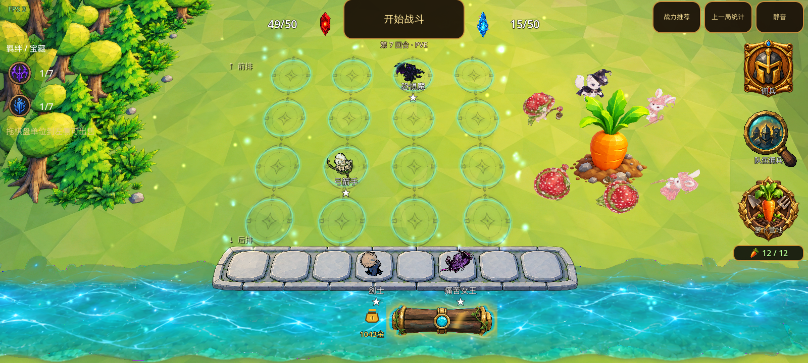

# 模型颗粒问题修复与验证（2026-09-13）

痛苦女王的问题由硬法线与渲染设置共同造成。此次保留原模型的 3054 个三角形，修正三个动作的法线、共用角色材质的深度行为和描边，并给 HIGH 画质的备战/战斗视口开启 2× MSAA。UI 布局与原画保持原样。

## 已确认的原因

| 检查项 | 实测结果 | 修复 |
| --- | --- | --- |
| 女王模型面数与法线 | idle/attack/run 各 3054 面，与同类单位接近；三者 100% 三角形使用独立硬法线。全量 252 个模型文件中，仅这三个达到全模型硬法线。 | 按顶点位置、面夹角和角度权重重算法线，保留大于 60° 的折角；逐面硬法线降为 47 面（1.54%）。 |
| 角色主体的透明队列 | `character_toon.gdshader` 写入 ALPHA。同一 mesh 内的后方蓝面能穿透前方红面，交换三角提交顺序还会改变结果。 | 主体保持不透明、恢复正确深度写入。78 个引用该 shader 的材质共同生效。 |
| 描边 | 原模型空间外扩在小棋子、薄部件与硬法线接缝上形成粗黑楔形；纯色材质的有/无描边对照可分离这个影响。 | 保留每份材质的宽度与颜色；限制投影外扩为渲染目标的 1.25 像素，并保持原表面深度。主体负责投影，描边不写入阴影。 |
| 几何轮廓采样 | 真实 1600×720 备战界面的 3D 视口也是 1600×720，未开启 MSAA。不是固定 540p 放大。 | HIGH 档开 2× MSAA；LOW/MEDIUM 仍保持原有成本，备战 30Hz 不变。 |

Godot 官方说明：读写 `ALPHA` 会使用透明管线，可能产生排序问题；`depth_draw_opaque` 只为不透明几何写入深度。[Spatial shaders](https://docs.godotengine.org/en/stable/tutorials/shaders/shader_reference/spatial_shader.html)

仅去掉 ALPHA 的真实角色 A/B 改善有限，因此没有把它单独认定为全部颗粒的原因。最终修复同时处理了女王法线、描边和几何边缘采样。

## 其他资源扫描范围

- 全量扫描 `assets/models` 的 252 个 FBX/GLB，全部加载成功，未发现零法线；除女王三个动作外，没有其他全模型硬法线异常。
- 78 份共用角色材质：单位 34、佣兵 12、首领 10、杂兵 16、盟友 6。这是材质数量，不等于独立角色数量。
- 76 张独立 albedo 中，74 张有部分 alpha，未发现需要完全透明孔洞的该类主体材质；原图片不变，由不透明主体 shader 正确解释颜色。
- Queen 2048²、Archer 4096² 源图的导入上限均为 512。UV 对应方向正常，细小 UV 岛有细节损失风险；对照不足以证明它造成截图中的大量黑楔形。此次保留贴图和 mipmap，没有给全部模型扩大纹理内存。

全量数据：[model_grain_audit_20260913.json](assets/model_grain_audit_20260913.json)。

## 资源交付

三个修复后的源 FBX 以新文件名随 Git 提交：

```text
assets/models/units/dark_queen_animated/dark_queen_idle_smooth.fbx
assets/models/units/dark_queen_animated/dark_queen_attack_smooth.fbx
assets/models/units/dark_queen_animated/dark_queen_run_smooth.fbx
```

同目录的 `DarkQueenAnimated.gd`、UID、包装场景和三个 `.import` 一起交付。原来的外置 albedo 与身体材质继续使用。新导入文件具有独立 UID，原导入参数保持一致。

现有本机打包流程先合并 Git 工程与 `res/assets`，同路径脚本优先保留 Git 版本；云盘不存在新的 `_smooth` 文件名，因此旧云资源不会把修复模型覆盖。实际使用该合并函数验证：2569 个资源文件，必需/可选资源缺失均为 0，女王 wrapper 保留 Git 版本并选择新 FBX。

`assets.manifest.json` / `assets.bundle.json` 继续描述原云端基础资源包，没有把未重建的历史 ZIP 伪装成新包。此次新增 Git 资源及其哈希单独记录在 [dark_queen_smooth_normals_20260913.json](assets/dark_queen_smooth_normals_20260913.json)。构建报告会记录女王 wrapper 与云端旧清单不同，这是本次预期变化；末日使者 wrapper 的差异在此次之前已存在。

若手动复制资源，请保留 Git 的女王包装脚本和 `_smooth` 文件；完整运行仍需要项目原有云端资源。现有本机入口 `build_apk.sh --sync` 会取得最新 Git 代码和本次模型，再按上述规则合并云资源。

## 验证结果与边界

| 验证 | 结果 |
| --- | --- |
| FBX 修改边界 | 每个文件仅一个 Normals 数组改变，其余 11841 个节点属性逐字节不变。 |
| Godot 再导入 | 三角位置、绕序、UV、骨骼索引/权重、骨架、绑定、全部动画轨道和关键帧的语义哈希一致；仍为 3054 面。 |
| 女王三个动作 | 27 项通过；每个动作正常推进且只有一个可见动作网格，实际读取 `_smooth.fbx`。 |
| 角色不透明深度 GPU 回归 | Compatibility、Mobile 均 318 项通过；旧 shader 的负对照正确暴露遮挡错误。 |
| 描边投影 GPU 回归 | 两种渲染器各 13 项通过，覆盖透视/正交、0.01/1/100 缩放、非等比缩放与近裁剪；内部黑覆盖为 0。 |
| 既有材质完整性 / 描边规范 / 三档视口检查 | 分别 297 / 230 / 27 项通过。 |
| 实际角色动作矩阵 | 75 个角色全部成功加载，300 张截图全部生成，没有缺失动作、回退白模或材质缺失。 |
| 矩阵自动取景 | 末日使者 4 个状态各有面积/边框越界，共 8 项；修改前相同 8 项失败，属于既有取景问题。 |
| 旧通用动作连续性工具 | 修改前后都因当前数据中采样到 0 个 run 单位失败；没有把它计为通过，以本次真实女王三动作测试补足覆盖。 |

原 FBX 中保留的供应商旧 `.fbm` 纹理引用仍会在原始导入日志报缺失；最终模型使用 wrapper 指定的身体材质与独立 albedo，实际材质完整性检查通过。本次没有修改原 FBX 中与法线无关的属性。

这些结果来自 macOS 的真实 GPU、Godot 4.7 和隔离的最新代码/资源合并项目；不等于 Android 真机性能验收，也没有重新生成安装包。截图中的 FPS 是加载后冻结首帧的 HUD 数字，不能作为性能测量。

## 相同姿态的备战界面对比

四个角色固定为单星，金钱 1043、回合 7、双方血量 49/15。女王 idle 固定在原脚本配置的 7.001 秒，其余角色为 3.001 秒；窗口与渲染目标均为 1600×720。

修复前：



修复后：


## 复跑

资源修复工具仅接受审计过的全硬法线三角 FBX，输出到另一目录，不覆盖源文件：

```bash
python3 tools/repair_fbx_normals.py --source-dir PATH_TO_ORIGINAL_QUEEN_ASSETS --output-dir PATH_TO_FIXED_OUTPUT --report PATH_TO_REPORT.json
```

在资源齐全的 Godot 4.7 项目中：

```bash
godot --headless --path . tools/dark_queen_normal_check.tscn
godot --headless --path . tools/model_material_integrity_check.tscn
godot --headless --path . tools/viewport_status_regression_check.tscn
godot --path . --rendering-method gl_compatibility tools/character_opaque_depth_check.tscn -- --rendered
godot --path . --rendering-method mobile tools/character_outline_projection_check.tscn
godot --path . tools/model_visual_matrix_capture.tscn -- --matrix-tier=MEDIUM
```

固定备战截图工具为 `tools/character_prep_grain_capture.tscn`，必须在隔离副本设置独立 `glory-grain-capture-*` 用户目录，并提供 `GLORY_GRAIN_CAPTURE_DIR` 环境变量才允许运行。
