# 真机显示与启动问题：代码修复与自动验证（2026-09-13）

本轮处理棋子悬浮与居中、新手教程箭头偏移、地面阴影叠加，以及语言选择后进入教程时的同步加载卡顿。修复代码位于 `29921dc2`；最终 APK 已安装，设备安装包与构建产物的 SHA-256 一致。最终包已取得待命居中、棋盘箭头与实际拖放、女王和魔童落地、商店位置稳定及加载响应的手机证据。最终包的战斗、English/Back 也已完成实测，验证后已逐字节恢复原始存档。

痛苦女王的平滑法线、共用角色材质与 HIGH 档抗锯齿沿用先前 `80f2bbb` 的修复，详见[模型颗粒问题修复与验证](GLORY_模型颗粒问题修复_20260913.md)。本轮未新增女王 FBX 法线修改，其在本次 APK 中的实际显示效果由手机验证章节记录。

## 1. 已确认根因与修复

### 棋子悬浮

备战场景将世界坐标换算为模型根节点的局部坐标后，又把局部 Y 覆盖为固定偏移值。父节点本身存在平移和缩放，覆盖 Y 会丢失换算结果，使模型整体抬高约 0.21 个世界单位；该问题同时影响棋盘和待命区，并非魔童单独的面数或材质异常。

修复保留完整世界到局部坐标换算，再叠加美术配置的高度偏移。棋盘模型使用棋格表面高度，待命模型使用平台表面高度；屏幕投影回地面的计算采用同一落地平面。

实现位置：[PrepBoardModels.gd](../scenes/prep/PrepBoardModels.gd) 的 `_position_prep_board_model`、`_position_prep_standby_model`、`_prep_board_projected_ground_position`。

### 棋盘与待命区视觉居中

模型网格包围盒的中心不能代表动画姿态下的双脚中心。只按包围盒居中后，不同角色仍会相对棋格中心发生水平或前后偏移，待命区表现为角色偏向框边。

修复在角色初始化时，从 idle 姿态骨骼读取双脚中心，仅以 X/Z 分量作一次归中；不改已经确定的落地 Y，也不在每帧重新计算蒙皮或追随脚步。五种实际模型在棋盘和待命区共 10 个实渲染场景中，中心水平误差均不超过 6 像素，竖直偏移均为 -15 至 0 像素，测量分辨率为 1320×608。手机实际购买三个初始人类棋子的结果见第 5 节。

实现位置：[PrepBoardModels.gd](../scenes/prep/PrepBoardModels.gd) 的 `_center_prep_model`、`_prep_model_foot_center`。

### 新手教程箭头

投影格框设置尺寸时，原顺序为先写 `size`，再缩小 `custom_minimum_size`。Godot 会使用旧最小尺寸约束第一次赋值，因此可见投影圈已缩小，控件矩形仍偏大。教程读取这个矩形中心后，箭头会指向圈外。恢复旧赋值顺序的反向验证产生 160 项失败；2640×1216 测试中部分棋盘格的水平偏差达到约 61 个画布像素。

另一个独立问题是箭头采用字号 84 的三角字形，以固定偏移估算尖端。实测 Label 为 84×123，而布局使用的预估尺寸为 76×104；字体回退和字形基线会进一步影响位置。

修复包括：

- 先设置新的最小尺寸，再设置实际尺寸，使控件矩形与投影圈一致。
- 使用有明确尖端坐标的矢量三角箭头，保持红色三角提示形式。
- 通过 `get_global_transform_with_canvas()` 将目标坐标转换到教程覆盖层的局部坐标，覆盖不同 CanvasLayer 和缩放情况。
- 靠近安全区边界时围绕固定尖端缩小箭身，避免简单裁定位置把尖端挪离目标。

实现位置：[PrepBoardModels.gd](../scenes/prep/PrepBoardModels.gd) 的 `_fit_cell_to_screen_polygon`、[TutorialMode.gd](../scripts/tutorial/TutorialMode.gd)、[TutorialArrow.gd](../scripts/tutorial/TutorialArrow.gd)。

### 地面阴影与脚环

旧战斗表现叠加了 HUD 椭圆阴影、3D 黑色圆盘和实色阵营圆盘，形成明显的地面黑块。备战阴影还存在透明绘制顺序问题：阴影材质优先级为 0，棋格和平台分别以优先级 5、7 后绘制，会覆盖阴影。

修复移除重复的 HUD 阴影，将 3D 阴影统一为边缘连续淡出的平面接触影，并将阵营标记改为透明细环。备战接触影设置绘制优先级 8，使其位于平台之后；战斗接触影继续使用优先级 0。四星描边明确排除接触影和脚环，角色主体的描边仍保留。

实现位置：[BattleRenderer.gd](../scenes/battle/BattleRenderer.gd)、[PrepBoardModels.gd](../scenes/prep/PrepBoardModels.gd)、[UnitContactShadow.gd](../effects/runtime/presentation/UnitContactShadow.gd)、[unit_contact_shadow.gdshader](../shaders/unit_contact_shadow.gdshader)、[unit_team_ring.gdshader](../shaders/unit_team_ring.gdshader)、[FourStarAura3D.gd](../effects/vfx3d/modules/FourStarAura3D.gd)。

### 语言选择后进入教程的加载卡顿

原路径同步打开备战场景；场景构建继续同步读取贴图、宠物模型和动作 FBX，同时启动全量特效预热。模型包装场景的动作、材质路径存放在脚本常量中，仅加载包装场景不足以加载这些运行时依赖。

修复在语言选择后先显示加载反馈，再按当前棋盘、待命区、商店和宠物收集资源。后台最多同时处理两个请求，每帧新增一个请求、接收一个已完成资源；读取包装脚本中的 `ACTION_SCENES` 和 `BODY_MATERIAL_PATH`，补齐其运行时依赖。完成的当前模型与材质由共享资源服务持有，避免首次购买时再次冷读。

备战构建分帧完成；教程不再预取未来三轮敌人，全量特效预热改为显式诊断选项。恢复至 PVP 教程步骤时，按当前回合选择 PVP 音乐及提示框；PVE/Boss 只选择普通备战音乐，不同时预取另一套音乐。

修复同时覆盖返回键生命周期：资源阶段的 Android Back/Esc 会取消当前请求并返回语言选择；场景构建阶段消费返回键，避免覆盖层已被释放而加载协程仍继续访问。取消后可以重新选择语言进入。

实现位置：[Main.gd](../scenes/main/Main.gd)、[FrameResourceLoader.gd](../scripts/assets/FrameResourceLoader.gd)、[PrepStartupAssets.gd](../scripts/assets/PrepStartupAssets.gd)、[BattleAssetService.gd](../scripts/assets/BattleAssetService.gd)、[PrepScreen.gd](../scenes/prep/PrepScreen.gd)、[PrepUI.gd](../scenes/prep/PrepUI.gd) 的 `_build`、[GloryLoadingOverlay.gd](../ui/components/GloryLoadingOverlay.gd)。

### 商店按钮布局回归

分帧构建暴露了商店浮动动画的旧定位假设：动画启动时父容器尚未完成布局，脚本记录了临时的绝对 `position`，后续循环动画又反复写回，使本应位于底部中央的商店按钮发生漂移。窗口尺寸变化也会使这个绝对位置失效。

修复改为保留底部中央锚点的 `offset_top`、`offset_bottom`，动画只叠加上下浮动量，不再覆盖父容器计算出的绝对位置。真实宽屏测试加载 `UIFontFallback`，观察 15 秒，并切换至 1600×900 后恢复原尺寸；水平锚点最大误差为 0，竖直变化保持在预期 3 像素浮动范围内。

实现位置：[PrepScrollIdleFlipbook.gd](../scenes/prep/effects/PrepScrollIdleFlipbook.gd) 的 `_start_float`、`_apply_float_offset`、`_stop_float`。

## 2. 自动检查结果

以下检查均返回 PASS，失败数与允许列表豁免数均为 0。检查在资源齐全的独立项目副本中运行；带场景或教程状态变更的检查使用独立 `GLory-Codex-QA-*` 用户目录。

| 检查场景 | 通过项数 | 覆盖内容 |
| --- | ---: | --- |
| [unit_ground_contact_check](../tools/unit_ground_contact_check.tscn) | 45 | 16 个棋盘格、8 个待命格落地高度，美术偏移仍可叠加；阴影随角色移动/转向；重复阴影、平台排序及四星描边隔离；五种实际模型隐藏首帧的脚底居中及落地 Y 保留。 |
| [unit_anchor_contract_check](../tools/unit_anchor_contract_check.tscn) | 51 | 单位锚点、分类和缩放约定回归。 |
| [tutorial_arrow_alignment_check](../tools/tutorial_arrow_alignment_check.tscn) | 398 | 四档分辨率下逐一检查 96 个真实投影格框，直接对比可见多边形与箭尖；跨 CanvasLayer、缩放验证。合并落地修复后已复跑。 |
| [tutorial_overlay_layout_check](../tools/tutorial_overlay_layout_check.tscn) | 528 | 教程目标可见面积、安全区、控件遮挡及静止时气泡稳定性。 |
| [tutorial_target_check](../tools/tutorial_target_check.tscn) | 97 | 语义步骤与实际目标解析、目标缺失反馈。 |
| [startup_transition_check](../tools/startup_transition_check.tscn) | 37 | 携带 `--layout-soak`：实际 Android 返回通知和 Esc 入口取消、重入、重复选择、构建阶段返回保护、首次购买及当前回合资源选择；加载 `UIFontFallback` 的 2640×1216 窗口观察 15 秒，并验证窗口缩放后商店按钮锚点。 |
| [onboarding_persistence_check](../tools/onboarding_persistence_check.tscn) | 20 | 引导状态与启动路由持久化回归。 |
| [prep_battle_loading_check](../tools/prep_battle_loading_check.tscn) | 60 | 战斗加载层、失败恢复、等待反馈和离线成功路径。 |
| [page_lifecycle_check](../tools/page_lifecycle_check.tscn) | 74 | 非教程环境下，20 轮主菜单与设置、图鉴、宠物、组队大厅之间的返回操作及生命周期回归。 |

箭头实渲染分辨率为 1280×720、1920×1080、2400×1080、2640×1216。检查通过并不代表 Android 的帧率、触控体验和整场战斗表现已经验收。

本地自动验证日志位置：

```text
/Volumes/repository/github/GLory/review_phone_fixes_20260913/unit_ground_contact_check.log
/Volumes/repository/github/GLory/review_phone_fixes_20260913/unit_anchor_contract_check.log
/Volumes/repository/github/GLory/build/tutorial-arrow-check/integrated_alignment.log
/Volumes/repository/github/GLory/build/tutorial-arrow-check/layout.log
/Volumes/repository/github/GLory/build/tutorial-arrow-check/target.log
/Volumes/repository/github/GLory/build/tutorial-arrow-check/startup_pvp_assets_fixed.log
/Volumes/repository/github/GLory/build/tutorial-arrow-check/generic_back.log
/tmp/glory-startup-qa-layout-after.log
/tmp/glory-onboarding-qa.log
/tmp/glory-prep-battle-loading-qa.log
```

箭头实渲染输出位于：

```text
/Volumes/repository/github/GLory/build/tutorial-arrow-check/project/reports/tutorial_arrows/
```

五模型、棋盘与待命区的 10 个实际蒙皮画面测量另存于下列文件。这是离线验证，运行时仍只在角色初始化时读取一次骨骼位置。

```text
/Volumes/repository/github/GLory/review_phone_fixes_20260913/prep_center_capture.gd
/Volumes/repository/github/GLory/review_phone_fixes_20260913/prep_center_after.png
/Volumes/repository/github/GLory/review_phone_fixes_20260913/prep_center_after.json
/Volumes/repository/github/GLory/review_phone_fixes_20260913/prep_center_result.txt
```

## 3. 复跑方法

使用 Godot 4.7 和已经合并当前代码、完整资源并完成资源导入的独立副本。本轮实际使用的引擎与测试项目路径如下：

```bash
GLORY_GODOT="/Volumes/repository/github/GLory/build/android-work/engine/Godot.app/Contents/MacOS/Godot"
GLORY_QA="/Volumes/repository/github/GLory/build/tutorial-arrow-check/project"
```

测试副本的 `override.cfg` 必须启用独立目录；启动检查要求目录名以 `GLory-Codex-QA-` 开头。示例配置：

```ini
[application]
config/use_custom_user_dir=true
config/custom_user_dir_name="GLory-Codex-QA-display-startup-recheck"
```

只在独立测试副本中应用此配置。`page_lifecycle_check` 的前置条件是该测试环境已完成教程并选择过初始宠物；准备好这个条件后先运行导航检查，避免其他引导检查改变其前置状态。报告不附带测试账户或存档内容。

```bash
"$GLORY_GODOT" --headless --path "$GLORY_QA" res://tools/page_lifecycle_check.tscn
"$GLORY_GODOT" --headless --path "$GLORY_QA" res://tools/unit_ground_contact_check.tscn
"$GLORY_GODOT" --headless --path "$GLORY_QA" res://tools/unit_anchor_contract_check.tscn
"$GLORY_GODOT" --path "$GLORY_QA" --rendering-method gl_compatibility res://tools/tutorial_arrow_alignment_check.tscn
"$GLORY_GODOT" --headless --path "$GLORY_QA" res://tools/tutorial_overlay_layout_check.tscn
"$GLORY_GODOT" --headless --path "$GLORY_QA" res://tools/tutorial_target_check.tscn
"$GLORY_GODOT" --path "$GLORY_QA" --rendering-method gl_compatibility res://tools/startup_transition_check.tscn -- --layout-soak
"$GLORY_GODOT" --headless --path "$GLORY_QA" res://tools/onboarding_persistence_check.tscn
"$GLORY_GODOT" --headless --path "$GLORY_QA" res://tools/prep_battle_loading_check.tscn
```

箭头截图必须使用真实渲染后端；`--headless` 可检查几何与逻辑，但不能替代图像验收。每次复跑均核对进程退出码与 `CHECK_RESULT` 的 `status`、`checked`、`failures` 字段。

`startup_transition_check` 不带 `--layout-soak` 时为 34 项；带此选项时为 37 项。布局复跑须保留项目的 `UIFontFallback` 自动加载项，核对日志中的 `font_fallback_loaded=true`。

## 4. 最终 APK 与安装核验

最终 APK 包含商店按钮锚点与棋子居中修复，源代码提交为 `29921dc2`。该包已成功安装；构建产物的 SHA-256 已本地复核，设备已安装 APK 的 SHA-256 与其一致。

```text
路径：/Volumes/repository/github/GLory/build/apk/Glory-debug-20260913-234857-29921dc2.apk
源代码提交：29921dc2
SHA-256：5f2dac9b2b409ad8368c20ed901cf51af02efde2debb1c303180b9665f34bec9
安装校验记录：/Volumes/repository/github/GLory/review_phone_fixes_20260913/installed_final_verification.json
```

复核命令：

```bash
shasum -a 256 /Volumes/repository/github/GLory/build/apk/Glory-debug-20260913-234857-29921dc2.apk
```

手机截图原始尺寸为 2640×1216；下列 `final_*.png` 均来自此最终包。阶段战斗对照图单独标明其证据范围。

## 5. 手机验证

### 最终包：待命居中、落地与教程拖放

实际从商店购买民兵、弓箭手、商人后，三个棋子在待命框内居中并上移至平台内；教程箭头尖端指向首个待命框上缘。

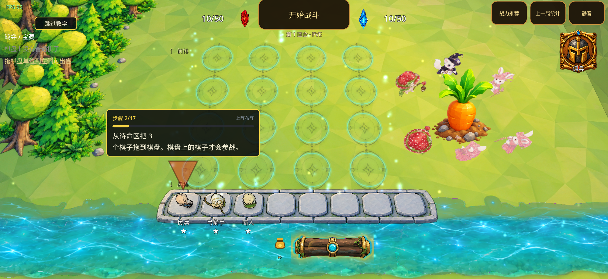

选择待命棋子后，箭头尖端指向从前排起第三排第一格的上缘，与可见棋格对应。

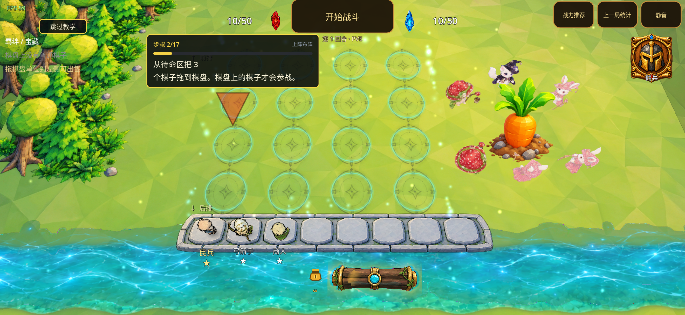

实际从待命区拖动民兵至该格成功：民兵已出现在目标棋格中，原待命格变空，教程继续指向下一个待命棋子。

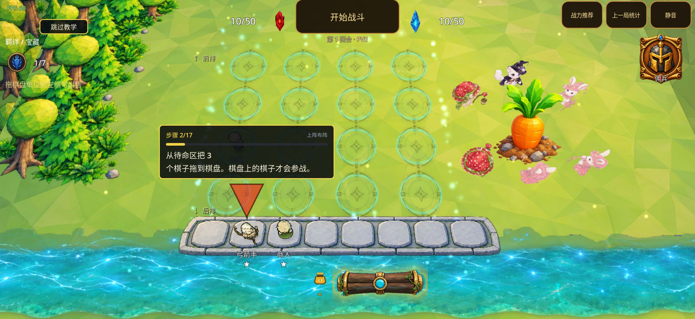

第三回合备战画面中，魔童和痛苦女王均落在棋盘表面，待命区的女王也位于平台内。

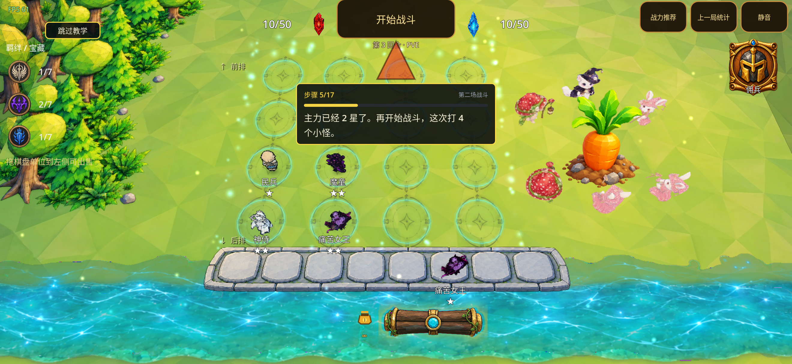

### 最终包：商店按钮位置稳定

手机停留教程 15 秒后的截图中，商店按钮保持在底部中央，箭头与按钮对应。最终录像另连续跟踪了 16.036 秒、1014 帧：按钮模板中心水平变化为 0 像素，竖直变化为 5 像素，属于有界浮动，没有持续漂移。此录像测量分辨率为 1920×884，不应与自动布局检查的画布像素混用。

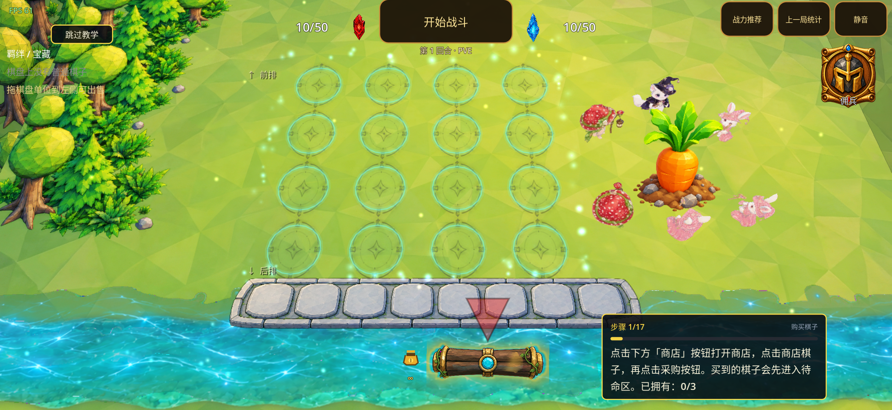

### 战斗阴影与女王动作：最终包复核

手机画面中，旧版棋子脚下的粗黑拖影和实色圆盘已变为较轻的接触影与空心阵营环。以下截图用于观察阴影形态，不作为同一姿态的逐像素比较或帧率测试。

修复前：

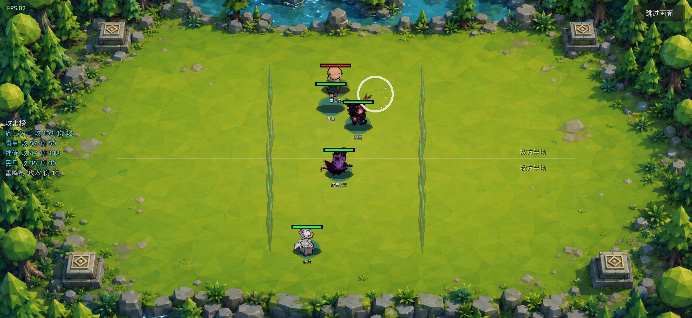

阶段修复后：

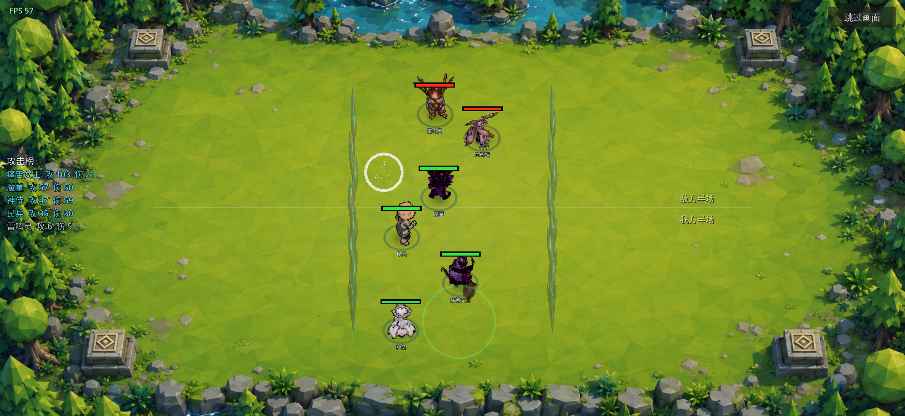

本地 `battle_after.mp4` 的 1.03–4.73 秒可观察到痛苦女王实际前移，并出现攻击姿态变化。该证据覆盖此次战斗中女王模型和动作的实际运行；女王法线资源仍为前一轮修复结果。此处两张战斗图及该录像对应阶段包。最终包也已实际完成同一测试阵容的一场战斗：`battle_final.mp4` 的 1.2 秒女王伤害为 0，随前移与攻击升至 21，3.5 秒胜利时为 42；轻接触影与空心脚环保持正常。

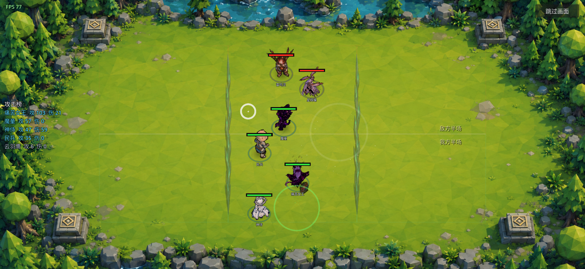

原始录像位置：

```text
/Volumes/repository/github/GLory/review_phone_fixes_20260913/battle_after.mp4
```

### 最终包：语言选择加载响应改善，仍有构建停顿

手机录像的最大相邻呈现帧间隔由 **757.689 ms 降至 121.878 ms，减少 83.9%**。这是录像中没有新呈现帧的最大间隔变化，不能据此推算总加载时间变化。旧录像缺少可辨认的点击反馈，录屏命令时钟与视频 PTS 也未同步，因此没有将旧画面静止区间当作点击响应时间。

| 观测项 | 结果与口径 |
| --- | --- |
| 语言选择到加载反馈 | **10 ms**，来自同一设备 `GLORY_STARTUP` 的选择语言与加载层可见标记。 |
| 后台资源加载期间 | 计数与等待动画持续推进；录像覆盖约 **1.153 秒、105 帧**，相邻帧最大间隔 **12.389 ms**，中位数约 11.1 ms。 |
| 资源阶段耗时 | 设备 trace 为 **1140 ms**；与录像阶段边界的口径不同。 |
| 选择语言到教程首帧就绪 | 设备 trace 为 **1433 ms**；未与旧版总加载时间作直接比较。 |
| 剩余停顿 | 最长 **121.878 ms** 的呈现间隔出现在覆盖层后方的棋盘/控件构建阶段，视频 PTS 为 1.711433–1.833311 秒。 |
| 构建阶段 trace 间隔 | 资源完成到背景完成 11 ms；背景到棋盘完成 43 ms；棋盘到控件完成 167 ms；控件到首帧就绪 62 ms。这些是阶段间隔，包含分帧等待，不等同于单帧 CPU 耗时。 |

资源加载期间的反馈持续可见，长时间画面停滞已减轻；场景构建仍有一次约 122 ms 的可见停顿。教程首两帧仍存在棋格高亮与气泡布局收敛，约 22.2 ms 后稳定；商店按钮后续持续漂移的问题未在这段最终录像中复现。

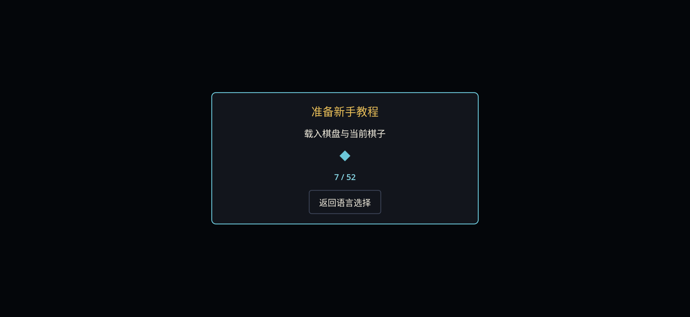

测量依据保留于：

```text
/Volumes/repository/github/GLory/review_phone_fixes_20260913/language_before_video_analysis.json
/Volumes/repository/github/GLory/review_phone_fixes_20260913/language_final_video_analysis.json
/Volumes/repository/github/GLory/review_phone_fixes_20260913/language_before.mp4
/Volumes/repository/github/GLory/review_phone_fixes_20260913/language_final.mp4
```

### 最终状态

| 手机验收项 | 当前记录 |
| --- | --- |
| 最终 APK 安装与来源 | `29921dc2` 构建包已安装，设备安装包与构建产物 SHA-256 一致。 |
| 魔童、女王落地与待命框居中 | 最终手机截图已确认；另有五模型 10 场景离线中心测量通过。 |
| 新手教程待命格与棋盘格箭头 | 最终包已观察正确指向，实际从待命区拖至第三排第一格成功。 |
| 商店按钮位置 | 最终手机 15 秒截图及 16.036 秒录像跟踪保持底部中央，无水平漂移。 |
| 语言选择加载 | 已记录 10 ms 反馈、1433 ms 首帧就绪及最长呈现间隔减少 83.9%；剩余构建停顿如上。 |
| 最终战斗录像 | 最终包已实际完成战斗，女王前移并攻击，伤害 0→21→42；阴影与脚环正常。四星描边隔离由自动检查覆盖。 |
| 末次 English/Back 与存档恢复 | 英文加载中按 Android Back 返回语言选择，再点 English 成功进入英文教程；原始 7 个数据文件已逐字节恢复核对，临时教程断点已删除。 |

最终包 English/Back 实测结果：

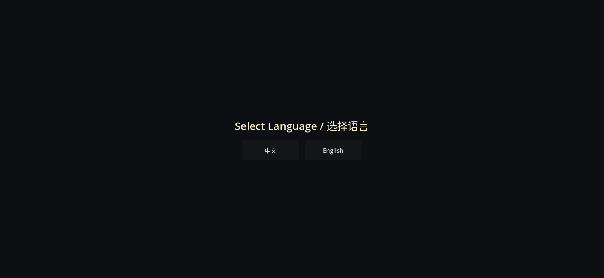

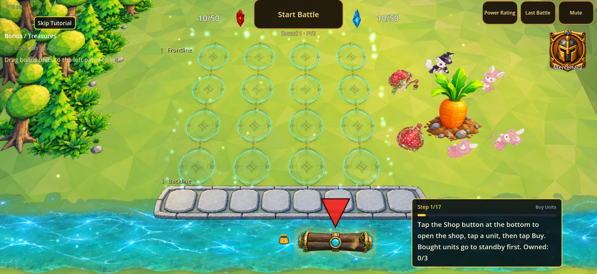

验证结束后应用保持关闭，以保留刚完成逐字节核验的原始进度；未卸载应用或清除应用数据。当前进程日志未匹配到脚本解析、着色器编译、资源加载或 Invalid call 错误。存档内容与账号数据仅保留在本机私有备份，不随本报告上传。
